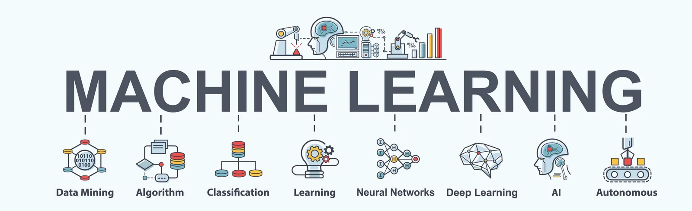

***“Machine Learning, at its most basic, is the practice of using algorithms to parse data, learn from it, and then make a determination or prediction about something in the world”. – Nvidia***

When most people hear “Machine Learning,” they picture a robot: a dependable but‐ ler or a deadly Terminator depending on who you ask. But Machine Learning is not just a futuristic fantasy, it’s already here. The first ML application that really became mainstream, improving the lives of hundreds of millions of people, took over the world back in the 1990s: it was the spam filter.

**What is Machine Learning ?**

Machine Learning is the science (and art) of programming computers so they can learn from data. Here is a slightly more general definition: ***Machine Learning is the field of study that gives computers the ability to learn without being explicitly programmed. —Arthur Samuel, 1959***

**Types of Machine Learning Systems :**

There are so many different types of Machine Learning systems that it is useful to classify them in broad categories based on:

• Whether or not they are trained with human supervision (supervised, unsuper‐ vised, semisupervised, and Reinforcement Learning)

• Whether or not they can learn incrementally on the fly (online versus batch learning)

• Whether they work by simply comparing new data points to known data points, or instead detect patterns in the training data and build a predictive model, much like scientists do (instance-based versus model-based learning).

Throughout this Article, will go through the supervised and unsupervised learning, all the way from their definition to their implimentation in python with ScikitLearn.

**What is Supervised Learning ?** Supervised machine learning falls into two categories—classification and regression. You train machine ­learning models on datasets that consist of rows and columns. Each row represents a data sample. Each column represents a feature of that sample. In supervised machine learning, each sample has an associated label called a target (like “dog” or “cat”). This is the value you’re trying to predict for new data that you present to your models.

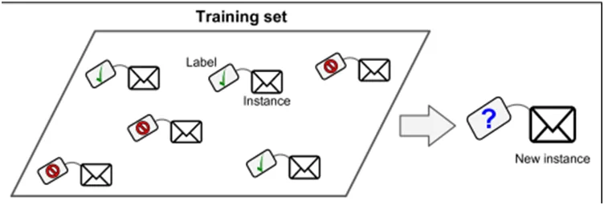

A typical supervised learning task is *classification* : where the target variable is categorical. The spam filter is a good example of this (shown in the figure above) : it is trained with many example emails along with their class (spam or ham), and it must learn how to classify new emails. Another typical task is to predict a target numeric value, such as the price of a car, given a set of features (mileage, age, brand, etc.) called predictors. This sort of task is called *regression*. To train the system, you need to give it many examples of cars, including both their predictors and their labels (i.e., their prices).

Here are some of the most important supervised learning algorithms :

• k-Nearest Neighbors

• Linear Regression

• Logistic Regression

• Support Vector Machines (SVMs)

• Decision Trees and Random Forests

• Neural networks

**What is unsupervided learning ?** Is a class of machin learning techniques for discovering patterns in data. As you might guess, the training data is unlabeled. The system tries to learn without a teacher as shown in the figure.

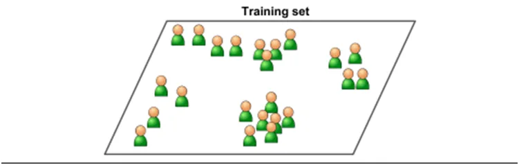

Here are some of the most important unsupervised learning algorithms:

• Clustering : — K-Means — DBSCAN — Hierarchical Cluster Analysis (HCA)

For instance : say you have a lot of data about your blog’s visitors. You may want to run a clustering algorithm to try to detect groups of similar visitors At no point do you tell the algorithm which group a visitor belongs to: it finds those connections without your help.

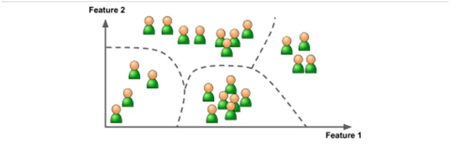

• Anomaly detection and novelty detection : — One-class SVM — Isolation Forest:
 Another important unsupervised task is anomaly detection—for example, detecting unusual credit card transactions to prevent fraud, catching manufacturing defects, or automatically removing outliers from a dataset before feeding it to another learn‐ing algorithm. The system is shown mostly normal instances during training, so it learns to recognize them and when it sees a new instance it can tell whether it looks like a normal one or whether it is likely an anomaly. A very similar task is novelty detection: the difference is that novelty detection algorithms expect to see only normal data during training, while anomaly detection algorithms are usually more tolerant, they can often perform well even with a small percentage of outliers in the training set.

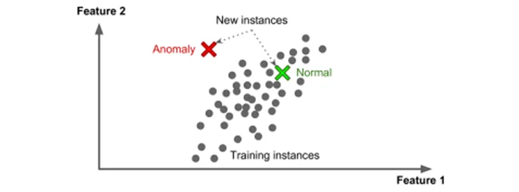

• Visualization and dimensionality reduction : — Principal Component Analysis (PCA) — Kernel PCA — Locally-Linear Embedding (LLE) — t-distributed Stochastic Neighbor Embedding (t-SNE):

Visualization algorithms are also good examples of unsupervised learning algorithms: you feed them a lot of complex and unlabeled data, and they output a 2D or 3D rep resentation of your data that can easily be plotted. A related task is dimensionality reduction, in which the goal is to simplify the data without losing too much information. One way to do this is to merge several correlated features into one. For example, a car’s mileage may be very correlated with its age, so the dimensionality reduction algorithm will merge them into one feature that represents the car’s wear and tear. This is called feature extraction.

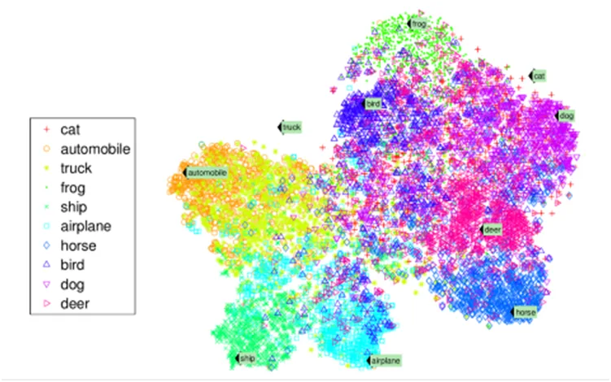

• Association rule learning : — Apriori — Eclat:

Association rule learning, in which the goal is to dig into large amounts of data and discover interesting relations between attributes. For example, suppose you own a supermarket. Running an association rule on your sales logs may reveal that people who purchase barbecue sauce and potato chips also tend to buy steak. Thus, you may want to place these items close to each other.

**CASE STUDY: Dimension Reduction and CLASSIFICATION WITH T-SNE , K-NEAREST NEIGHBORS AND THE DIGITS DATASET** :

Exploratory Data Analysis :

Before we start we need to import the libraries we need and we’re going to explain each of them throughout the cas study :

```python
from sklearn.datasets import load_digits
import pandas as pd
import numpy as np
import matplotlib.pyplot as plt
import seaborn as sns
from sklearn.neighbors import KNeighborsClassifier
from sklearn.model_selection import train_test_split,GridSearchCV
from sklearn.metrics import classification_report, confusion_matrix
from sklearn.preprocessing import StandardScaler
from sklearn.pipeline import Pipeline
from sklearn.manifold import TSNE
```

First, let me introduce the sklearn [Digits Dataset](https://scikit-learn.org/stable/modules/generated/sklearn.datasets.load_digits.html) : Digits Dataset is a part of sklearn library. Sklearn comes loaded with datasets to practice machine learning techniques and digits is one of them.

Digits has 64 numerical features(8×8 pixels) and a 10 class target variable(0-9). Digits dataset can be used for classification as well as clustering. Let’s learn to load and explore the digits dataset. Digits dataset is first step to image recognition.

```python
digits = load_digits()
print(type(digits))
```

```python
<class 'sklearn.utils.Bunch'>
```

Bunch is a subclass of dict that has additional attributes for interacting with the dataset. Similar t a dict, it contains key-value pair.

```python
print(digits.keys())
```

```python
dict_keys(['data', 'target', 'frame', 'feature_names', 'target_names', 'images', 'DESCR'])
```

The Digits dataset bundled with scikit­learn is a subset of the UCI (University of California Irvine) ML hand­written digits dataset at: http://archive.ics.uci.edu/ml/datasets/Optical+Recognition+of+Handwritten+Digits

The original UCI dataset contains 5620 samples—3823 for training and 1797 for testing. The version of the dataset bundled with scikit­learn contains only the 1797 testing samples. A Bunch’s DESCR attribute contains a description of the dataset. According to the Digits dataset’s description , each sample has 64 features (as specified by Number of Attributes) that represent an 8­by­8 image with pixel values in the range 0–16 (specified by Attribute Information). This dataset has no missing values (as specified by Missing Attribute Values). The 64 features may seem like a lot, but real­world datasets can sometimes have hundreds, thousands or even millions of features.

We can confirm the number of samples and features (per sample) by looking at the data array’s shape attribute, which shows that there are 1797 rows (samples) and 64 columns (features):

```python
digits.data.shape
```

```python
(1797, 64)
```

You can confirm that the number of target values matches the number of samples by looking at the target array’s shape:

```python
digits.target.shape
```

```python
(1797,)
```

**Preprocessing the data** **:**

The scikit-learn Api requires :

-That you have the data as a numpy array or a pandas Dataframe.

-The features takes on continuous values such as : price of the house. So if we have categorical features, we need to encode them numerically. The way to achieve this is by splitting the features into a number of binary features called dummy variables. We have 2 ways of creating dummy variable :

- scikit-learn :***OneHotEncoder()*** or pandas : ***pd.get_dummies(df)***.

- No missing data : if there is, we need to handle it : one way to do it is by imputing data. How ? well, it’s by making an educated guess about the mean of the non-missing entries. To do so, we use ***SimpleImputer from sklearn.preprocessing.***

- The features need to be in an array where each column is a feature and each row is a different observationor datapoint. Similarly the tagets needs to be a single column with the same number of observations as the feature data.

The Sklearn datasets comes already preprocessed. If we check the sample image at index 13 :

```python
digits.images[13]
```

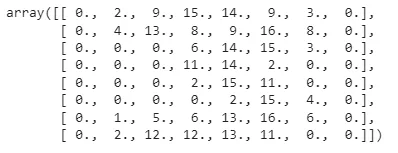

The BUNCH object returned by load-digits contains an images array in which each element is a two dimensional 8 by 8 representing a digit image’s pixel. It need to be flattened into one dimensional array, we can find it in the data array :

```python
digits.data[13]
```

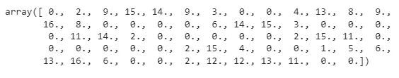

Let’s Visualize it :

```python
plt.imshow(digits.images[13],cmap=plt.cm.gray_r, interpolation='nearest')
plt.show()
```

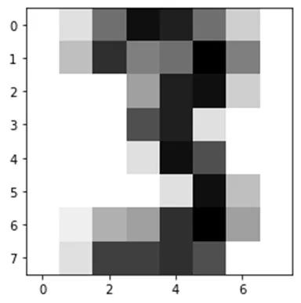

And finally let’s create 2 numpy arrays from our data and targets array :

```python
X = np.array(digits.data)
y = np.array(digits.target)
```

**Dimensionality Reduction** **:**

We have 64 features in our dataset, one of the unsupervised learning techiniques is Dimensionality reduction which will represent the same data using less features and help us visualize our data. When we graph the resulting information, we might see patterns in the data that will help us choose the most appropriate machine learning algorithms to use. For example, if the visualization contains clusters of points, it might indicate that there are distinct classes of information within the dataset. So a classification algorithm might be appropriate. Dimensionality reduction also serves other purposes. Training estimators on big data with significant numbers of dimensions can take hours, days, weeks or longer. It’s also difficult for humans to think about data with large numbers of dimensions. This is called the curse of dimensionality. If the data has closely correlated features, some could be eliminated via dimensionality reduction to improve the training performance. This, however, might reduce the accuracy of the model.

The Digits dataset is already labeled with 10 classes representing the digits 0–9. Let’s ignore those labels and use dimensionality reduction to reduce the dataset’s features to two dimensions, so we can visualize the resulting data. Well realise that using t-SNE.

**How does t-Distributed Stochastic Neighbor Embedding (t-SNE) work?** we can describe t-SNE as a technique that utilizes a gradual iterative approach to find a lower-dimensional representation of the original data while preserving information about local neighborhoods.

## *The steps performed by t-SNE:*
**Step 1**
t-SNE starts by determining the “similarity” of points based on distances between them. Nearby points are considered “similar,” while distant ones are considered “dissimilar.” It achieves this by measuring distances between the point of interest and other points and then placing them on a Normal curve. It does this for every point, applying some scaling to account for variations in the density of different regions.

**Step 2**
Next, t-SNE randomly maps all the points onto a lower-dimensional space and calculates “similarities” between points as described in the process above. One difference, though, this time, the algorithm uses **t-distribution** instead of Normal distribution.

**Step 3**
Now the goal of an algorithm is to make the new “similarity” matrix look like the original one by using an iterative approach. With each iteration, points move towards their “closest neighbors” from the original higher-dimensional space and away from the distant ones. The new “similarity” matrix gradually begins to look more like the original one. The process continues until the maximum number of iterations is reached or no further improvement can be made.

We will now use t-SNE to reduce the dimensionality from 64 down to 2 using TSNE from sklear.manifold :

```python
n_components = 2
model = TSNE(n_components)
transformed = model.fit_transform(X)
transformed.shape
```

```python
(1797, 2)
```

Then we plot our reduced data :

```python
xs = transformed[:,0]
ys = transformed[:,1]
dots = plt.scatter(xs, ys,c=y)
colorbar = plt.colorbar(dots)
```

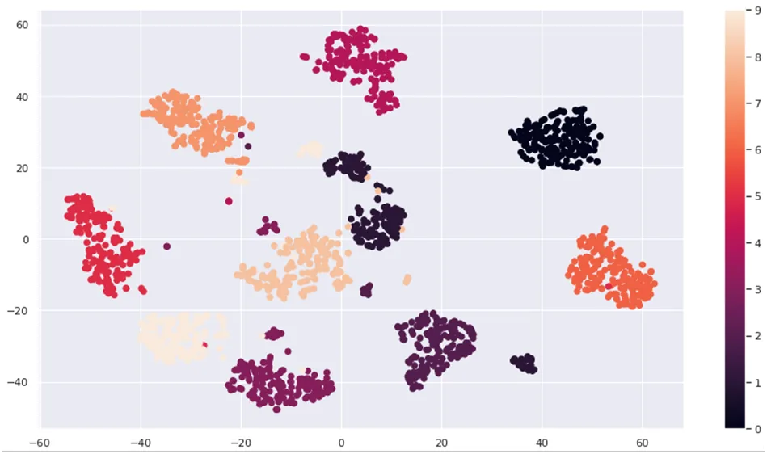

The diagram shows the resulting scatter plot. There are clearly clusters of related data points, though there appear to be 11 main clusters, rather than 10. There also are “loose” data points that do not appear to be part of specific clusters.

**Classification** **:**

Using our 2D data, we’ll now implement our classifier using :

**K-Nearest Neighbors Algorithm** : Scikit­learn supports many classification algorithms, including the simplest—knearest neighbors (k­NN). This algorithm attempts to predict a test sample’s class by looking at the k training samples that are nearest (in distance) to the test sample.

***The main idea is creating a fne tuned model with high performances!***

**-****Splitting the data** **:** For higher performances, the data we fit and train our model on need to be different from the data we’ll use to test our model. So, we need to split our data into training and test.

data using train_set_split() from sklearn.model_selection :we use 70% of the data for the training and 30% for the testing (test_size=0.3).

```python
X_train, X_test, y_train, y_test = train_test_split(transformed, y, test_size=0.3, random_state=11)
```

```python
X_train.shape
```

```python
(1257, 2)
```

```python
X_test.shape
```

```python
(540, 2)
```

Then, we need to instanciate our KNeighborsClassifier that we imported from sklearn.neighbors and fit the classifier to our training data. But, before that there are some extra steps to achieve the high performances of our model :

**Centering and Scalling** **:** Many models use some form of distance io inform data, so if we have features on larger scales, our model can be influenced.

For instance : KNN uses distance explicitly when making predictions and we want our features to be on the same scale : This is called normalizing or scalling and centering the data.

***How a normlization is performed ?*** given any columns, we can substract the mean and divide the variance : so that the features are centered around 0 and have a variance of 1 : we use the StandardScaler from sklearn.preprocessing.

**Hyperparameters and Hyperparameter Tuning** **:** There are two parameter types in machine learning: those the model calculates as it learns from the data you provide and those you specify in advance when you create the scikit­learn model object. The parameters specified in advance are called ***hyperparameters***. In the k­nearest neighbors algorithm, k is a hyperparameter.

In real­ world machine­learning studies, you’ll want to experiment with different values of k to produce the best possible models for your studies. This process is called ***hyperparameter tuning.***

***Basic Idea :*** try a whole bunch of different values , fit ll of them separately, see how each of the performs separatly and choose the best performing one. It is essential though, to use cross validation, because using train_test_split() alone alone would risk overfitting the hyperparameter to the test set : we use GridSearchCv () from sklearn.model_selection.

**-****Cross Validation** **:** enables you to use all of your data for both training and testing, to get a better sense of how well your model will make predictions for new data by repeatedly training and testing the model with different portions of the dataset. Kfold cross­ validation splits the dataset into k equal­size folds. Then repeatedly train your model with k – 1 folds and test the model with the remaining fold.

For example, consider using k = 5 with folds numbered 1 through 5. With 5folds, we’d do 5 successive training and testing cycles: First, we’d train with folds 1–4, then test with fold 5. Next, we’d train with folds 1–3 and 5, then test with fold 4. Next, we’d train with folds 1–2 and 4–5, then test with fold 3. This training and testing cycle continues until each fold has been used to test the model.

**Implementation** **:** Create a pipeline with the steps we need to apply on our trainset : scalling and knn.

Define the parameters as the bunch of values for the k parameter :

```python
steps = [
         ('scaler',StandardScaler()),
         ('knn',KNeighborsClassifier())]
pipeline = Pipeline(steps)
parameters = { 'knn__n_neighbors':np.arange(1,50)}
```

Then we perform the k-fold cross validation :

```python
cv = GridSearchCV(pipeline,param_grid=parameters,cv=5)
```

Fit our model to our train data :

```python
cv.fit(X_train,y_train)
```

Finally, predict the digit classes using the test set :

```python
y_pred = cv.predict(X_test)
```

**How about we check the results and perforances of this model ?**

To see the hyperparameter k that has been chosen to implement the model :

```python
print(cv.best_params_)
```

```python
{'knn__n_neighbors': 4}
```

**Metrics for Model Accuracy** **:**

**Model Score :** Each model has a score method that returns an indication of how well the estimator performs for the test data you pass as arguments :

```python
print(cv.score(X_test,y_test))
```

```python
0.9851851851851852
```

The kNeighborsClassifier’s with its k (that is, n_neighbors=4) achieved 98.51% prediction accuracy.

**Confusion Matrix :** Another way to check a classification models’s accuracy is via a confusion matrix, which shows the correct and incorrect predicted values for a given class. Simply call the function confusion_matrix from the sklearn.metrics module, passing the expected classes and the predicted classes as arguments, as in:

```python
confusion = confusion_matrix(y_test, y_pred)
confusion
```

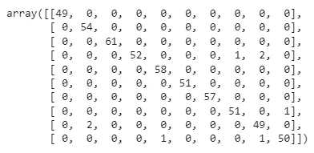

Each row represents one distinct class—that is, one of the digits 0–9. The columns within a row specify how many of the test samples were classified into each distinct class. For example, row 0, 45 test samples were classified as the digit 0, and none of the test samples were misclassified as any of the digits 1 through 9. So 100% of the 0s were correctly predicted.:

But for row 3 : The 1 at column index 7 indicates that one 3 was incorrectly classified as a 7.

The 2 at column index 8 indicates that two 3 were incorrectly classified as a 8. And those are the loose points we find when we plotted the reduced data.

**Classification Report :** The sklearn.metrics module also provides function classification_report, which produces a table of classification metrics based on the expected and predicted values:

```python
print(classification_report(y_test,y_pred))
```

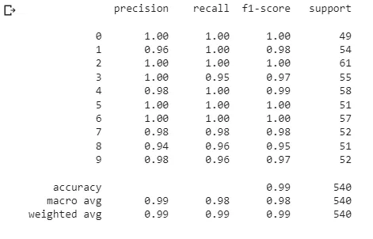

Here, we reach the end of this tutoriel. As usual, find below important links if you wanna dig further:

BOOKS:

Python For Programmers With Introductory AI Case Studies: Paul Deitel, Harvey Deitel.

Hands On Machine Learning ith Scikit-Learn, Keras & TensorFlow: Aurélien Geron.

## [Scientific Programming Blog](https://danielmuellerkomorowska.com/)

## [Machine Learning Database](https://archive.ics.uci.edu/ml/datasets/Congressional+Voting+Records)

## [Towards Data Science](https://towardsdatascience.com/t-sne-machine-learning-algorithm-a-great-tool-for-dimensionality-reduction-in-python-ec01552f1a1e)

## You can find the code [here](https://github.com/asmakrl/datacampstd/tree/main/Supervised%20and%20Unsupervised%20Learning)

## Happy Learning!
