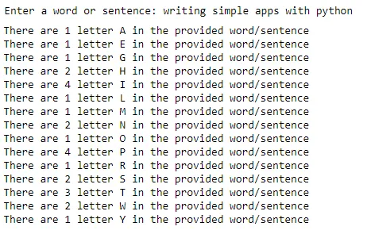

The python code illustrated below allows a user to count the number of occurrences of alphabets in a word or sentence. The code uses loop statement to count the alphabets.

First an input is asked from the user which is converted into a list. The repetition of letters is then removed by converting the list into a set *(Note that the set data type can only contain unique elements which helps to remove the duplication of the letters)*.

Then every occurrences of a letter in set is checked in the list and every time the letter is encountered, the counter is increased by one. This is achieved by the for loop. The final counter (c) value for a letter is then appended into a new list and the output is displayed. Here I have made use of string formatting to display the output in the end.

The overall program looks as:

```python
user_input = input('Enter a word or sentence: ')
letters = list(user_input.upper())
sorted_letters = list(sorted(set(letters)))
count = []
for s in sorted_letters:
    c = 0
    for x in letters:
        if s == x:
            c += 1
    count.append(c)
for i in range(len(sorted_letters)):
    if (i+1)<len(sorted_letters):
        print('There are {} letter {} in the provided word/sentence'.format(count[i+1],sorted_letters[i+1]))
```

If we breakdown the above code, we see the following:

- user_input asks the user for input (word or sentence)
- letters stores the alphabets of user_input
- sorted_letters removes the duplicate character from letters (notice the sorted() function, this allows to store the characters in ascending order)
- count is an empty list to store the value of occurrences of characters
- the for loop (first one) is used to count the occurrence of the character
- the for loop (second one) is used to print the number of occurrences (notice in this for loop how the printing is done from i+1 index and not i - this is to remove the space between words in the sentence as space occurs first when arranging the characters in ascending order)

A sample of the program run is shown below:



Here the characters are converted to upper case since python recognizes lower and upper case as difference characters by their [ASCII](https://en.wikipedia.org/wiki/ASCII) value.

The entire code with their steps are provided in [Git](https://github.com/Clown-Face/Character-count-in-a-sentence.git) repository.
