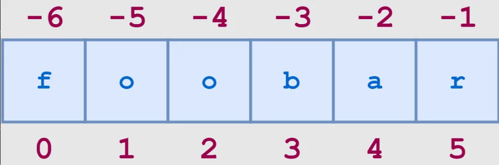

Given a string and a character, your task is to locate the positions of that character in the string. These types of problems are very competitive programming!

The first thing we need to ask the user about **String** & **Character**

```python
string = input("Enter a string: ")
char   = input("Enter the character you want to locate: ")
```

Then by for loop, we go to each character in the string to check if it is the character we want or not, once it is true, we add the index of that character in the string as a position

```python
char_locations = []

for x in range(len(string)):
    if string[x].lower() == char.lower():
        char_locations.append(x)
```

The output will be:

```python
print(char_locations)
```

```python
Enter a string: Mariam Ahmed
Enter the character you want to locate: a
[1, 4, 7]
```

That's it, I hope this article was worth reading and helped you acquire new knowledge no matter how small.

Feel free to check up on the [notebook](https://github.com/MariamAlsaedy/Data-Insight-Scholarship-Article-2/blob/main/Character_Locator.ipynb). You can find the results of code samples in this post.
