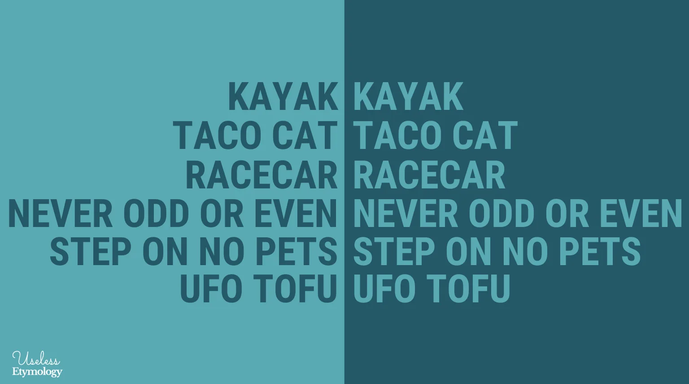

You have probably been tasked at some point or another to write a program that checks whether or not a given string is a palindrome. If not, try it! It's a good exercise.

The purpose of this blog is not to check for palindromes, but to check whether or not a string, if it were arranged in a certain way, could be a palindrome.

### But what is a palindrome?
If you are not already familiar with the term, a palindrome is a string of characters, alphabetical or numerical, that are symmetric around their middle. A phrase like "Was it a car or a cat I saw?" is a palindrome, or even a date such as 21/9/21. Try reading them backwards and you'll find that they read the same (whitespace characters not considered).

An example of a string that could be a palindrome if rearranged is "cccaa". Its palindrome form could be "cacac" or "accca". A string like "fgfa" cannot be a palindrome no matter how many ways you try to arrange it.

**So how do we check if a string could be a palindrome?** It's simple. First, let's get user's input:

```python
string = input('Please enter a string you wish to check: ')
```

After that let's begin our operation. Let's go over each character in the given string and count its number of *occurences.*

```python
odd_count = 0
string_set = ''.join(set(string)) # get all unique characters in string
for char in string_set:
    if string.count(char) % 2:
        odd_count += 1

if odd_count > 1:
    print(f'{string} cannot be a palindrome')
else:
    print(f'{string} can be a palindrome')
```

Did you catch that? A string must contain **at most** one character with an odd frequency of occurence; meaning it appears in the string an odd number of times. The rest of the characters **must** have an even frequency of occurence. Brilliant!
