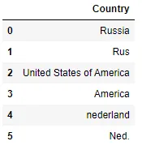
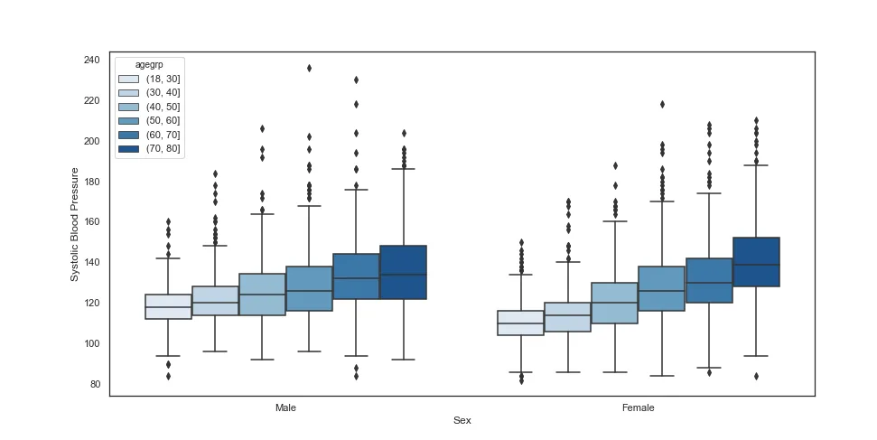
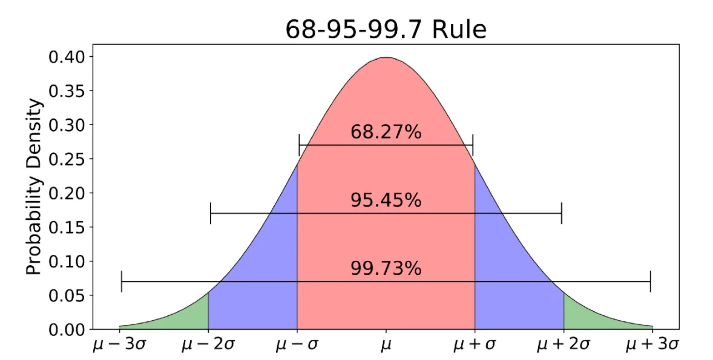
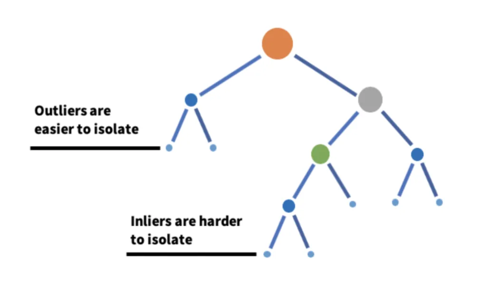
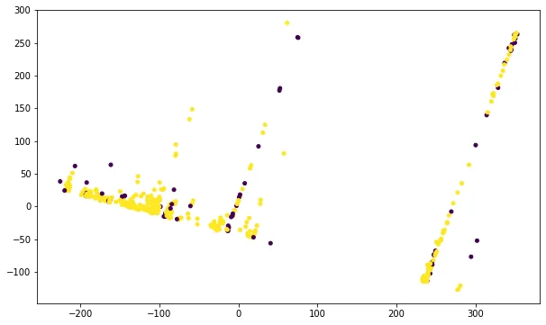
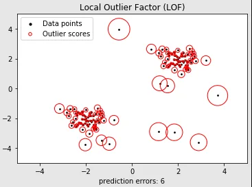

### Introduction
In this blog I will write about Data cleaning. Both of them are important for accuracy of our model. We clean data and get more appropriate model, and decide to which model to use or calculating some values based on a more appropriate formula we need vizualizing of features.

### Data Cleaning
Data Cleaning is the one of the first steps in preprocessing.


Data Cleaning mainly centered by 3 types

Missing Value

Irrelivant Features

Outliers

### Missing Value
To solve missing value problem we have several methods. We can delete all missing values with the help of **dropna()** method.

dropona() has multiple parameters:

**inplace,** it could be True or False. It used for transform changes on the column or no**t.**

**subset,** It is label along the axis ex: we can give list of columns to apply method. and ect.

Also we have **fillna()** method for imputing missing value:

It has some paramters like:

**method,** *{‘backfill’, ‘bfill’, ‘pad’, ‘ffill’, None}*

We could also fill null values with our methods (it could be constant or some function's output).

Here we fill Null values with mode. If colum's dtytpe is int64 or float64 we can use mean or another custom function.

Also we [sklearn](https://scikit-learn.org/stable/modules/classes.html) provide us powerfullimputation method. It is **SimpleImputer()** which located in impute submodule.

First we define strategy for imputing, after that as actual we apply fit_transform and we get filled Series.

Additionally, we can use statistics_ Attributes. It return imputation fill value for each feature and its dtypes.

Output:

One of the advantages of SimpleImputer is that we can easly use it in [Pipeline](https://towardsdatascience.com/tagged/pipeline). And that gives it even more flexibility.

### Irrelivant Features
Sometimes we could faced with datasets such as collected by some forms or direct individually. In that case we see some writing mistakes.

Ex:



If we given that usually we get datasets with thausands of rows, we can't replace writing errors by hand. So, what can we do? that is where [fuzzywuzzy](https://www.geeksforgeeks.org/fuzzywuzzy-python-library/) come. fuzzywzzy is a python library that help us to compare string with its correct form and if their rank is high we replace wrong string with correct one. Let's look at an example.

At the begining, we import needed library, and we will use **process** for comparing values. After that we use for loop to iterate over kat list (consist of categories). We match whole column with val(some category).

match is a list os tuples

```python
[('shjAgricultureafr', 90, 56), ('shjAgricultureafr', 90, 436), ('shjAgricultureafr', 90, 606), ('shjAgricultureafr', 90, 839), ('shjAgricultureafr', 90, 1084), ('shjAgricultureafr', 90, 1181), ('shjAgricultureafr', 90, 1182), ('shjAgricultureafr', 90, 1214), ('shjAgricultureafr', 90, 1216), ('shjAgricultureafr', 90, 1225), ('shjAgricultureafr', 90, 1285), ('shjAgricultureafr', 90, 1301), ('shjAgricultureafr', 90, 1303), ('shjAgricultureafr', 90, 1309), ('shjAgricultureafr', 90, 1311), ('shjAgricultureafr', 90, 1313), ('shjAgricultureafr', 90, 1327), ('shjAgricultureafr', 90, 1361), ('shjAgricultureafr', 90, 1415), ('shjAgricultureafr', 90, 1838), ('shjAgricultureafr', 90, 2014)......
```

First value in tuple is a string which located in DataFrame, second is rank (wrong string vs correct one) and 3rd one is its index in dataframe. After finding whole match for one category we iterate over it and find relevant rank if we do, we replace wrong value with correct.

Also we can compare one string with another with **WRatio()** method of  fuzzy module.

Output: 90

### Outliers
Also, we have otliers in our dataset. If the value in the dataset looks completely differently from other values, we suppose it as outlier. However it is not enough, sometimes values which we take as outlier could be original data(Note that we approach values from a statistical point of view). Outliers is most dangerous things because in case of not removing them our model they skew our model and cause to [Bias](https://searchenterpriseai.techtarget.com/definition/machine-learning-bias-algorithm-bias-or-AI-bias). To stand against the outlier we can use different methods.

We could find it by visualizing it with boxplot.



Here we use statistical method. Our outliers is 1.5IQR far from Q1 and Q3

```python
 outlier < Q1-1.5IQR
outlier > Q3+ 1.5IQR
```

If we know that our Series is normally distributed we can find outliers by Z-score. If it is as far as 3 Z-score from mean, we can asume that as outlier because nearly 99.7% of values is in the range of 3 Z-score.



## Also we can use sklearn library to find outlier. We will use IsolationForest and LocalOutlierFactor modules.

## IsolationForest
IsolationForest is working base on DecisionTree.



Outliers have a few branch and it means it has few connections. IsolationForest modelize that values and we get our clean data. We don't dive deeper theorically because it is not the subject of our topic.

Here we apply IsolationForest and we use [PCA](https://scikit-learn.org/stable/modules/generated/sklearn.decomposition.PCA.html) for visualizing it.



## LocalOutlierFactor
LocalOutlierFactor is working base on KNeighbors. In simple words, LOF compares the local density of a point to local density of its k-nearest neighbors and gives a score as final output.



We do the same thingwith LOF. Again we use PCA for visualizing.


### Conclusion
In this blog we learn about Data Cleaning and its main types. I hope it will be useful for you. I fyou want to see whole code click [here](https://github.com/Ibrahimbeu/Data-Cleaning/blob/main/Data%20Cleaning%20Code%20.ipynb).
