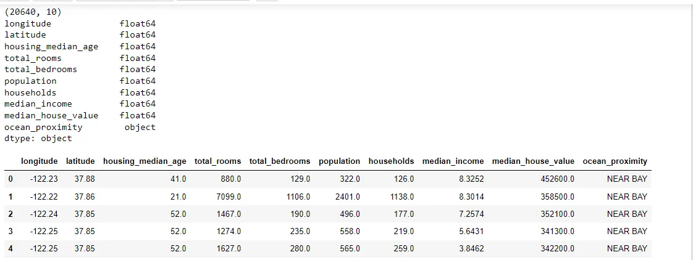
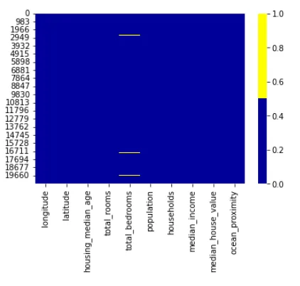
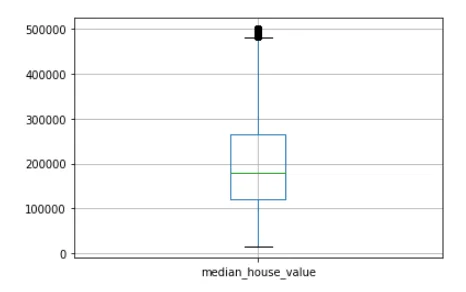

## Data cleansing

## is a process of detecting and rectifying (or deleting) of untrustworthy, inaccurate or outdated information from a data set, archives, table, or database.

## You’ll learn techniques on how to find and clean:

- Missing Data
- Irregular Data (Outliers)
- Unnecessary Data — Repetitive Data, Duplicates and more

## we use the [California Housing Prices](https://www.kaggle.com/camnugent/california-housing-prices) from Kaggle.

About this file

1. longitude: A measure of how far west a house is; a higher value is farther west
2. latitude: A measure of how far north a house is; a higher value is farther north
3. housingMedianAge: Median age of a house within a block; a lower number is a newer building
4. totalRooms: Total number of rooms within a block
5. totalBedrooms: Total number of bedrooms within a block
6. population: Total number of people residing within a block
7. households: Total number of households, a group of people residing within a home unit, for a block
8. medianIncome: Median income for households within a block of houses (measured in tens of thousands of US Dollars)
9. medianHouseValue: Median house value for households within a block (measured in US Dollars)
10. oceanProximity: Location of the house w.r.t ocean/sea

```python
# import packages
import pandas as pd
import numpy as np
```

```python
df = pd.read_csv("california-housing-prices-housing.csv")
print(df.shape)
print(df.dtypes)
df.head()
```



```python
# select numeric columns
df_numeric = df.select_dtypes(include=[np.number])
numeric_cols = df_numeric.columns.values
print(numeric_cols)
```

```python
['longitude' 'latitude' 'housing_median_age' 'total_rooms'
 'total_bedrooms' 'population' 'households' 'median_income'
 'median_house_value']
```

```python
# select non numeric columns
df_non_numeric = df.select_dtypes(exclude=[np.number])
non_numeric_cols = df_non_numeric.columns.values
print(non_numeric_cols)
```

```python
['ocean_proximity']
```

## Missing Data Heatmap

## When there is a smaller number of features, we can visualize the missing data via heatmap.

```python
colours = ['#000099', '#ffff00']
# specify the colours - yellow is missing. blue is not #missing.
sns.heatmap(df.isnull(), cmap=sns.color_palette(colours))
```



The total_bedrooms feature only has little missing values around the 20640th row.

```python
print(df.isnull().sum())
```

```python
longitude               0
latitude                0
housing_median_age      0
total_rooms             0
total_bedrooms        207
population              0
households              0
median_income           0
median_house_value      0
ocean_proximity         0
dtype: int64
```

fill massing values in total_bedrooms with mean.

```python
df['total_bedrooms'] = df['total_bedrooms'].fillna(df['total_bedrooms'].mean())
```

## Irregular data (Outliers)

## Outliers are data that is distinctively different from other observations. They could be real outliers or mistakes.

```python
# box plot.
df.boxplot(column=['median_house_value'])
```



```python
df['median_house_value'].describe()
```

```python
count     20640.000000
mean     206855.816909
std      115395.615874
min       14999.000000
25%      119600.000000
50%      179700.000000
75%      264725.000000
max      500001.000000
Name: median_house_value, dtype: float64
```

## The 500001 value is an outlier.

```python
df[df['median_house_value'] == 500001]['median_house_value'].count()
```

```python
965
```

```python
print((965/ 20640)*100)
```

```python
4.675387596899225
```

we have 4.6% of value 500001 we can decide to remove it or not but I see this prcentage big to remove it effect on analysis.

Unnecessary Data — Repetitive Data, Duplicates and more
remove households column.

```python
df =  df.drop(columns=['households'])
```

Have a look at code: <https://www.kaggle.com/emancs/cleaning-data-in-python>

## References:

## - <https://www.cloverdx.com/blog/data-cleansing-steps-better-data-health>

## - <https://towardsdatascience.com/data-cleaning-in-python-the-ultimate-guide-2020-c63b88bf0a0d>
