### 1- Handling Missing Data
## Missing data occurs commonly in many data analysis applications. One of the goals of pandas is to make working with missing data as painless as possible. For example, all of the descriptive statistics on pandas objects exclude missing data by default. The way that missing data is represented in pandas objects is somewhat imperfect, but it is functional for a lot of users. For numeric data, pandas use the floating-point value NaN (Not a Number) to represent missing data. We call this a sentinel value that can be easily detected:

```python
string_data = pd.Series(['aardvark', 'artichoke', np.nan, 'avocado'])
string_data
string_data.isnull()
```

Output is:

```python
0    False
1    False
2     True
3    False
dtype: bool
```

The built-in Python None value is also treated as NA in object arrays:

```python
string_data[0] = None
string_data.isnull()
```

Output is:

```python
0     True
1    False
2     True
3    False
dtype: bool
```

### *Filtering Out Missing Data*
There are a few ways to filter out missing data. While you always have the option to do it by hand using pandas.isnull and boolean indexing, the dropna can be helpful. On a Series, it returns the Series with only the non-null data and index values:

```python
from numpy import nan as NA
data = pd.Series([1, NA, 3.5, NA, 7])
data.dropna()
```

Output is:

```python
0    1.0
2    3.5
4    7.0
dtype: float64
```

With DataFrame objects, things are a bit more complex. You may want to drop rows or columns that are all NA or only those containing any NAs. dropna by default drops any row containing a missing value:

```python
data = pd.DataFrame([[1., 6.5, 3.], [1., NA, NA],
                     [NA, NA, NA], [NA, 6.5, 3.]])
cleaned = data.dropna()
cleaned
```

Output is:

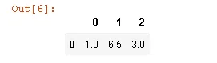

Passing how='all' will only drop rows that are all NA:

```python
data.dropna(how='all')
```

Output is:

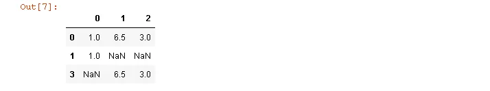

To drop columns in the same way, pass axis=1:

```python
data[4] = NA
data
data.dropna(axis=1, how='all')
```

Output is:

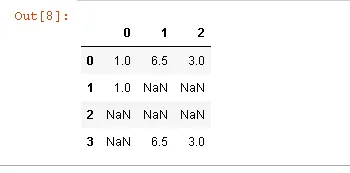

A related way to filter out DataFrame rows tends to concern time series data. Suppose

you want to keep only rows containing a certain number of observations. You can

indicate this with the thresh argument:

```python
df = pd.DataFrame(np.random.randn(7, 3))
df.iloc[:4, 1] = NA
df.iloc[:2, 2] = NA
df
```

Output is:

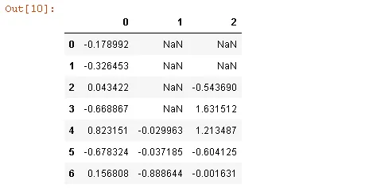

```python
df.dropna()
```

Output is:

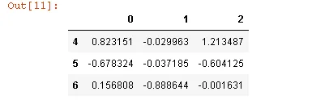

```python
df.dropna(thresh=2)
```

Output is:

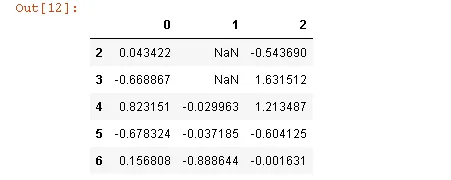

### *Filling In Missing Data*
Rather than filtering out missing data (and potentially discarding other data along with it), you may want to fill in the “holes” in any number of ways. For most purposes, the fillna method is the workhorse function to use. Calling fillna with a constant replaces missing values with that value:

```python
df.fillna(0)
```

Output is:

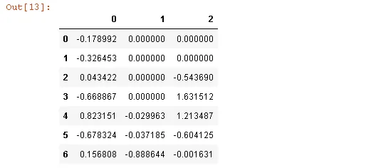

Calling fillna with a dict, you can use a different fill value for each column:

```python
df.fillna({1: 0.5, 2: 0})
```

Output is:

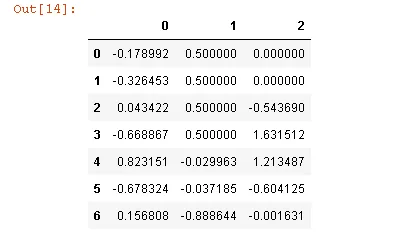

fillna returns a new object, but you can modify the existing object in-place:

```python
_ = df.fillna(0, inplace=True)
df
```

Output is:

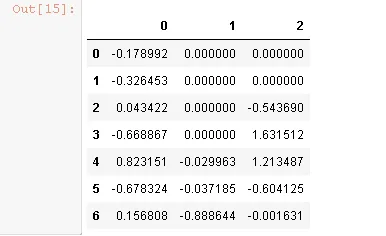

## 2-Removing Duplicates

Duplicate rows may be found in a DataFrame for any number of reasons. Here is an example:

```python
data = pd.DataFrame({'k1': ['one', 'two'] * 3 + ['two'],
                     'k2': [1, 1, 2, 3, 3, 4, 4]})
data
```

Output is:

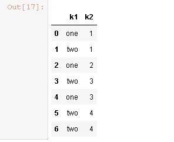

The DataFrame method duplicated returns a boolean Series indicating whether each row is a duplicate (has been observed in a previous row) or not:

```python
data.duplicated()
```

Output is:

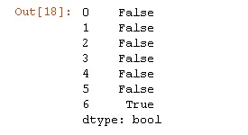

Relatedly, drop_duplicates returns a DataFrame where the duplicated array is False:

```python
data.drop_duplicates()
```

Output is:

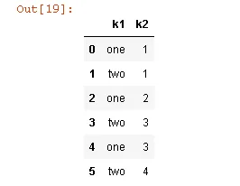

To see more details visit GitHub [here](https://github.com/Amr-Ali/Cleaning-Data-in-Python/blob/main/Cleaning%20Data%20in%20Python.ipynb)
