**Cleaning The Dataset**

Data cleaning is important because, if data is wrong or contains missing values, outcomes and algorithms will be unreliable.

So, we must clean it first before doing any process on the data.

```python
# importing pandas to build a data frame from the csv file
import pandas as pd
```

```python
# Importing the dataset as csv file
myData = pd.read_csv('companies.csv')
```

```python
# Display the first ten rows of dataset
myData.head(10)
```

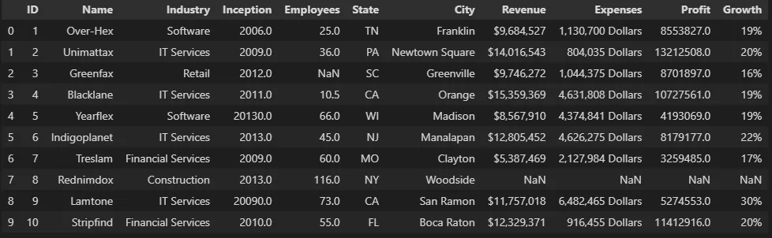

**1. Detecting Null Values**

```python
# Display null values
myData.isna()
```

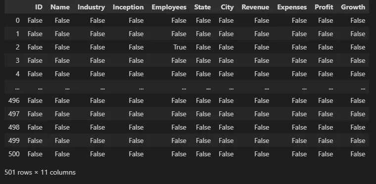

```python
# Display the total number of the null values in every column
myData.isna().sum()
```

```python
ID           0
Name         0
Industry     2
Inception    1
Employees    2
State        4
City         0
Revenue      2
Expenses     3
Profit       2
Growth       1
dtype: int64
```

```python
myData.isna().sum().sum()
```

```python
17
```

**2.1. Filling Null Values**

```python
# Filling all null values with a static number such as 0
demo1 = myData.fillna(value=0)
demo1.head(10)
```

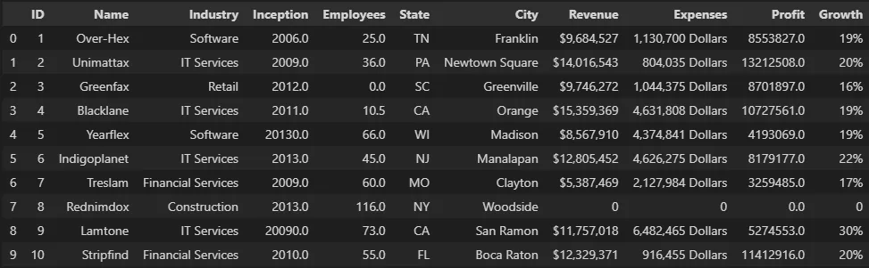

```python
# Filling each null value with its previous value
demo2 = myData.fillna(method='pad')
demo2.head(10)
```

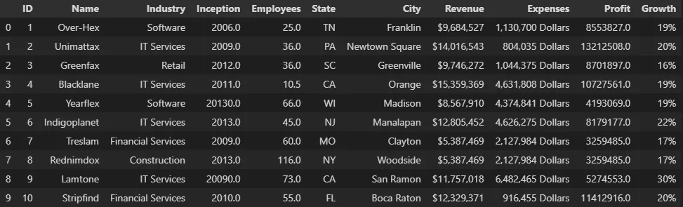

```python
# Filling each null value with its following value
demo3 = myData.fillna(method= 'bfill')
demo3.head(10)
```


```python
# Filling numeric values with the mean value in a specific column
mn = myData["Employees"].mean()
myData['Employees'].fillna(mn, inplace=True)
myData.head(10)
```

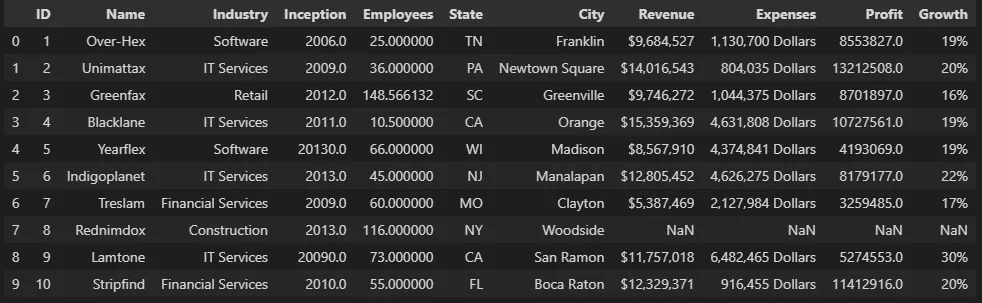

```python
myData = pd.read_csv('companies.csv')

# Filling numeric values with the median value in a specific column
med = myData["Employees"].median()
myData["Employees"].fillna(med, inplace = True)
myData.head(10)
```

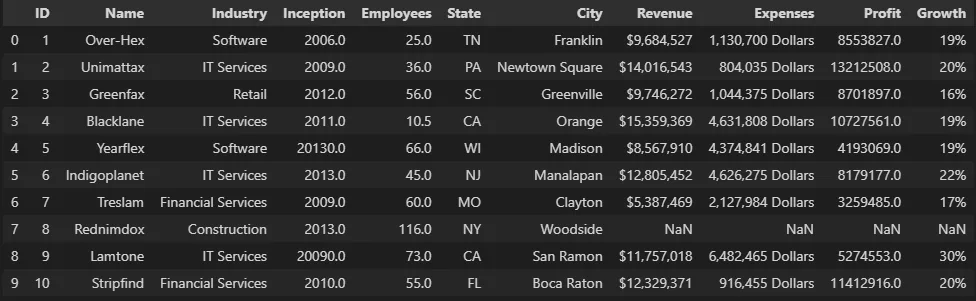

```python
myData = pd.read_csv('companies.csv')

# Filling numeric values with the mode value in a specific column
mod = myData["Employees"].mode()[0]
myData["Employees"].fillna(mod, inplace = True)
myData.head(10)
```

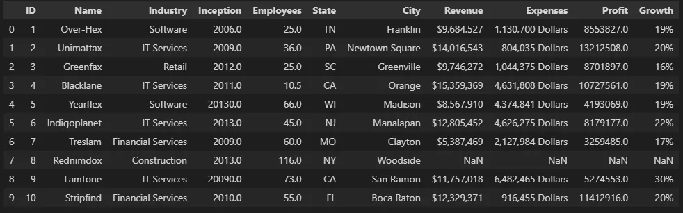

**2.2. Drop All Null Values Instead Of Filling It**

```python
myData = pd.read_csv('companies.csv')

# Drop all null values
data = myData.dropna()
data.head(10)
```

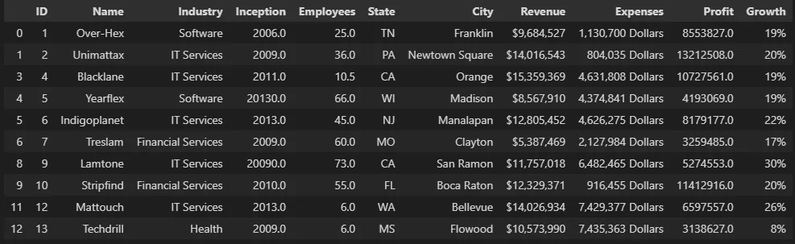

```python
# Display the null values detection in each column
data.isna().sum()
```

```python
ID           0
Name         0
Industry     0
Inception    0
Employees    0
State        0
City         0
Revenue      0
Expenses     0
Profit       0
Growth       0
dtype: int64
```

**3. Wrong Formatted Data**

**Note:** null values can be considered as wrong formatted data That we can easily fill or drop from the dataset as previous.

We can solve the wrong formatted data by converting the column into the same data format. In our dataset, we have a float number in the 'Employees' column and its third-row (after dropping nulls) has 10.5 employees which is not logical. So, we convert it to integer format to solve this logical error.

```python
data['Employees'] = data['Employees'].astype(int)

# The 'Inception' year also must be integer, so we convert it also.
data['Inception'] = data['Inception'].astype(int)
data.head(10)
```

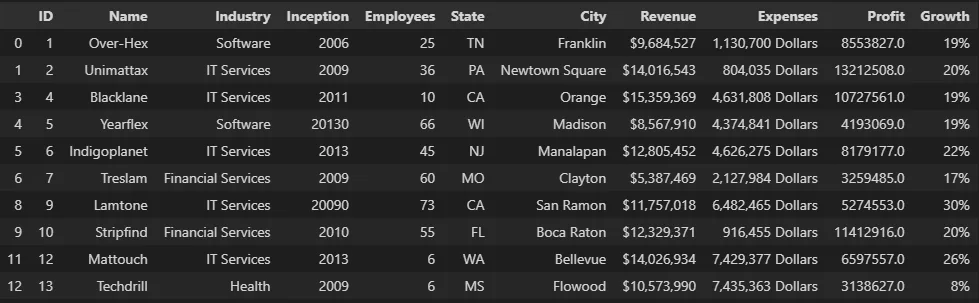

**4. Wrong Data**

It needn't be null values or wrong formatted data, it can be wrong like if someone writes "20000" instead of "2000" in the Inception year, although we are still in the 2022 year.

if the data set is small, you can look at it and change the wrong data one by one, but the huge ones need some sophisticated code blocks to detect and correct it, or you can drop it. In our dataset, we note that the fifth and the ninth rows have wrong data in the 'Inception' column so, we need to correct it.

```python
data.loc[4, 'Inception'] = 2013
data.loc[8, 'Inception'] = 2009
data.head(10)
```

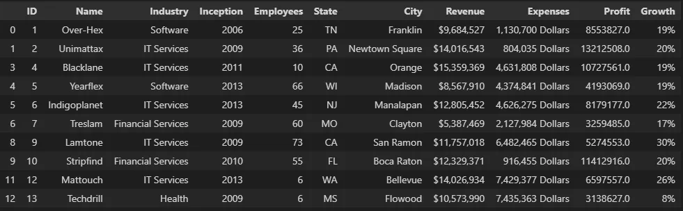

**5. Removing Duplicates**

Duplicated rows are more than one row that has the same data. That can affect the processing of the data badly.

We need to check if there are any duplicates or not using duplicated() that return 'True' if the row is duplicated and 'False' otherwise.

```python
data.duplicated()
```

```python
0      False
1      False
3      False
4      False
5      False
       ...
496    False
497    False
498    False
499    False
500     True
Length: 489, dtype: bool
```

```python
data.loc[4, 'Inception'] = 2013
data.loc[8, 'Inception'] = 2009
data.head(10)
```

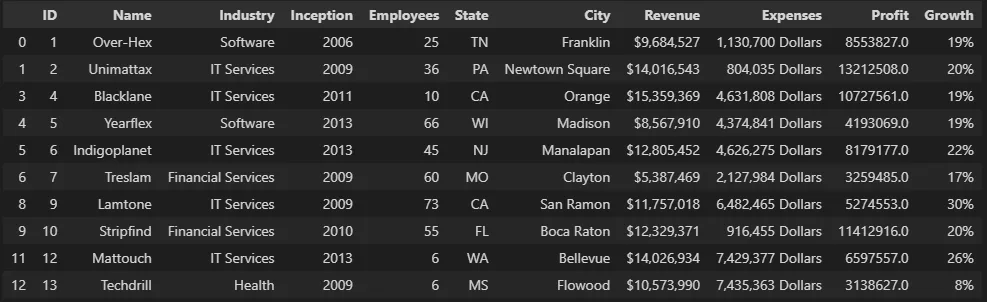

We note that the row with ID 500 is duplicated. So, we need to drop the duplicated row

```python
data.drop_duplicates(inplace = True)
data.duplicated()
```

```python
0      False
1      False
3      False
4      False
5      False
       ...
495    False
496    False
497    False
498    False
499    False
Length: 488, dtype: bool
```

So, **finally**, we can say that we clean the dataset and now we can move to the next step.

That's it, I hope this article was worth reading and helped you acquire new knowledge no matter how small.

Feel free to check up on the [notebook](https://github.com/MariamAlsaedy/Data-Insight-Scholarship-Article-3/blob/main/DataCleaning.ipynb). You can find the results of code samples in this post.
