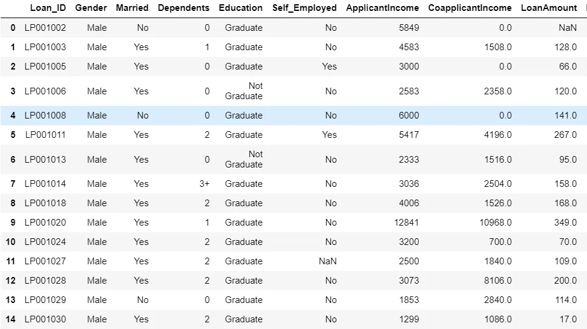
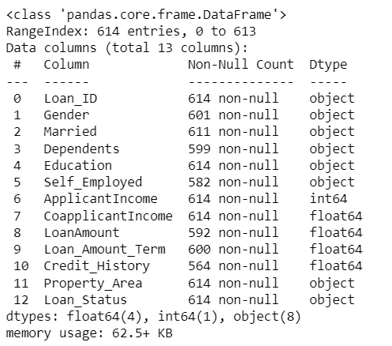
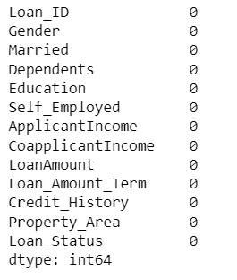
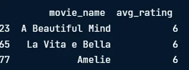
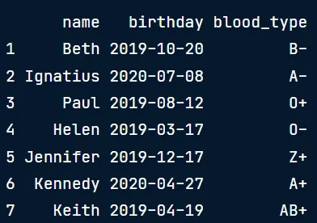

## Having clean data will ultimately increase overall productivity and allow for the highest quality information in your decision-making.

## Dirty data can appear because of duplicate values, mis-spellings, data type parsing errors and legacy systems.we are going to explore some popular cleaning data method.

### 1)Data type constrains
(we should make sure we have the correct datatype)

importing the needed libraries before we preprocess.

```python
import pandas as pd
import numpy as np
```

reading the csv file and displaying the first 15 rows

```python
df = pd.read_csv('loan_data_set.csv')
df.head(15)
```

output:



then we bring the information of this dataframe.

```python
df.info()
```

output:



we find that we have in the **Dependents** column the plus sign and its datatype is object which pandas uses to store strings.

what we should do to clean data is to extract the + sign and turn this column datatype into intger.

```python
#Remove + sign
df['Dependents'] = df['Dependents'].str.strip('+')
df['Dependents'] = df['Dependents'].astype('int')
```

**2) Null values**

we drop the null values if they contain small amout from the overall data.inplace = true means we update the dataset with dropping

```python
df.dropna(inplace = True)
df.isnull().sum()
```

output:



## **3) uniquness constrains** (duplicated values)

when multiple rows have the same information in dataframe

# by .duplicated method we can remove duplicated values , it has two arguments

subset = list of column names to check for duplicates

keep : wether to keep first('first') , last('last') , all(false) duplicate value

```python
#couldnot find a dataset with duplicated rows so here an illustration
columns_name = ['firstName' , 'lastName' , 'age']
#keep all duplicates
duplicates = df.duplicated(subset =columns_name ,keed = False )
```

```python
#the output may have have complete duplicates or semi duplicates to handle complete duplicates we use
df.drop_duplicates(inplace = True)
```

## 4)Data range constrains
we have a dataset of movies with their respective average rating from a streaming service. The rating can be any integer between 1 an 5.but we see that there are a few movies with an average rating of 6, which is well above the allowable range.

how to deal with out of range data?

1)drop data(only drop data when a small proportion of your dataset is affected by out of range values)

2)setting custom minimums or maximums to your columns

3)treat as missing

```python
df = pd.read_csv('movies.csv')
df.head(10)
```

```python
#output movies with ratings more than 5
df[df['avg_rating']>5]
```



this drops values more than 5

```python
#drop values using filtering
df df[df['avg_rating']<=5]
```

we can also change the outer range values into a hard limit.

```python
#convort any value more than 5 to 5
df.loc[df['avg_rating']>5,'avg_rating'] =5
```

## 5)Membership constraints
To run machine learning models on categorical data, they are often coded as numbers.We can have inconsistencies in our categorical data for a variety of reasons. This could be due to data entry issues with free text vs dropdown fields, data parsing errors and other types of errors. we can 1)drop the rows with incorrect categories.

2) attempt remapping incorrect categories to correct ones.

```python
study_data = pd.read_csv('study.csv')
study_data.head()
```

output:here we find an inconsistant category which is z+ , we dont have a blood type z+ , we know this information because we have a dataset with all possible values of bloodtype.



set() stores unique values , and we take the difference between our study_data and categories datasets.

```python
inconsistant_catgories = set(study_data['blood_type']).difference(categories['blood_type'])
print(inconsistant_catgories)
```

output:

{'z+'}

We then find the inconsistent rows by finding all the rows of the blood_type columns that are equal to inconsistent categories.

```python
inconsistant_rows = study_data['blood_type'].isin(inconsistant_catgories)
```

then we subset these boolean values from our datasets to print the incoinsistant rows

```python
study_data[inconsistant_rows]
```
