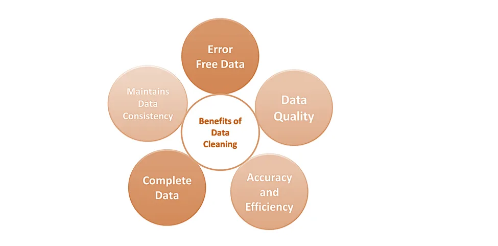
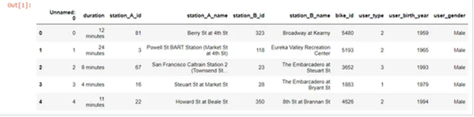
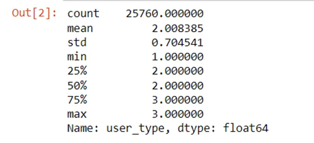
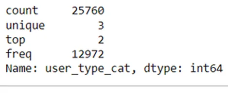

###### Photo Courtesy: Analyticsvidhya

**Data cleaning in Python**

It is an affirmative fact that cleaning data is an instrumental process behind successful data analysis, as handling data that is not cleaned properly can be accountable for inaccurate data analysis or machine learning model, resulting in the inaccurate deduction. In this article, we will discuss the different essential aspects of data cleaning in Python.

**How do we check data is clean or qualified?**

Five characteristics of data should be judged to determine its quality. These five characteristics are:

· Validity

· Accuracy

· Completeness

· Consistency

· Uniformity

**What is data cleaning? What are the steps of data cleaning?**

**Data cleaning** is the process of fixing or removing incorrect, or incomplete data within a dataset. Although there is no absolute way to assert the steps in the data cleaning process, it is important to create a template for one’s data cleaning process in order to remain aware of the issues that have been searched for removing purposes. However, **basic and essential steps** for data cleaning are presented as:

1. Remove duplicate or irrelevant data

2. Fix structural errors

3. Filter unwanted outliers

4. Handle missing data

5. Validate and QA

Through our data analysis journey, we might get to learn about different data cleaning processes, such as **data type constraints**, **inconsistent categories**, **cross-field validation**, and **range constraints**.

The process known as **Data type constraints** has been described below.

**Data Type Constraints**

While doing data analysis, one might encounter different types of data, such as text, integers, decimals, dates, zip codes, etc. It is easier to manipulate these various data types in **Python**, as **Python** has specific data type objects for various data types. In order to have the correct insights of the data while initiating data analysis, it should be made sure that the variables have the correct data types. For example, we can work with a datasheet about ride-sharing with regards to data type constraints, while the data constitutes information about each trip having the features stated below.

- **rideID**
- **duration**
- **source station ID**
- source **station name**
- **destination station ID**
- **destination station name**
- **bike IDF**
- **user type**
- **user birth year**
- **user gender**

**The data are presented as:**

```python
import numpy as np
import pandas as pd
ride_sharing_Data = pd.read_csv(ride_sharing_new.csv)
ride_sharing_Data.head()
```



**String to Numerical**

The first thing data **analysts notice** is the **duration column so that** you can **see** the values **​​that** contain **"minutes" that are** not **suitable** for analysis. **This** feature **should** be a pure **numeric** data type, not a string.

**Firstly, removing the text "minutes" from each value**

- We will use the function **strip** from the **str** module
- and store the new values in a new column: **duration_trim**

```python
ride_sharing_Data['duration_trim'] =ride_sharing_Data['duration'].str.strip('minutes')
```

**Secondly, converting the data type to integer**

- We will apply the **as type** method on the column **duration_trim**
- and store the new values in a new column: **duration_time**

```python
ride_sharing_Data['duration_time'] =ride_sharing_Data['duration_trim'].astype('int')
```

**Lastly, Using the assert statement**

```python
assert ride_sharing_Data['duration_time'].dtype=='int'
```

This line of code is not generating any output, which is a good thing.

We can now derive insights from this feature, like what is the average duration for the rides.

**Numerical to Categorical**

Let's check the user_type column to see the data type.



```python
ride_sharing_Data['user_type'].describe()
```

You see!! Pandas is treating this as a **float!** The good thing is. it's categorical**.**

The user_type column contains information on whether a user is taking a free ride and takes on the following values:

(1) for free riders.

(2) for pay per ride=

(3) for monthly subscribers.

This can be changed by changing the data type of this column to **categorical** and storing it in a new column: **user_type_cat**

```python
ride_sharing_Data['user_type_cat'] =ride_sharing_Data['user_type'].astype('category')
```

Let's check with an assert statement:

```python
assert ride_sharing_Data['user_type_cat'].dtype=='category'
```

Let's use describe to see the change

```python
ride_sharing_Data['user_type_cat'].describe()
```



Wow! the top category is 2, which means most of the user uses pay per ride.

Problems with data types are solved!

Find my Github Code [here](https://github.com/rubayat-tithi/Data-Cleaning-using-Python-Pandas/blob/main/data_clean.py).

**Conclusion**

In this article, one of the data cleaning methods has been described with an example. This can result in exposure to the process of diagnosing dirty data and fixing the process of incorrect data types. Cleaning data is an important step to perform exact calculations and accurate models in the machine learning field.

Thank You for reading this article.

**Acknowledgment**:

1. [DataInsightOnline](http://datainsightonline.com) Data Scientist Program
2. [Datacamp](http://datacamp.com)

**Reference**:

I took help from [this](https://www.datainsightonline.com/post/three-important-data-cleaning-methods-in-python-data-analysis) article.

Find my Github Code [here](https://github.com/rubayat-tithi/Data-Cleaning-using-Python-Pandas/blob/main/data_clean.py).
