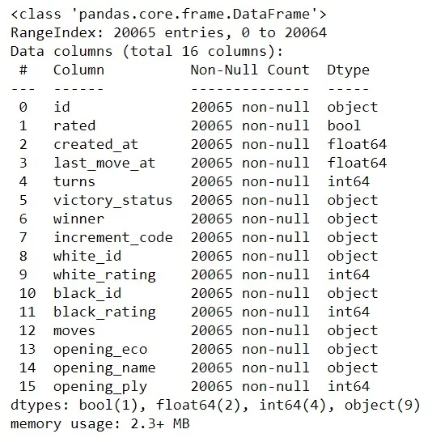
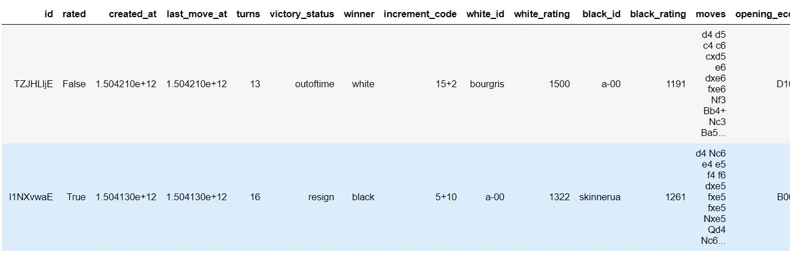
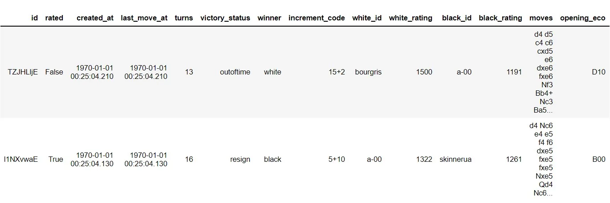
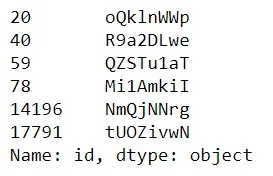
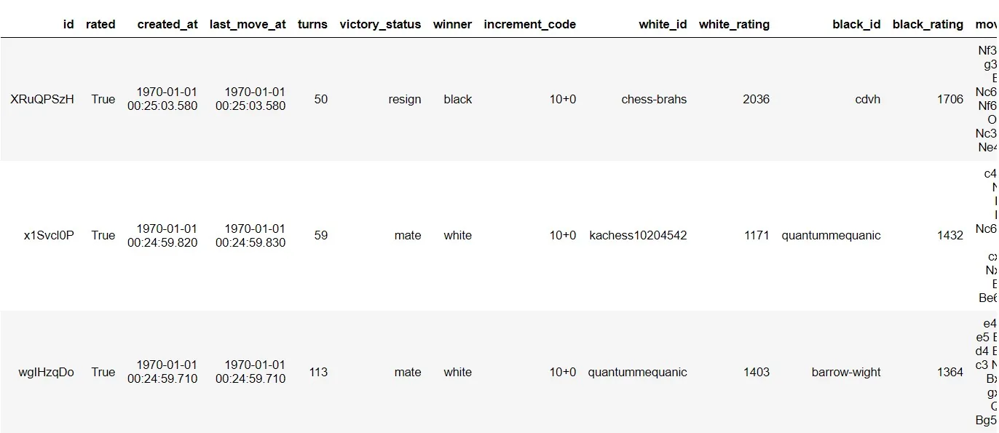
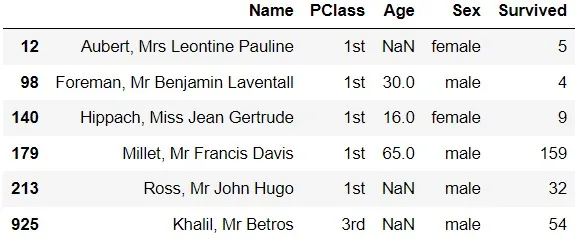
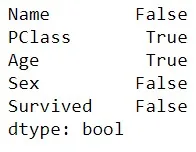
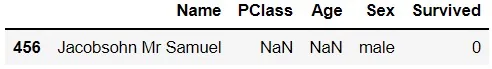
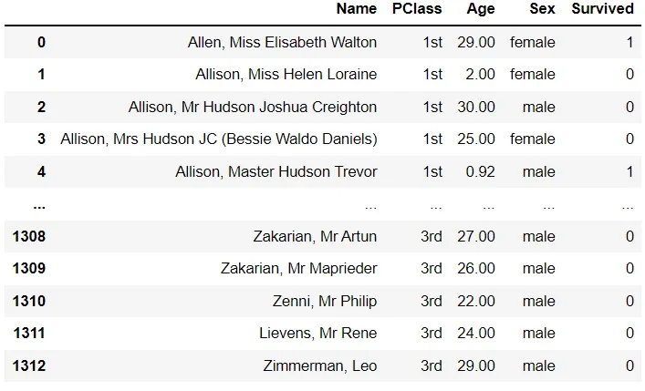

Cleaning data is a mandatory process for every data scientist to perform. Dealing with data not properly cleaned can lead to inaccurate data analysis or machine learning model. Which results to drawing inaccurate conclusions. In this tutorial, we will learn how to identify, diagnose, and treat a variety of data cleaning problems in Python. We will deal with improper data types, check that out data is in the correct range, handle missing data, and more!


## Data type constraints

When working with data, there are various types that we may encounter along the way. We could be working with text data, integers, decimals, dates, zip codes, and others.
So, we need to make sure our variables have the correct data types, otherwise we risk compromising our analysis. Luckily, Python has specific data type objects for various data types! Let's take, for instance, chess games dataset imported from [Kaggle](https://www.kaggle.com/datasnaek/chess).

```python
import pandas as pd

df = pd.read_csv('games.csv')#, index_col=0)

df.info()

df.head(2)
```





As we can see, our dataset contains nine column of data type 'Object'. They are supposed to be strings. We have to convert all object types to strings.

For that, we need to call the pandas function pandas.Series.astype(dtype). Here, the dtype needed is str. Since there are nine columns to be converted, we need a loop.

```python
for column in df:
    if str(df[column].dtype) == 'object':
        df[column] = df[column].astype(str)
```

Furthermore, we can notice that the two columns "created_at" and "last_move_at" are floats.

Obvioulsy, they are supposed to have Date as data type. To do that, we should apply pandas.to_datetime method.

```python
df['created_at'] = pd.to_datetime(df['created_at'])
df['last_move_at'] = pd.to_datetime(df['last_move_at'])
```

When we apply the head method, we can see the results.

```python
df.head(2)
```



## Range constraints

Obviously, the rating of a player in a match can not be negative. After creating a histogram with matplotlib, we see that there are a few games with white players having ratings below zero.

This is mostly because of typo error. We should treat these cases and change them to positive numbers.

```python
import matplotlib.pyplot as plt
plt.hist(df[df['white_rating']<0]['white_rating'])
plt.title('Negative white rating of games')
```


```python
df['white_rating'] = abs(df['white_rating'])
df['white_rating'].min() # >0
```

784

We also see the same problem with black rating.

```python
print(df[df['black_rating']<0]['id'])
```



```python
df['black_rating'] = abs(df['black_rating'])
assert df['black_rating'].min() > 0  # No output
```

## Uniqueness constraints

Duplicate values usually happen because of data entry and human error or join or merge errors.

Let's see whether our data frame contains duplicate values using the method pandas.DataFrame.duplicated

```python
duplicates = df.duplicated(keep = 'first') # keeping only the first row
df[duplicates].head(3)
```



The complete duplicates can be treated easily. All that is required is to keep one of them only and discard the others.

This can be done with the dot-drop_duplicates() method.

```python
df.drop_duplicates(keep='first', inplace=True)
```

```python
duplicates = df.duplicated(keep = False) # keeping only the first row
assert(len(df[duplicates])==0) # No output
```

## Categories and membership constraints

For this type of problem, we will be dealing with an obvious categorical data which is the survival status. We will work on the titanic dataset.

Before cleaning our data, we need to import the csv file and see what's inside.

```python
df = pd.read_csv('Titanic.csv')

survived = {0, 1}
df[~df['Survived'].isin(survived)]
```



We need to get rid of these rows.

```python
df = df[df['Survived'].isin(survived)]
```

## Handle missing data

When working on datasets, we usually face the problem of completeness and missing data. Like all of the previous constraints, it can be caused by technical error or human error.

To see whether our dataframe contain missing values we apply DataFrame.isna().any() method.

```python
df.isna().any()
```



We clearly see missing data in PClass and Age columns.

We also can plot missing values by columns to understand more the situation.

```python
df.isna().sum().plot(kind="bar")
plt.title('Number of null data by column')
plt.show()
```


```python
df[df['PClass'].isna()]
```



To handle this case, we coulds either delete rows that contains missing informations or raplace NaN values by the mean of that column if it is numerical.

```python
df['Age'] = df['Age'].fillna(df['Age'].mean())
```

```python
len(df[df['Age'].isnull()])
```

0

```python
df.dropna()
```



## Conclusion
Cleaning data is an important step to perform exact calculations and accurate models for machine learning and other uses.

[Github](https://github.com/Jihed503/data_insight_cleaning_Data_in_Python)
