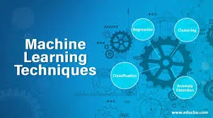
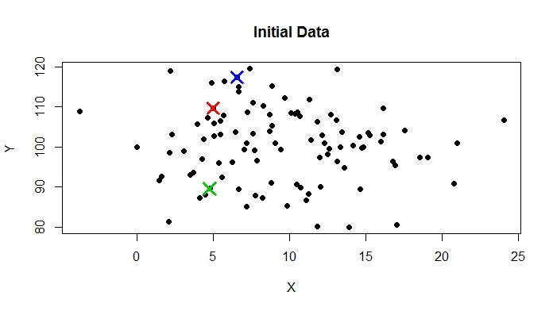
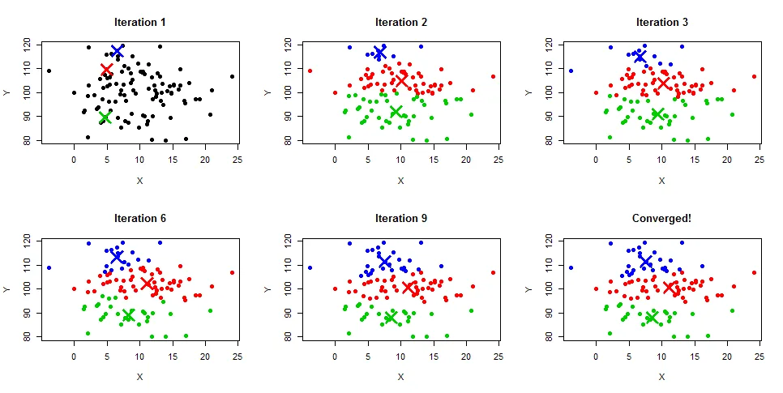
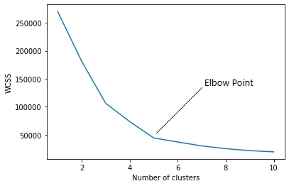
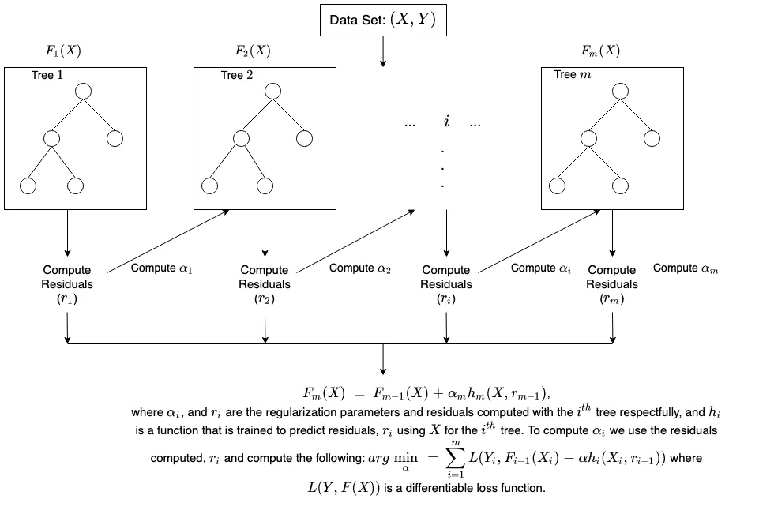

*Machine learning*

In this article, we are going to look at two machine learning techniques and understand how these work.

1. Clustering
2. XGBoost

**CLUSTERING**

Clustering is an unsupervised technique in which data points are grouped together based on their similarities.

The groups formed are called clusters or subsets.

There are a variety of different clustering algorithms, which are

1. k-*means clustering* - data set is classified through a certain number of pre-determined clusters or 'k' clusters
2. *Hierarchical clustering* - this clustering technique uses two approaches, Divisive and agglomerative. Agglomerative considers each observation as a single cluster then groups similar data points until fused into a single cluster and Divisive works the opposite.
3. *Fuzzy C means clustering -* the working of this algorithm is similar to that of the k-means algorithm, but with this, the data point can be grouped into more than one cluster
4. *Density-Based* Spatial *clustering -* this algorithm is most useful in application areas where we require non-linear cluster structures, purely based on density.

Here in this article, we will focus on the k-means clustering algorithm, how it works and its advantages and disadvantages.

**K-Means Clustering**

You might be wondering what the k in 'k-means' means; well, the k defines the number of clusters/subset that will be formed, say if we want to form 5 clusters from the data, then k = 5, if six clusters, then k = 6 e.t.c

the k-means algorithm mainly performs two tasks.

\* Selects an optimal value for k centre points using an iterative process

\* Assigns each data point to each closest k-centre.

***How does the k-means clustering work?***

K-means clustering allocates each data point to the nearest centroid, which is made up of K separate randomly-initiated points in the data. After all of the points have been allocated, the centroid is moved to the average of all of them. The process is then repeated: each point is allocated to the centroid closest to it, and centroids are shifted to the average of the points assigned to them. When no point's assigned centroid changes, the algorithm is done.

Since there are no target variables in unsupervised learning, we're just letting the patterns in the data become more apparent.

**Visualizing K-means Clustering**

this is how a typical data set in it's initial stage will look like

- Here are 50 data points with three randomly initiated centroids.

- Iteration 2 shows the new location of the centroid centres.
- Iteration 3 has a handful more blue points as the centroids move.
- Jumping to iteration 6, we see the red centroid has moved further to the right.
- Iteration 9 shows the green section is much smaller than in iteration 2, blue has taken over the top, and the red centroid is thinner than in iteration 6.
- The 9th iteration’s results were the same as the 8th iteration’s, so it has “converged”.

**But how is the k-value selected?**

We now know what the 'k' in k-means clustering means, but how do we get an optimal value for k since the performance of this clustering algorithm is dependent on the value of k.

There are numerous ways in which we can determine the number of clusters (k), but we will discuss the commonly used method which is the *elbow method*.

*Elbow Method*

The elbow method uses WCSS( Within Cluster Sum of Squares) which accounts for the total variations within a cluster.

*Steps involved in elbow method*

1. k-means clustering is performed for different values of k (from 2-10)

2. WCSS is calculated for each cluster

3. A curve is plotted between WCSS values and the number of clusters k.

4. If a sharp point or a bend that looks like an arm is seen, then that point is considered the best value of k.

In the above figure, the optimal value will be 5 as seen from the elbow plot.

**Advantage of k-means clustering**

1. k-means produces tighter clusters, especially if the clusters are globular

2. Easy to implement

3. With a large number of variables, k-means might be computationally faster than hierarchical clustering (if k is small)

**Disadvantages of k-means clustering**

1. Difficult to find the optimal value for k

2. Initial seeds have a strong impact on the final results

**. . .**

**XGBoost**

***Gradient Boosting***refers to a class of ensemble machine learning algorithms used for classification and regression modeling problems.

Ensembles are constructed from decision tree models.

trees are added to the ensemble and fit to correct the prediction errors made by prior models.

This is a type of ensemble machine learning model referred to as boosting.

XGBoost is a popular and efficient open-source implementation of the gradient boosted trees algorithm.

Gradient boosting is a supervised learning algorithm that predicts a target variable by combining the estimates of a set of simpler, weaker models.

XGBoost minimizes a regularized (L1 and L2) objective function that combines a convex loss function (based on the difference between the predicted and target outputs) and a penalty term for model complexity (in other words, the regression tree functions).

The training proceeds iteratively, adding new trees that predict the residuals or errors of prior trees that are then combined with previous trees to make the final prediction. It's called gradient boosting because it uses a gradient descent algorithm to minimize the loss when adding new models.

because of how efficient and fast this algorithm is, it is widely used in data science competition for best performance.

**CONCLUSION**

In this article, we learnt about two types of ML algorithms, K-means algorithm, how efficient it is, and XGBoost algorithm.

Thank you for reading !
