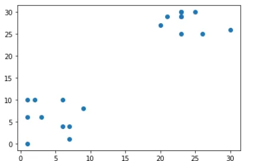
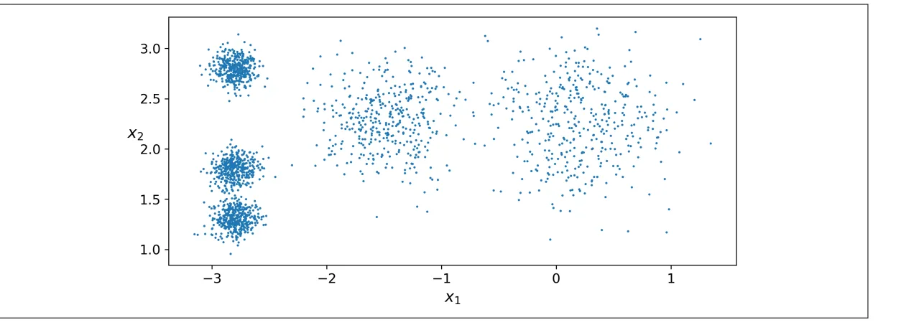
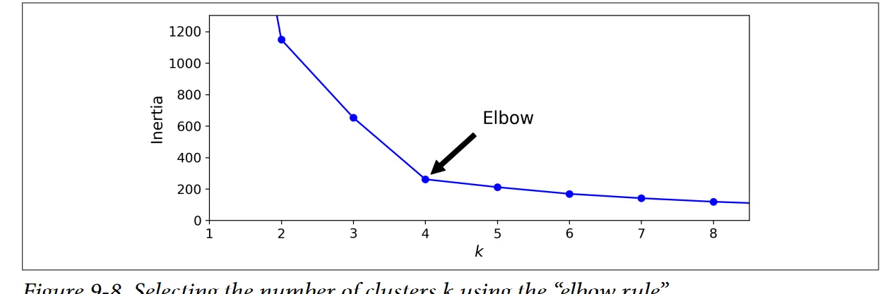
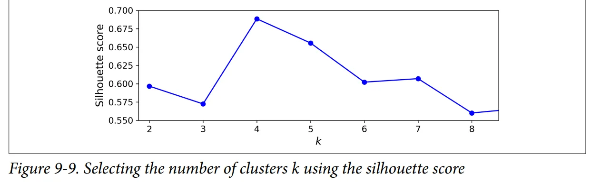
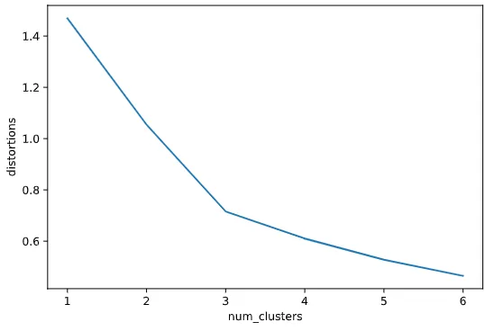
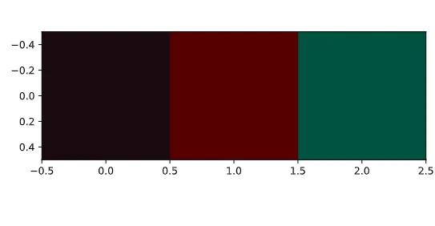

### How does Google News classify articles?

By using unsupervised machine learning algorithm google

Match frequent terms in articles to find similarity between this terms and put them in the same group .Another example of clustering is segmentation of customers based on their spending habits.

### Clustering :It is often used as a data analysis technique for discovering interesting patterns in data, such as groups of customers based on their behavior.

you can cluster your customers based on their pur‐ chases, their activity on your website, and so on. This is useful to understand who your customers are and what they need, so you can adapt your products and marketing campaigns to each segment. For example, this can be useful in recommender systems to suggest content that other users in the same cluster enjoyed.

```python
x = [9, 6, 2, 3, 1, 7, 1, 6, 1, 7, 23, 26, 25, 23, 21, 23, 23, 20, 30, 23]
y = [8, 4, 10, 6, 0, 4, 10, 10, 6, 1, 29, 25, 30, 29, 29, 30, 25, 27, 26, 30]
```

```python
# Create a scatter plot
plt.scatter(x, y)

# Display the scatter plot
plt.show()
```



K-Means :



we have this data and we want to cluster it (make it groups) so we will find the center of each blob's and assign each blob to the nearest one to it

> Note: You need to identify the number of clusters

Elbow Method:This technique for choosing the best value for the number of clusters is rather coarse



n_clusters = 4



n_clusters = 4,5 is much better than 6,7

#### How many dominant colors?


#### image consist of pixel

#### pixel contain 3 colors (red, green, blue )

```python
# Import image class of matplotlib
import matplotlib.image as img

# Read batman image and print dimensions
batman_image = img.imread('batman.jpg')
print(batman_image.shape)

# Store RGB values of all pixels in lists r, g and b
for pixel in batman_image:
    for temp_r, temp_g, temp_b in pixel:
        r.append(temp_r)
        g.append(temp_g)
        b.append(temp_b)
```

```python
distortions = []
num_clusters = range(1, 7)

# Create a list of distortions from the kmeans function
for i in num_clusters:
    cluster_centers, distortion = kmeans(batman_df[['scaled_red', 'scaled_blue', 'scaled_green']], i)
    distortions.append(distortion)

# Create a DataFrame with two lists, num_clusters and distortions
elbow_plot = pd.DataFrame({'num_clusters': num_clusters, 'distortions': distortions})

# Create a line plot of num_clusters and distortions
sns.lineplot(x='num_clusters', y='distortions', data = elbow_plot)
plt.xticks(num_clusters)
plt.show()
```



n_clusters = 3 so it mains this image contain 3 colors so what are this colors?

```python
# Get standard deviations of each color
r_std, g_std, b_std= batman_df[['red', 'green', 'blue']].std()

for cluster_center in cluster_centers:
    scaled_r, scaled_g, scaled_b = cluster_center
    # Convert each standardized value to scaled value
    colors.append((
        scaled_r * r_std / 255,
        scaled_g * g_std / 255,
        scaled_b * b_std / 255
    ))

# Display colors of cluster centers
plt.imshow([colors])
plt.show()
```



Resourses : 1: file:///F:/mine/ITI/machien/2-Aur%C3%A9lien-G%C3%A9ron-Hands-On-Machine-Learning-with-Scikit-Learn-Keras-and-Tensorflow_-Concepts-Tools-and-Techniques-to-Build-Intelligent-Systems-O%E2%80%99Reilly-Media-2019.pdf

2:https://campus.datacamp.com/courses/cluster-analysis-in-python/clustering-in-real-world?ex=4
