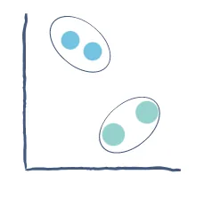

**Clustering :** is a classic machine learning-based data mining technique that divides groups of abstract objects into classes of similar objects.

Clustering allows the data to be divided into several subsets. Each of these clusters consists of data objects with high inter-similarity and low within-similarity.

Clustering methods can be classified into the following categories:

- Partitioning method
- Hierarchical method
- Density-based method
- Grid-based method
- Model-based method
- Constraint-based method

## *Clustering Algorithms*
### K-means clustering algorithm

K-means clustering is the most commonly used clustering algorithm. It is a centroid based algorithm and the simplest unsupervised learning algorithm.

This algorithm attempts to minimize the variance of data points within a cluster. This is also how most people are introduced to unsupervised machine learning.

### DBSCAN clustering algorithm

DBSCAN stands for density-based spatial clustering of applications with noise. It is a density-based clustering algorithm, unlike k-means.

This is a good algorithm for finding outliners in a dataset. It finds arbitrarily shaped clusters based on the density of data points in different regions. It separates regions by low-density areas so that it can detect outliers between high-density clusters.

This algorithm is better than k-means when it comes to working with oddly shaped data.

### Gaussian Mixture Model algorithm

One of the problems with k-means is that the data must follow a circular format. The way k-means calculates the distance between data points has to do with a circular path, so non-circular data is not grouped correctly.
