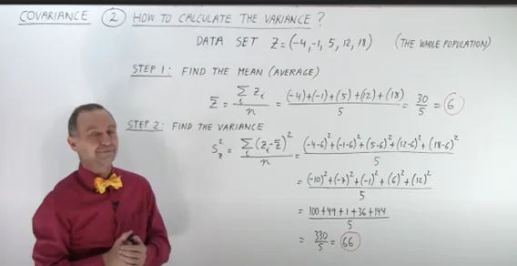
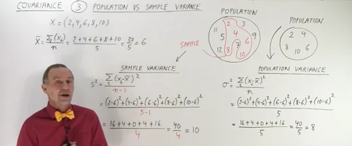
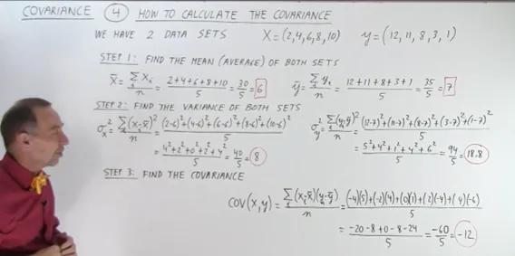
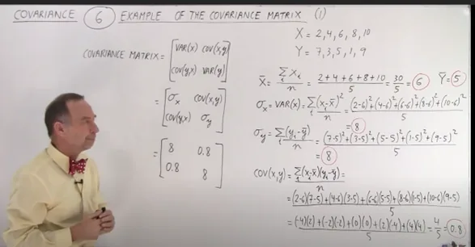
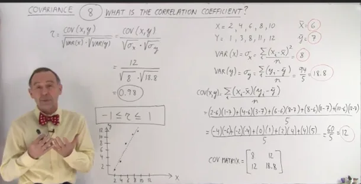
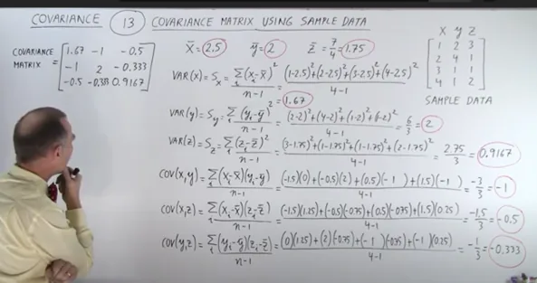
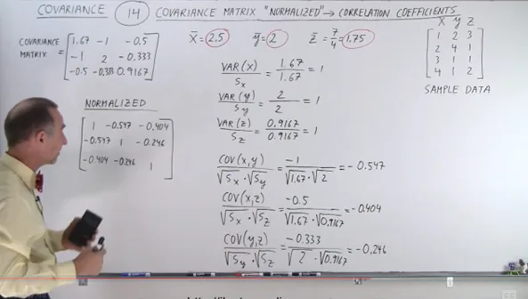

**Why is it important?**

**Covariance:**

There is a strong relationship between Covariance and correlation

The concept of variance: s^2 is a measure of how spread are the numbers of a data set.

Small variance: points are closed together, and the opposite is true.

And variance is:

We may calculate the variance for x and y as well, both data sets.

Covariance compares two data sets, x data set with y data sets, for example does one data set increases while the other does not, and so on.

It is the measure of how the trends of two data sets are related:

**The covariance is:**

But we might not be aware of the right interpretation of covariance, for example if the result is 12 could it be very big number, very small, how much these data sets are related, how much they have the same trends, we do not have sense of this.

Thus, we need correlation constant r, which has the same definition but with -1 < r < 1.

If it is very close to the positive one, this means the covariance very strong relationship between the two data sets, if it is close to the -1 they increase and decrease in the opposite direction.

R = cov(x,y) / √s2x √s2y.

The covariance of both data sets divided by the square root of the variances of the both data sets.

The more numbers we pull out of the population the close the sample variance becomes to the population variance, which means bigger samples makes the term n-1 ineffective, which means bigger samples gives results similar to if we used the whole population.

Covariance will be calculated for two data sets, logically it cannot be done with one data set.

The covariance matrix: Is an n x n matrix, n is the number of data sets. Two data sets mean n equals 2.

Diagonal is the variances, the off-diagonals are the covariance.

Example in a screenshot:

In this example the teacher computes for the mean and the variances, then put them in the covariance matrix, where the cov(x,y) is the same as the cov(y,x).

**Correlation constant:**

**It measures how much the two variables are related, the strength of the relationship between their movements.**

**It is calculated by dividing the covariance with the multiplication of the square roots of the variances of the two variables.**

If you get correlation number either 1 or -1 this means the data sets are perfectly correlated the difference is in the direction.

**An example using sample data:**

**calculate the variances and the covariances:**

It still difficult to see the relationship between them in the matrix only, you still need to calculate the correlation constant.

**Then, we normalize the matrix,**

We calculate the correlation coefficient for the data itself – compared to itself- for the variance which yields 1 in every case.

Also, we find the correlation constant for the covariance:

All of them are negative which means always one is increasing and the other is decreasing, the bigger the number the more the correlation.

**Final Thoughts:**

we see from the detailed work by hand by [Michel van Biezen](https://www.youtube.com/c/MichelvanBiezen), we can see clearly that covariance matrix is vectors for each variable, and it must be normalized for the relationship to be understood.

it is a major factor in calculating gaussian distribution when using gaussian mixture models for supervised clustering.

The main reference for this article which I highly recommend to understand stats and probs thoroughly, this YouTube playlist by **Michel van Biezen:**

[(2) COVARIANCE AND VARIANCE - YouTube](https://www.youtube.com/playlist?list=PLX2gX-ftPVXWHdoWSeshfEbRarb_LiX-e)
