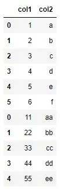
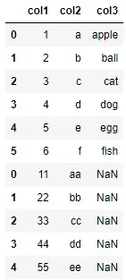
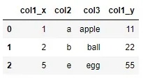
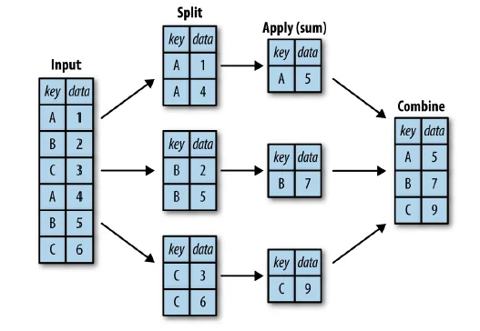
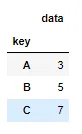
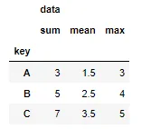
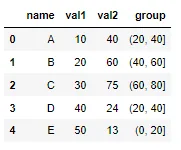
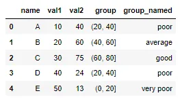

While analyzing data, there might arise situations where the data required is available in different tables. In such situations, one needs to combine the data from various sources for proper analysis and interpretation. Today, we will be looking in two such functions available in pandas - Concat and Merge.

### Pandas.Concat

The concat function in pandas allows to combine data one on top of other (by default).This is not a issue when we combine data of same shape and size. Let's see this with an example:

```python
#defining the data with a dictionary
data1 = {'col1': [1,2,3,4,5,6],
        'col2': ['a','b','c','d','e','f']}

data2 = {'col1': [11,22,33,44,55],
        'col2': ['aa','bb','cc','dd','ee']}

#creating dataframe with the dictionaries
df1 = pd.DataFrame(data1)
df2 = pd.DataFrame(data2)

#combining the dataframe
df3 = pd.concat([df1,df2])

#displaying the dataframe
print(df3)
```



As we can see the two tables, df1 and df2, just stacked one over the other *(We can do the same column wise by passing the parameter* *axis=1* *in the concat function)*. Notice the index of the columns, they do not change and is shown as is in the original table. The ignore_index parameter set to True will reset the index in the table.

So the question arises, what happens when we try to concat tables of different shape and size. Let's see that with the same example as above but with an additional column in df1.

```python
#changing data1 with one additional key-value pair
data1 = {'col1': [1,2,3,4,5,6],
        'col2': ['a','b','c','d','e','f'],
        'col3': ['apple','ball','cat','dog','egg','fish']}

#redefining the df1
df1 = pd.DataFrame(data1)

#data2 and df2 is the same as above

#finally concatinating df1 and df2
df3 = pd.concat([df1,df2])
```



As we can see, python simply fills the missing cells with NaN (not a number) value. This feature makes it easy to combine two different tables together.

### Pandas.Merge

The merge function of pandas allows more flexibility in combining two tables. Unlike to concat function, the merge only allows combining data horizontally (axis=1) and allows combining only two tables at a time. Despite this limitation, the function is more flexible than the concat function as it allows to combine tables on a key, i.e. a shared index or column.

By default, it only displays rows where the index (or defined column) has common values, this is known as inner join.

Let's see the use of merge with simple changes to the above defined tables.

```python
data1 = {'col1': [1,2,3,4,5,6],
        'col2': ['a','b','c','d','e','f'],
        'col3': ['apple','ball','cat','dog','egg','fish']}

data2 = {'col1': [11,22,33,44,55],
        'col2': ['a','b','cc','dd','e']}

df1 = pd.DataFrame(data1)
df2 = pd.DataFrame(data2)
```

We've redefined the values of col2 in data2 to highlight the use of merge function. If we now merge the above two tables, we get

```python
df3 = pd.merge(left=df1, right=df2, on='col2')
```



To understand how we got the output above, let's first look at the syntax of the merge function. We've defined which table should be the left and which table should be the right while merging. This is then followed by the on parameter. This parameter defines the column on which the two tables are to be merged. In this case, the two tables combine on the col2 column.

When the two tables are merged, only those rows where the values in col2 of both df1 and df2 match are displayed, in this case on the rows with values of a, b, and e are shown since they are the only ones that are common in col2 of both tables.

Also notice, how the column name has _x and _y included in the end. This is to identify the columns on the left table (_x) and on the right table (_y) while merging. This value can be changed by using the suffixes parameter of the function.

**What happens when the column names don't match?**

This is also covered in the merge function as it allows to specify individual column name while merging the tables. When the column names in the two tables don't match, we use the parameters left_on to specify the column on the left table and right_on to specify the column on the right table to merge on.

## Aggregating in Python

The aggregating function operates on several data/values and give a single output. These function allows to view the characteristic or distribution of the data. Some of the aggregating function includes:

|  |  |
| --- | --- |
| **Aggregation** | **Description** |
| ```python count() ``` | Total number of items |
| ```python first(), last() ``` | First and last item |
| ```python mean(), median() ``` | Mean and median |
| ```python min(), max() ``` | Minimum and maximum |
| ```python std(), var() ``` | Standard deviation and variance |
| ```python mad() ``` | Mean absolute deviation |
| ```python prod() ``` | Product of all items |
| ```python sum() ``` | Sum of all items |

To go deeper into the data, however, simple aggregates are often not enough. The next level of data summarization is the groupby operation, which allows you to quickly and efficiently compute aggregates on subsets of data. The groupby function performs in three steps: split, apply and combine. First it groups and splits data based on defined column/information provided and then apply the aggregating task and finally combined the data to give the output. This can be seen in the figure shown below:



The power of the GroupBy is that it abstracts away these steps: the user need not think about how the computation is done under the hood, but rather thinks about the operation as a whole. Let's see this with an example.

```python
df = pd.DataFrame({'key': ['A', 'B', 'C', 'A', 'B', 'C'],
                   'data': range(6)}, columns=['key','data'])
df.groupby('key').sum()
```



Here we apply the sum() function and we see that the values in data column in summed up based on the values of key column i.e. every values in data is added for every **A** value of the key column and so forth.

Multiple aggregating functions can also be applied in a single go by providing a list of aggregating function within the agg method. *Notice how the function is not followed by parenthesis. We don't use the parenthesis when supplying the function in the* *agg* *method.*

```python
import numpy as np
df.groupby('key').agg([sum, np.mean, max])
```



## Pandas cut() method

The cut() method in pandas allows onw to convert a continuous variable to a categorical variable. It helps to handle large numerical data that is continuous or very large or skewed by converting it into bins or categories of data of certain intervals. This is helpful to perform descriptive statistics when values are divided into meaningful categories. For example, we can divide the exact age into Toddler, Child, Adult, and Elder.

```python
# creating a sample dataframe
df = pd.DataFrame({'name': ['A', 'B', 'C', 'D', 'E'],
                  'val1': [10,20,30,40,50],
                  'val2': [40, 60, 75, 24, 13]})

#defining the bins to categorize the values in the above table
bins = [0, 20, 40, 60, 80, 100]

#grouping the data of val2 column into categories defined above
df['group'] = pd.cut(df['val2'], bins=bins)
df
```



Notice how the group column has values starting with round parenthesis and ending with a square parenthesis. This signifies that the starting value is not included in the group while the end value is included i.e. for (20, 40] number 20 will not be included in this group but 40 will be included.

We can also supply name to group name for each category, this is done by providing the label parameter in the cut method.

```python
#defining the labels to be included for the groups
label = ['very poor', 'poor', 'average', 'good', 'very good']

df['group_named'] = pd.cut(df['val2'], bins=bins, labels = label)
df
```



More examples can be found in my [GitHub](https://github.com/Clown-Face/DataInsight/blob/509a96d1ee74a05bd4fba8554709aa22a6f13e84/Combining%20and%20Aggregating.ipynb).

This blog has been written as part of the Data Scientist program of Data Insight.
