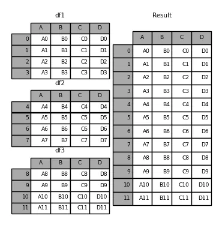

The concat() function (in the main pandas namespace) does all of the heavy lifting of performing concatenation operations along an axis while performing optional set logic (union or intersection) of the indexes (if any) on the other axes. Note that I say “if any” because there is only a single possible axis of concatenation for Series.

Before diving into all of the details of concat and what it can do, here is a simple example:

```python
import pandas as pd
```

```python
df1 = pd.DataFrame(
{
"A": ["A0", "A1", "A2", "A3"],
"B": ["B0", "B1", "B2", "B3"],
"C": ["C0", "C1", "C2", "C3"],
"D": ["D0", "D1", "D2", "D3"],
},
index=[0, 1, 2, 3],
)

df2 = pd.DataFrame(
{
"A": ["A4", "A5", "A6", "A7"],
"B": ["B4", "B5", "B6", "B7"],
"C": ["C4", "C5", "C6", "C7"],
"D": ["D4", "D5", "D6", "D7"],
},
index=[4, 5, 6, 7],
)

df3 = pd.DataFrame(
{
"A": ["A8", "A9", "A10", "A11"],
"B": ["B8", "B9", "B10", "B11"],
"C": ["C8", "C9", "C10", "C11"],
"D": ["D8", "D9", "D10", "D11"],
},
index=[8, 9, 10, 11],
)
```

Lets put all the three into frames as

```python
frames = [df1, df2, df3]
```

Now finally concatenating the data frames and storing into result as

```python
result = pd.concat(frames)
```

```python
result
```

Output will be the join of the all three dataframes as shown in the picture above.
