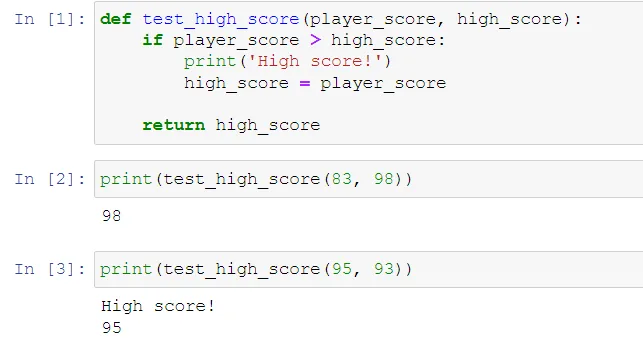
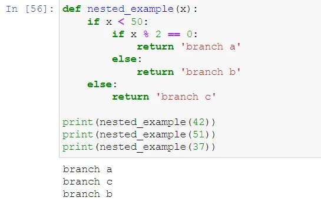
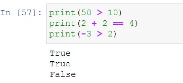
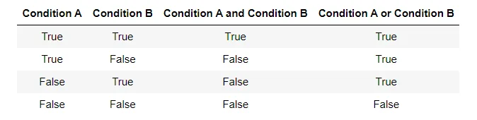
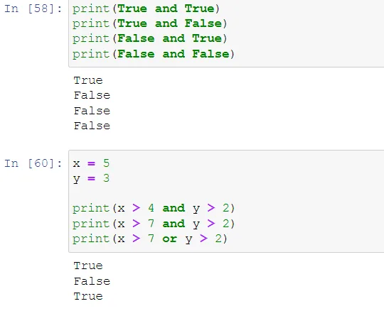
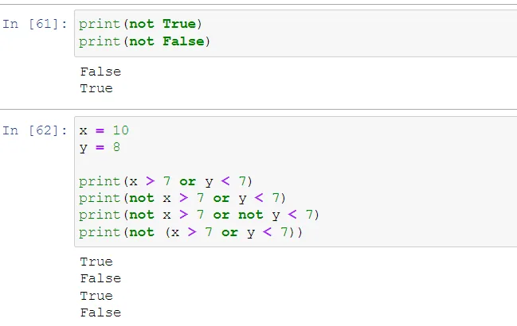

We'll often want the computer only to take an action under certain circumstances. For example, we might want a game to print the message 'High score!', but only if the player's score is higher than the previous high score. We can write this as a formal logical statement: *if* the player's score is higher than the previous high score *then* print 'High score!'.

The syntax for expressing this logic in Python is very similar. Let's define a function that accepts the player's score and the previous high score as arguments. If the player's score is higher, then it will print 'High score!'. Finally, it will return the new high score (whichever one that is).

With if statements we use a similar syntax as we used for organizing functions. With functions we had a def statement ending with :, and an indented body. Similarly for a conditional, we have an if statement ending with :, and an indented body.

Conditional statements are used to control program flow. We can visualize our example, test_high_score, in a decision tree.

We can nest if statements to make more complicated trees.

In this example, we have an if statement nested under another if statement. As we change the input, we end up on different branches of the tree.

The statement that follows the if is called the **condition**. The condition can be either true or false. If the condition is true, then we execute the statements under the if. If the condition is false, then we execute the statements under the else (or if there is no else, then we do nothing).

Conditions themselves are instructions that Python can interpret.

Conditions are evaluated as booleans, which are True or False. We can combine conditions by asking of condition A *and* condition B are true. We could also ask if condition A *or* condition B are true. Let's consider whether such statements are true overall based on the possible values of condition A and condition B.

The keywords or and and are called **logical operations** (in the same sense that we call +, -, \*, etc. arithmetic operations). The last logical operation is not: not True is False, not False is True.

