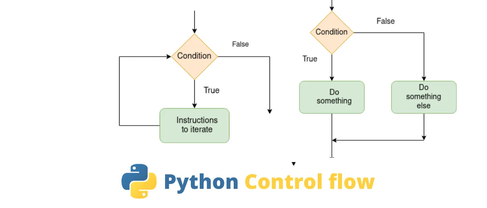

We discuss the most important and the most commonly used operations for making the computer do stuff. We start with something that computers do well, do quickly, and do a lot — make decisions.

You control what your program (and the computer) does by making decisions, which often involves making comparisons.We use operators. These are often referred to as relational operators or comparison operators because by comparing items the computer is determining how two items are related.

## Making Decisions with if

The word if is used a lot in all apps and computer programs to make decisions. The simplest syntax for if where the variable named sun receives the string "down." Then an if statement checks to see whether the variable sun contains the word down and, if it does, prints "Good night!"

```python
sun = 'down'
if sun == 'down':
 print('Good Night!')
print('I am here')
```

If you run the same code with some word other than down in the sun variable, then the first print is ignored, but the next line is still executed normally because it’s not dependent on the condition being true.

```python
sun = 'up'
if sun == 'down': print('Good Night!')
print('I am here')
```

You can indent any number of lines under the if, and those indented lines execute only if the condition proves true. If the condition proves false, none of the indented lines are executed. The code under the indented lines is always executed because it’s not dependent on the condition. Here is an example where we have four lines of code that execute only if the condition proves true:

```python
total = 100
sales_tax_rate = 0.065
taxable = True
if taxable:
   print(f"Subtotal : ${total:.2f}")
   sales_tax = total * sales_tax_rate
   print(f"Sales Tax: ${sales_tax:.2f}")
   total = total + sales_tax
print(f"Total : ${total:.2f}")
```

As you can see, we start off with a total, a sales_tax_rate, and a taxable variable. When taxable is True, then all four lines under the if are executed and you end up with the output has executed.

## Adding else to your if login

So far we’ve looked at code examples in which some code is executed if some condition proves true. If the condition proves false, then that code is ignored. Sometimes, you may have a situation where you want one chunk of code to execute if a condition proves true, otherwise (else) if it doesn’t prove true, you want some other chunk of code to be execute.

```python
import datetime as dt
# Get the current date and time
now = dt.datetime.now()
# Make a decision based on hour
if now.hour < 12 :
 print('Good Morning')
else:
 print('Good afternoon')print('I hope you are doing well!')
```

## Handling multiple else’s with elif

When if . . . else isn’t enough to handle all the possibilities, there’s elif (which, as you may have guessed, is a word made up from else if. An if statement can include any number of elif conditions. You can include or not include a final else statement that executes only if the if and all the previous elifs prove false.

```python
light_color = "green"
if light_color == "green":
print("Go")
elif light_color == "red":
print("Stop")
print("This code executes no matter what")
```

## Ternary operations

The line is a shorthand way of saying “Put into the beverage variable beer or milk depending on the contents of the age variable” In Python you may write that as something like this:

```python
age = 31
if age < 21:
# If under 21, no alcohol
beverage = "milk"
elif age >= 21 and age < 80:
# Ages 21 - 79, suggest beer
beverage = "beer"
else:# If 80 or older, prune juice might be a good choice.
beverage = "prune juice"
print("Have a " + beverage)
```

## Repeating a Process with for

there are also cases where you need to count or perform some task over and over. A for loop is one way to do that. It allows you to repeat a line of code, or several lines of code, as many times as you like.

## Looping through numbers in a range

If you know how many times you want a loop to repeat, using this syntax may be easiest:

```python
for x in range(7):
print(x)
print("All done")
```

## Looping through a string

Using range() in a for loop is optional. You can replace range with a string, and the loop repeats once for each character in the string.

```python
for x in "Eslam":
print(x)
print("Done")
```

## Looping through a list

A list, in Python, is basically any group of items, separated by commas, inside square brackets. You can loop through such a list either directly in the for loop or through a variable that contains the list. Here is an example of looping through the list with no variable:

```python
for x in ["The", "rain", "in", "Spain"]:
print(x)
print("Done")
```

## Bailing out of a loop

Typically, you want a loop to go through an entire list or range of items, but you can also force a loop to stop early if some condition is met. Use the break statement inside an if statement to force the loop to stop early. The syntax is:

```python
answers = ["A", "C", "", "D"]
for answer in answers:
if answer == "":
 print("Incomplete")
 break
print(answer)
print("Loop is done")
```

## Looping with continue

You can also use a continue statement in a loop, which is kind of the opposite of break. Whereas break makes code execution jump past the end of the loop and stop looping, continue makes it jump back to the top of the loop and continue with the next item (that is, after the item that triggered the continue).

```python
answers = ["A", "C", "", "D"]
for answer in answers:
if answer == "":
 print("Incomplete")
 continue
print(answer)
print("Loop is done")
```

## Looping with while

As an alternative to looping with for, you can loop with while. The difference is subtle. With for, you generally get a fixed number of loops, one for each item in a range or one for each item in a list. With a while loop, the loop keeps going as long as (while) some condition is true. Here is the basic syntax:

```python
counter= 65
while counter < 91:
  print(str(counter) + "=" + chr(counter))
  counter +=1
print("all done")
```

The chr() function inside the loop just displays the ASCII character for whatever the number in counter. Going from 65 to 90 is enough to print all the uppercase letters in the alphabet.

## Starting while loops over with continue

You can use if and continue in a while loop to skip back to the top of the loop just as you can with for loops.

```python
import random
print("Numbers that aren't evenly divisible by 5")
counter = 0
while counter < 10:
  # Get a random number
  number = random.randint(1,999)
  if int(number / 5) == number / 5:
    # If it's evenly divisible by 5, bail out.
    continue
   # Otherwise, print it and keep going for a while.
   print(number)
   # Increment the loop counter.
   counter += 1
print("Loop is done")
```

## Breaking while loops with break

there are two things that can stop this loop. Either condition1 proves False, or condition2 proves True. Regardless of which of those two things happen, code execution resumes at the first line of code outside the loop, the line that reads do this code when loop is done in the sample syntax.

```python
import random
print("Numbers that aren't evenly divisible by 5")
counter = 0
while counter < 10:
  # Get a random number
  number = random.randint(1,999)
  if int(number / 5) == number / 5:
    # If it's evenly divisible by 5, bail out.
    break
   # Otherwise, print it and keep going for a while.
   print(number)
   # Increment the loop counter.
   counter += 1
print("Loop is done")
```

Hopefully, this article was helpful to you.

Link to the GitHub repository [here](https://github.com/EslamElkot/EslamEklot.github.io/blob/main/Control_flow_statements.ipynb)
