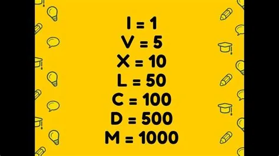
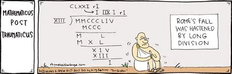

One of the most favorite questions in a coding interview is to convert Roman numbers to decimals. In this article, I’ll walk you through how to write a Python program to convert Roman numbers to decimals.

**Roman numerals** are a [numeral system](https://en.wikipedia.org/wiki/Numeral_system) that originated in [ancient Rome](https://en.wikipedia.org/wiki/Ancient_Rome) and remained the usual way of writing numbers throughout Europe well into the [Late Middle Ages](https://en.wikipedia.org/wiki/Late_Middle_Ages). Numbers in this system are represented by combinations of letters from the [Latin alphabet](https://en.wikipedia.org/wiki/Latin_alphabet). Modern usage employs seven symbols, each with a fixed integer value




this is a sample of how roman people dealing with these complicated numbers



Remember that the base numbers are not the numbers that are used by the Romans as they have count values such as I: 1, V: 5, X: 10, C: 100, D: 500, M: 1000, etc.

So we need to follow the above logic to write a program to convert roman numbers to decimals with Python. So let’s have a look at the process of converting roman numbers to decimals:

1. Work your way through the string of Roman numerals from left to right, examining two adjacent characters at a time. If you want then you can also specify that the direction of loops, but it does not matter as long as the comparisons are implemented accordingly.
2. If the value on the left is higher than the value on the right, then subtract the count at that position from the final value. Otherwise, just add it.
3. Once the process is complete, the final value is the decimal value equivalent of the roman number.

### that's why we try we try to solve this problem with code
The dictionary used to convert roman numerals do decimals:

note: we can edit the dictionary with the numbers and it symbols as much as required

```python
roman_dict ={'I': 1, 'V': 5,
             'X': 10, 'L': 50,
             'C': 100, 'D': 500,
             'M': 1000}
```

The parsing will be implemented using function decimal:

```python
def decimal(roman):
    """
    roman: a string or roman numerals.
    Returns the equivalent in decimal numbers (int).
    """
    global roman_dict
    # Analyze string backwards
    roman_back = list(reversed(list(roman)))
    value = 0
    # To keep track of order
    right_val = roman_dict[roman_back[0]]
    for numeral in roman_back:
        left_val = roman_dict[numeral]
        # Check for subtraction
        if left_val < right_val:
           value -= left_val
        else:
            value += left_val
        right_val = left_val
    return value
```
