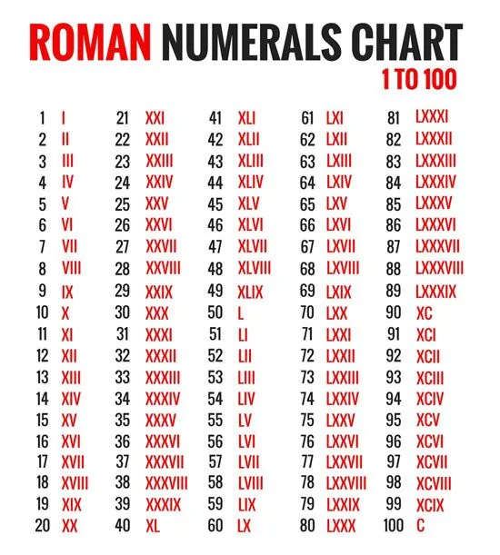
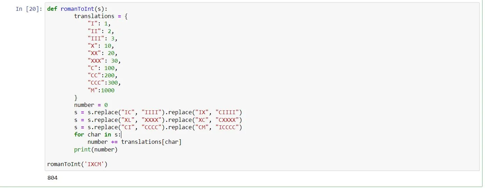
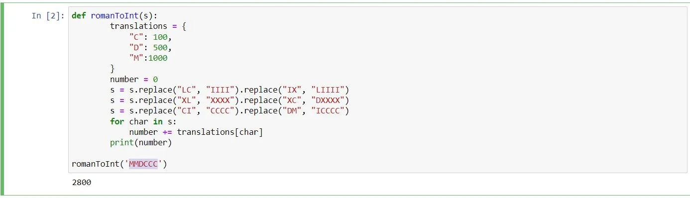

Python is the key code of solving programming problems, Well, Python is the magical world of programming. you can do anything with it, right now I will try to change Roman Numerals to Decimals and vise versa.

first of all, let's have a short note about the Roman numbers and the way it's written with. Figure 1 :

it's soo easy to use with Py 3, just try to create an index just like below :

here you can see that first, we defined the function "ronamtoInt" (S)

then we list roman numbers with it's equivalent in English.

- we tried to use replace method with the function S

then we write a number in roman "IXCM", then run the code to be "804".

Now

, let's try another code for written Roman number (MMDCCC),

by doing the same steps "

1- Define the function

2- Doing some calculations to replace values

3- Use For - In Function.

4 - Print (roman number),

you can run the code and find the result.

let's have fun and do some code yourself for the numbers below :

(XXV), (MMMXII),
