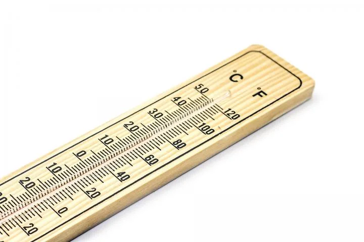

Looking to change Fahrenheit to Celsius or Celsius to Fahrenheit? Use our simple Celsius to Fahrenheit Temperature Converter, our temperature conversion charts, or calculate C to F or F to C yourself using the conversion formulas.

**About Fahrenheit and Celsius**

The Fahrenheit temperature scale is named for German physicist Daniel Gabriel Fahrenheit and is the measurement of temperature commonly used by the United States (and its associated territories) and by several nations in the Caribbean. On the Fahrenheit scale, water freezes at 32°F and boils at 212°F (at sea level).

The Celsius temperature scale—originally called *centigrade* and later renamed for Swedish astronomer Anders Celsius—is used almost everywhere else in the world. On the Celsius scale, water freezes at 0°C and boils at 100°C (at sea level).

F° TO C°: FAHRENHEIT TO CELSIUS CONVERSION FORMULA

Fahrenheit is a temperature scale, and it is named after Polish-born German physicist Daniel Gabriel Fahrenheit, and it uses degrees Fahrenheit as a unit for temperature.

Suppose we have a temperature in degree Celsius, and our task is to convert the value of temperature into the degree Fahrenheit and display it.

To convert temperatures in degrees Fahrenheit to Celsius, subtract 32 and multiply by .5556 (or 5/9).

- Example: (50°F - 32) x .5556 = 10°C

C° TO F°: CELSIUS TO FAHRENHEIT CONVERSION FORMULA

Celsius is also a unit of measurement for temperature, and it is also known as centigrade, and it is SI derived unit used by most of the countries worldwide. It is named after the Swedish astronomer Anders Celsius.

To convert temperatures in degrees Celsius to Fahrenheit, multiply by 1.8 (or 9/5) and add 32.

- Example: (30°C x 1.8) + 32 = 86°F

The centigrade scale, which is also called the Celsius scale, was developed by Swedish astronomer Andres Celsius. On the centigrade scale, water freezes at 0 degrees and boils at 100 degrees. The centigrade to Fahrenheit conversion formula is:

Fahrenheit and centigrade are two temperature scales in use today. The Fahrenheit scale was developed by the German physicist Daniel Gabriel Fahrenheit. On the Fahrenheit scale, water freezes at 32 degrees and boils at 212 degrees.

This script converts temperature between Fahrenheit to Celsius. To create a python converter for celsius and Fahrenheit, you first have to find out which formula to use.

Fahrenheit to Celsius formula:

```python
C = (5/9) * (F - 32) or in plain English, First subtract 32, multiply by 5, and divide by 9.
```

where F is the Fahrenheit temperature. You can also use this Web page to convert Fahrenheit temperatures to centigrade. Just enter a Fahrenheit temperature in the text box below, then click on the Convert button.

Python Code:

```python
Fahrenheit = int(input("Enter a temperature in Fahrenheit: "))
Celsius = (Fahrenheit - 32) * 5.0/9.0
print (Celsius)
```
