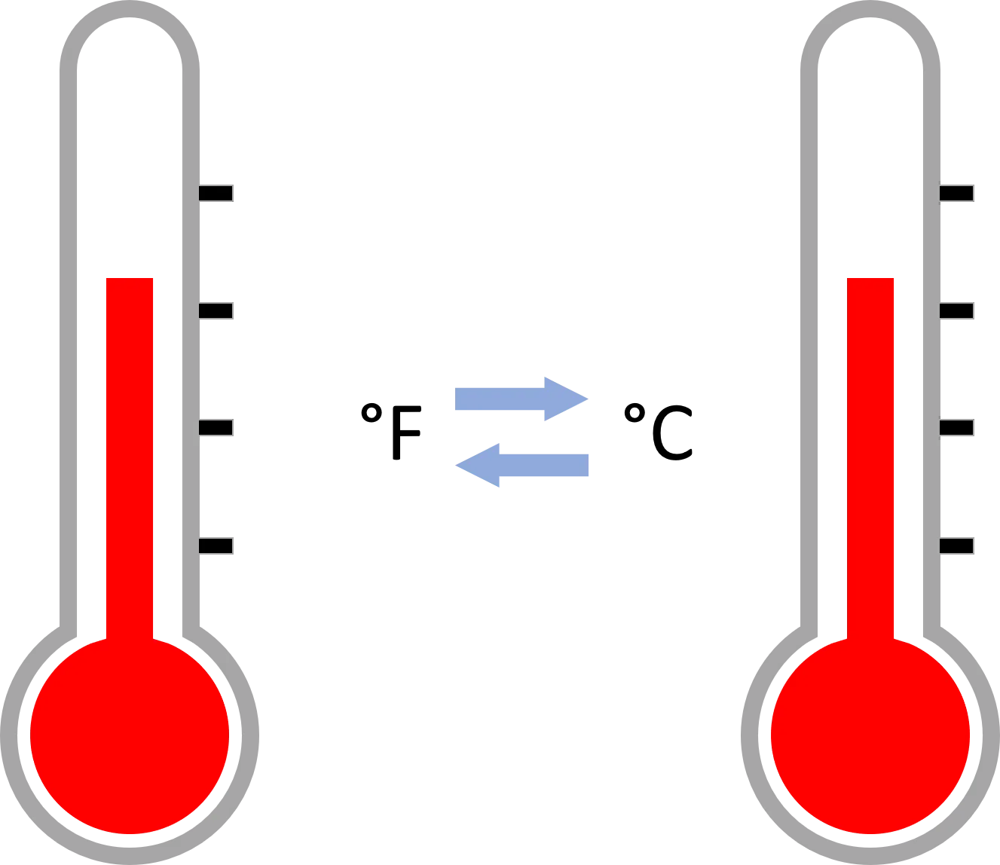

In this blog, we will talk about Converting Temperature from Fahrenheit to Celsius and vice versa.

The **Fahrenheit** temperature scale is named for German physicist Daniel Gabriel Fahrenheit and is the measurement of temperature commonly used by the United States (and its associated territories) and by several nations in the Caribbean. On the Fahrenheit scale, water freezes at 32°F and boils at 212°F (at sea level).

The **Celsius** temperature scale—originally called *centigrade* and later renamed for Swedish astronomer Anders Celsius—is used almost everywhere else in the world. On the Celsius scale, water freezes at 0°C and boils at 100°C (at sea level).

In order to convert temperature in Fahrenheit to Celsius following formula is used:

**C = 5/9 (° F - 32)**

And for vice versa,

**F = 9/5 ( ° C) + 32**

Now we will consider a simple converter app, written in Python language.

```python
temperature = input("Enter the temperature you would like to convert (e.g., 56F, 39C, etc.): ") #Getting input from the user
```

In the above piece of code, we get the input from a user and assign it to a *temperature* variable.

```python
degree = int(temperature[0:-1])#Getting digits from the input
```

Here we declare a new variable, *degree,* which contains the characters that are digits from the t*emperature* variable.

```python
scale = temperature[-1].upper()#Getting the scale from the input
```

*Scale* variable contains the upper case of the last character, F or C, in this example.

```python
result_scale='' #Initializing an empty string
```

Now we initialize an empty string, *result_scale,* in order to store resulting scale.

```python
#Converting Celsius to Fahrenheit
if scale == 'C':
    result = int(round((9 * degree) / 5 + 32))
    result_scale = 'Fahrenheit'
```

The above code checks if the scale that should be converted is Celsius or not, if yes, it uses the relevant formula and rounds the finding, makes it integer data type, and assigns the final result to a variable called *result.*

In the last line of the code *result_scale*  is the variable that contains the desired scale name, in this case, "Fahrenheit".

```python
#Converting Fahrenheit to Celsius
elif scale == 'F':
    result = int(round((degree - 32) * 5 / 9))
    result_scale = 'Celsius'
```

Here are the same operations but for converting Fahrenheit to Celsius.

```python
#Warning the user in case of not entering proper input
else:
    print("Your input is not proper")
    quit()
```

This code prints a warning that the user has entered a wrong input.

```python
#Printing out the final result
print("The temperature in", result_scale, "is", result, "degrees.")
```

And here is the final print statement that prints the output.

Let us see an example:

When we run the code the following message pops up and requires us to enter input and if we type "34c" like the following:

```python
Enter the temperature you would like to convert (e.g., 56F, 39C, etc.): 34c
```

We get the output like this:

```python
The temperature in Fahrenheit is 93 degrees.
```

Let us say we enter an invalid input such as:

```python
Enter the temperature you would like to convert (e.g., 56F, 39C, etc.): 43s
```

In this case, the output will be:

```python
Your input is not proper
```

You can find the GitHub repo for this simple project at this [link](https://github.com/iamNargiz/data_insight1)
