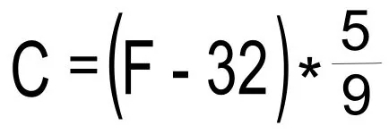
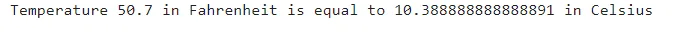

In this blog, we will talk about Converting Temperature from Fahrenheit to Celsius.

On the Fahrenheit scale, water freezes at 32 degrees and boils at 212 degrees.

On the Celsius scale, water freezes at zero degrees and boils at 100 degrees.

Now, we are going to write a python application that converts temperature in Fahrenheit to Celsius

First, we define a python function to convert from Fahrenheit to Celsius

```python
def fahren_to_cels(input_temp):
    celsius = (input_temp - 32) * 5/9
    return celsius
```

As shown, the fahren_to_cels function takes the input_temp which is the temperature degree in Fahrenheit. Then, we use the following formula to convert the temperature from Fahrenheit to Celsius



After that, we return the celsius variable which is converted temperature in Celsius as we want.

So how does our program work?

We ask the user to enter the temperature in Fahrenheit as he wants by using the following line

```python
temp = float(input("Enter a temperature in Fahrenheit: "))
```

Then, we got the input from the user like this


We pass the input value to the fahren_to_cels function as we have explained.

Finally, we got the output which is the temperature in Celsius

```python
print("Temperature {} in Fahrenheit is equal to {} in Celsius".format(temp, fahren_to_cels(temp)))
```



you can refer to the complete code from here [link](https://github.com/MarehanRefaat/Temperature_Converter/blob/main/Temperature_Converter.ipynb)
