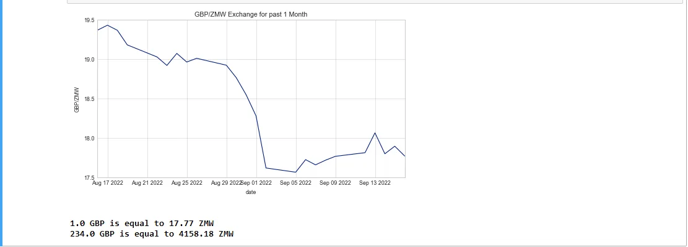

## Table of Contents

1. Introduction

2. Load Required Packages

3. Define Currency pairs

4. Get Data for the Tickers

5. Convert Base Currency to Quoted Currency

Github Link

## 1. Introduction

[Investopedia](https://www.investopedia.com/terms/c/currencypair.asp#:~:text=A%20currency%20pair%20is%20the,is%20called%20the%20quote%20currency) defines a currency pair as a quotation of two different currencies with value of one currency (Base Currency) being quoted against the other (Quoted Currency).

In a currency pair the first currency is the base and the second is the quoted. The pair is represented as BaseQuoted=X which interprets as 1 Base Currency is equal to X Quoted Currency. for example, a quote of USDZMW=15.65 means that USD1 is equal to ZMW15.65.

We will develop a program that will allow a user to enter an amount to be converted from one currency to another and also provide a historical visualization of the performance of the selected currency pair over a one month period.

## 2. Load Required Packages

We will import the following python packages:

1. pandas for data manipulation using dataframes.
2. pyplot from the matplotlib library for visualizations.
3. yfinance for getting forex data from YahooFinance.

## 3. Define Currency Pair Variables

We will reference all the currencies to the USD with the USD as the base currency and the other currencies as the quoted currency. This will allow us to convert the currencies between the other currencies based on their conversion rates with the USD.

The symbols for the circulating currencies can be checked from [Wikipedia](https://en.wikipedia.org/wiki/List_of_circulating_currencies).

Based on the symbols provided, we want to get the exchange for each of the currencies with the USD as the base currency. The ticker from YahooFinance for most of the currencies for the USD exchange with USD as base currency is 'CurrencySymbol=X'. For example, the USD/GBP exchange will have a ticker symbol of 'GBP=X'. This is with the exception of the EUR which has a ticker symbol of 'USDEUR=X'. As such the following code takes this into consideration by using the IF statement when defining the tickers based on the user inputs.

4. Get the Data for the Tickers

Based on the defined tickers we get the exchange data for the two currencies against the USD as the base currency. We use YahooFinance to get the historical data for the previous 20 days. This is loaded into two pandas data frames: (a) base_data for the currency we are converting from and (b) quoted_data for the currency we are converting to.

Since, the currency data downloaded is for the exchange with the USD as the base currency, we include code that takes care of a case were the user defined base or quoted currency is the USD. The code simply populates ones for the dataframe that represents an exchange of USD/USD.

The two dataframes are merged into one dataframe and a column that represents the exchange rate between the two currencies is added (currency_pair)

## 5. Convert Base Currency to Quoted Currency

The current exchange rate between the two currencies is obtained from the merged dataframe from the _currency_pair column. The last data point in this column represents the most recent exchange rate. The data from YahooFinance gives the previous day close which is a good estimation for the current exchange rate.

The current exchange rate is then used to calculate the amount in the other currency which was provided by the user. The code below shows this computation and the visualization of the previous one month data.

The following is an example output for conversion of 234 Zambian Kwacha (ZMW) to Pound sterling (GBP).

Github Link

the notebook for the code used in this post can be found on the following [github link](https://github.com/Musonda2day/Currency-Conversion)
