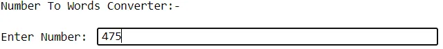
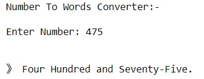

I started by defining a function which enable the user to enter input values

of number needed to be converted into words

[#Defining](https://www.datainsightonline.com/blog/hashtags/Defining) a function

y=int(input("Number To Words Converter:-\n\nEnter Number: "))

x,tyu=str(y),print("\n")

import sys

if int(x)>10\*\*100 or int(x)<0:sys.exit("Range Is From Zero To One Googol!")

def num1wrd(x,w={0:"",1:"One",2:"Two",3:"Three",4:"Four",5:"Five",6:"Six",7:"Seven",8:"Eight",9:"Nine"},f={2:"Twen",3:"Thir",4:"For",5:"Fif",6:"Six",7:"Seven",8:"Eigh",9:"Nine"},t={11:"Eleven",12:"Twelve",13:"Thirteen",14:"Fourteen",15:"Fifteen",16:"Sixteen",17:"Seventeen",18:"Eighteen",19:"Nineteen"}):

if len(x)==1:return(w[int(x)])

elif len(x)==2 and x[0]=="0" and x[1]=="0":return("")

elif len(x)==2 and x[0]=="0":return (w[int(x[1])])

elif len(x)==2:

if int(x) in range(11,20):return(t[int(x)])

elif int(x[1])==0:

if int(x)==10:return("Ten")

else:return(f[int(x[0])]+"ty")

else:return(f[int(x[0])]+"ty"+"-"+w[int(x[1])])

s=s1[:len(s1)-3]

print("》 "+s+".")

After running the function shown in the above image below is a pop up which enable the user to input any value.

After clicking enter below is the result of 475 in words.

