Corona is a virulent disease that has invaded our lives. Wuhan being its birthplace, the non-sojourner virus has moved from the east of the world, China, to the west of the world, United States of America. Work has been brought to a halt, free movement has been stymied and the world economy has been cratered; the corona virus has been a force to reckon with since it’s unprecedented infection on December, 2019. With few infections in January, 2020, the virus has however proliferated in April, 2020 and it’s affecting every corner of the earth. With the death toll gradually increasing, we as data scientists cannot just watch but ask the vital questions to alleviate the fatal viral situation at hand. Even better, we wish to unearth the underlying pattern to slow down the spread curve. Consequently, this thread is an exploratory data analysis(EDA) which asks three necessary questions to better understand the COVID 19 data to help build better predictive models to stop the virus.

Before we ask the necessary questions, let’s first understand our datasets. Our datasets were two disparate datasets from Our World In Data, *www.ourworldindata.org*. The first data frame, named location, consists of five disparate columns - '**countriesAndTerritories', 'population_year', 'location', 'continent'** and '**population**'. The second data frame, named **fdata**, consists of six disparate columns - '**date', 'location', 'new_cases', 'new_deaths', 'total_cases'** and **'total_death**'.

The first process in the EDA is to clean the datasets. The libraries used for cleaning the dataset as well as performing the EDA are first loaded. The first data frame is also imported and two columns are dropped. These two columns are - '**countriesAndTerritories**', and '**population_year**'. These columns are dropped because the '**countriesAndTerritories**' contains the same entries as '**location**'. And also '**population_year**' contains the same entry throughout – 2020.

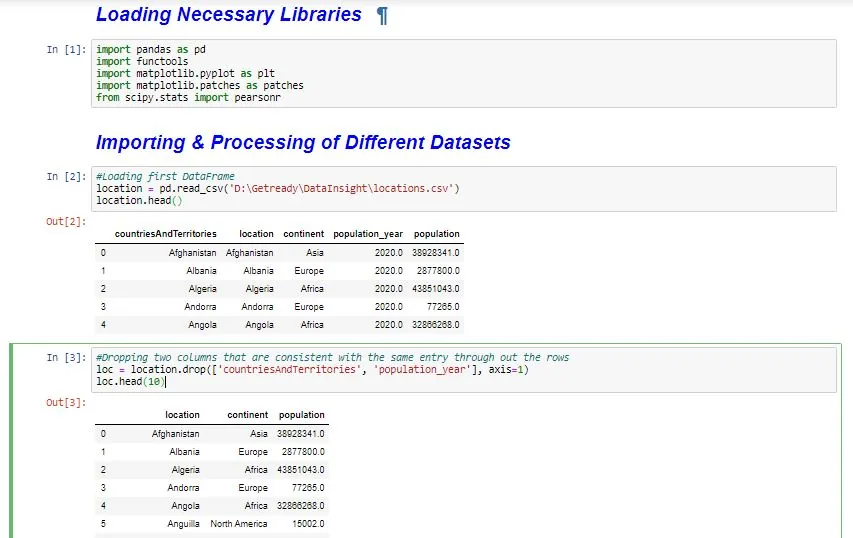

*Fig 1*

The data frame with the dropped columns, **loc**, is grouped by the continents and accessed as different data frames to better understand the viral situation in each country and the world as a whole.

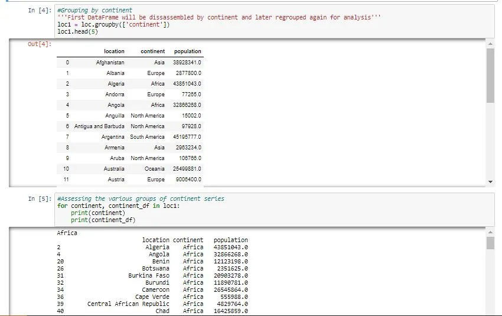

*Fig 2*

After examining the grouped data frames, it can be seen one country has a NaN in the continent column. This country is **World**, which represents sum of all values of all countries in the world. Also, it can be seen two countries, **Guernsey** and **Jersey**, in the European continents have NaN for their population column. All these rows are dropped before questions are answered.

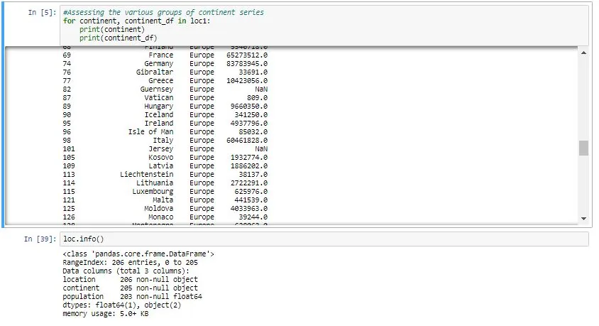

*Fig 3*

Accessing the grouped data frames too, it can be seen at the time the data was collected, only a few countries are corona free.

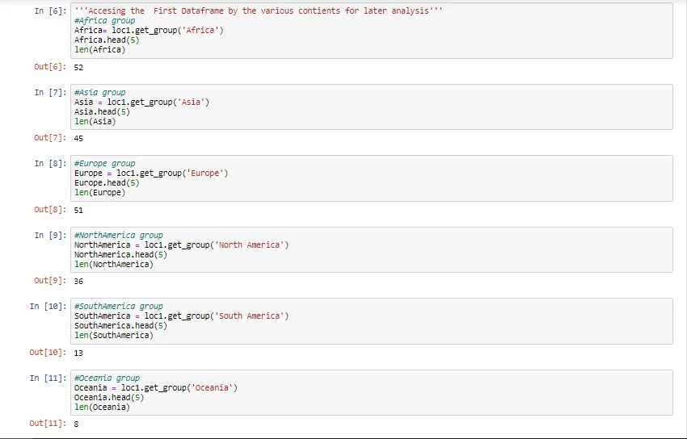

*Fig 4*

The second data frame is then loaded and the rows containing **World, Guernsey** and **Jersey** are also dropped.

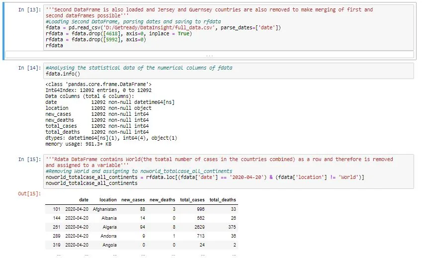

*Fig 5*

After the necessary cleaning has been done, the two data frames are merged to answer the necessary questions.

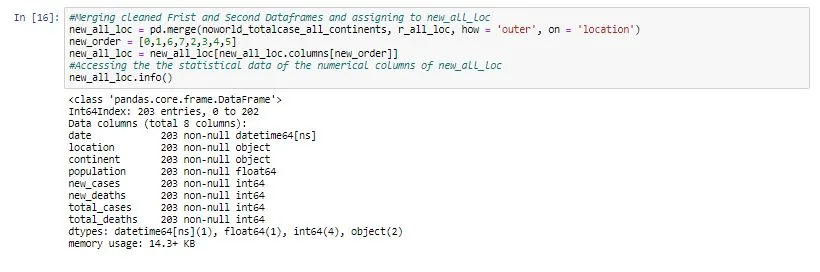

*Fig 6*

**FIRST QUESTION**

With the rate people are people are dying in various countries, it begs for the question, what is the rate at which at which people are dying compared to the total number of corona cases that are recorded. To be circumspect in answering this question, all the six continents in our data set is considered. The country that has recorded the highest corona cases in each continent is used to answer this question.

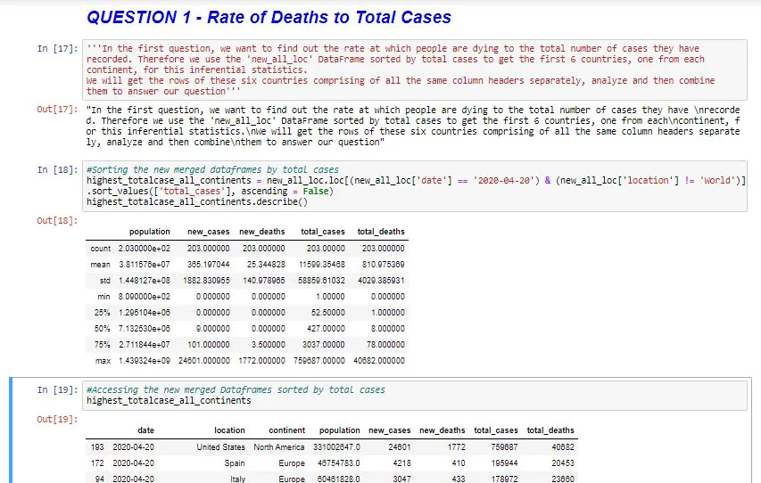

*Fig 7*

As such, our new merged data frame, now called **new_all_loc**, is grouped by '**total_cases**' and the six countries from the first fifty (50) countries, one from each continent, are selected. Thus, **South Africa from Africa, Turkey from Asia, Brazil from South America, United States of America from North America, Australia from Oceania and Spain from Europe** are used to answer the question. A few are shown below.

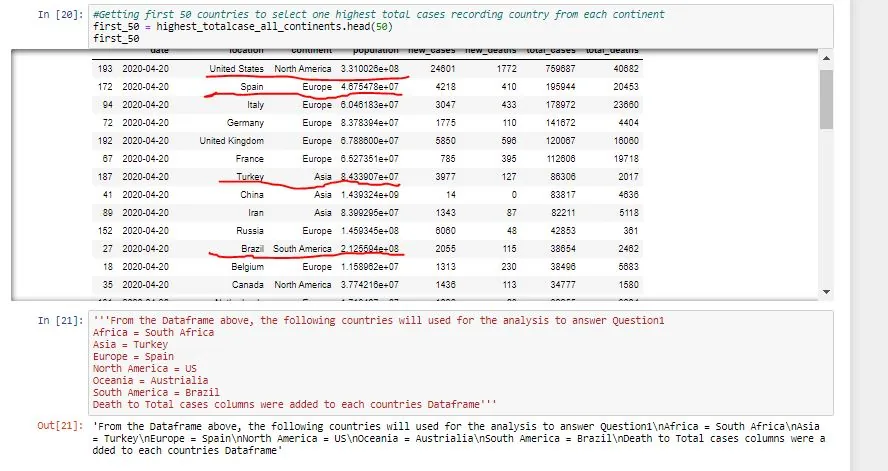

*Fig 8*

The different countries rows are acessed; all rows of each country contain the same columns. A new column is added to each country’s data frame - '**death_to_case**'. This column takes the total death and divides it by the total cases to get the death to total cases rate. A few are shown below.

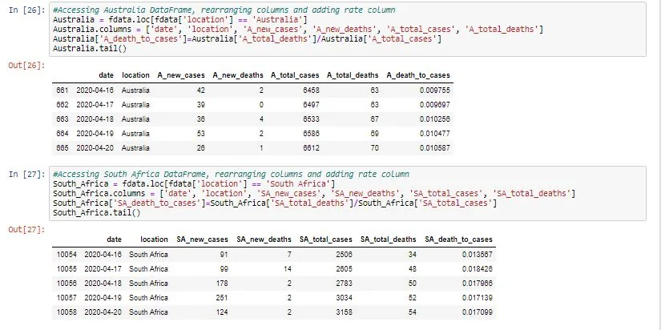

*Fig 9*

The six data frames of the six countries, one from each continent, are then merged. All columns but the '**death_to_case**' columns are dropped. Also the merged data frames contain NaN values. The NaN values are as a result of the following:

• The country hadn’t yet started recording any corona case

• No data was collected on that particular day for that country

• Since the rate is given by total deaths/ total cases, if no case was recorded on a particular day, it makes the calculation turn to a null value. **For example, 3/0 = NaN.**

As such, all Nan values are replaced by **0.000** and is shown below.

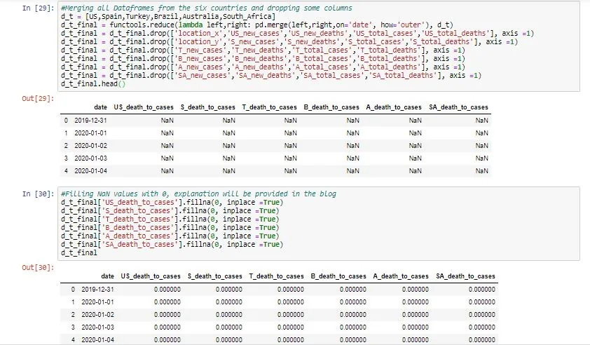

*Fig 10*

From the dotted line chart below, we can see that the higher the number of cases recorded in a particular country doesn’t necessary mean more death.

Though United States has recorded the highest case compared to all the other countries, it has less than 6% of its total cases as death cases. However, Spain and Brazil lag behind the United States in the total number of cases recorded as shown in **Fig 8** above, yet, Brazil has recorded more than 6% of total cases as death cases. Ditto, Spain has recorded 10%. The same can be said about Brazil and Turkey.

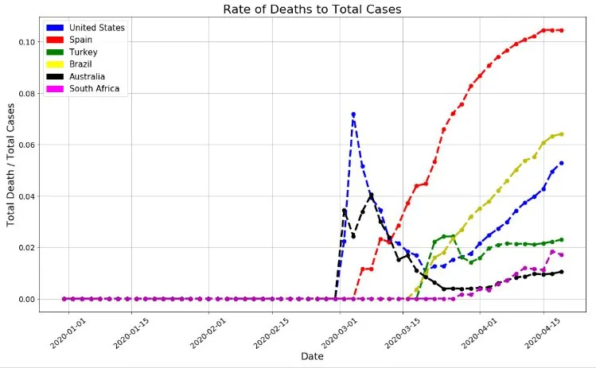

*Fig 11*

In addition, from the same graph above, Austrilia recorded its first case before Ist March, 2020 and South Africa recorded its first case more than twenty days later. It makes sense that Austrilia will have more cases recorded than South Africa on 20th April, 2020. Yet, The rate of death cases in South Africa is more than in Australia. This butresses the fact that the total number of cases recorded necessarily does not mean there will be more death. The better the treatment given to infected patients, no matter the number recorded, the faster patients will heal and be free from the virus apparently. Ditto, death will definitely be averted in various countries.

**SECOND QUESTION**

The second question that buffled my mind was whether higher population size exacerbates the infection rate around the world. To answer this question, 150 countries are selected from the **new_all_loc** data frame sorted by population in descending order. **First 50** are fifty densely populated countries, **last 50** are fifty least populated countries, and the **middle 50** full in between the range.

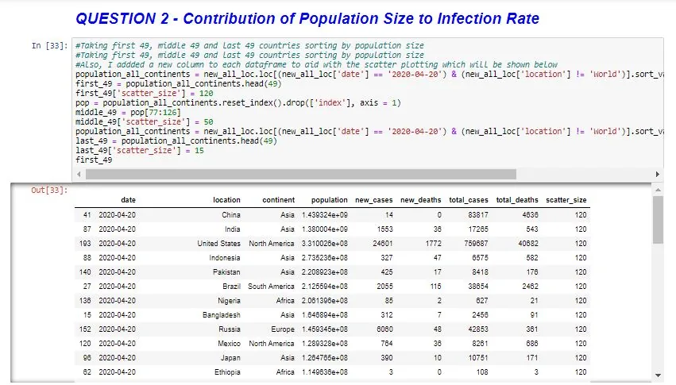

*Fig 12*

From the scatter plot below, we can see that three least populated countries, circled at the far left have a higher infection(or higher total cases) than a few countries from the **first 50** and **middle 50.** Again, circled at the top right, densely populated countries are showing a very high infection rate. The arugument is settled by the **Pearson’s correlation which is 0.222**; a positively weak correlation for that matter. Indeed, population size is a minor factor of infection rate, but other major factors account for the rapid spread in many countries. Countries should therefore pay major attention to other lurking factors to flatten down the spread curve.

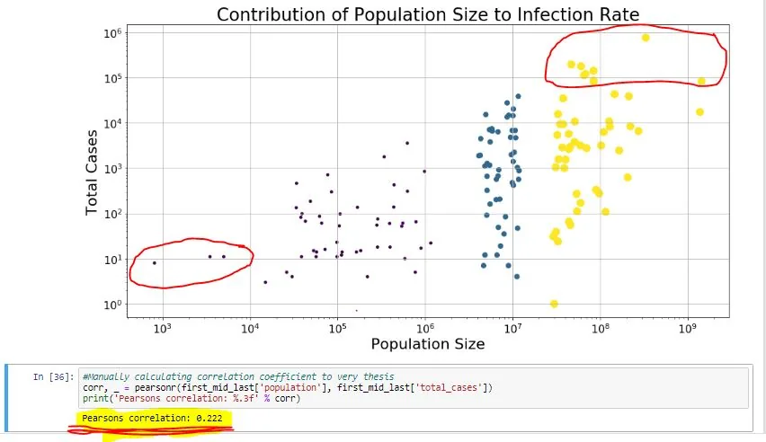

*Fig 13*

**THIRD QUESTION**

Have you ever wondered how the total death data will be distributed around the central mean value? A box plot of '**total_death**' will help us answer this question perfectly. Yes, and that brings us to our third question – averagely, how many people are dying in all countries around the world as this can be a measure of our progress in battling this virulent and contagious virus. To answer this question, the **.info()** method is used to gather the relevant information to better understand our chart. The **total_death.info()** details are shown below highlighted in yellow:

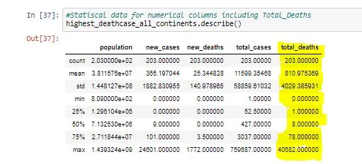

*Fig 14*

We can therefore we from our chart below that compared to the countries all around the world, only a few countries have recorded more than 2000 total cases as of 20th April, 2020. As a result, the mean has been affected distorting the right skewness of our total death data. Averagely, most countries have recorded less than 100 cases but our maximum value is a harbinger. Therefore we should observe the strict preventive measures from World Health Organization to slow down the spread and obviate higher total cases.

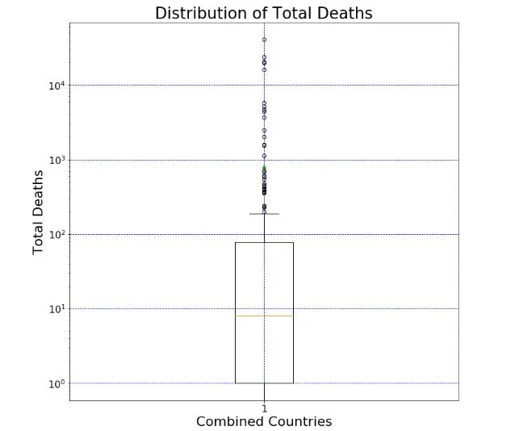

*Fig 15*

In conclusion, Data science indeed as the power to unearth the underlying facts as emperically shown above. To reiterate, total cases recorded have nothing to do with total deaths, densely populated areas have less to do with infection rate exacerbation and we can roecorded more cases if we don’t strictly follow preventive measure. Corona is neither my enemy nor my friend, yet I have to do all I can to stay alive and safe till this pestilence passes. Adjei Franklin is my name and I’ll be bringing you more information soon. **WATCH THIS SPACE AND STAY SAFE😉!!!**

**.**
