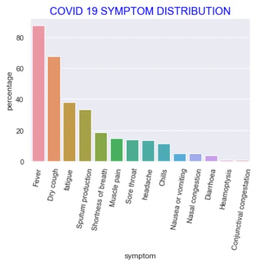
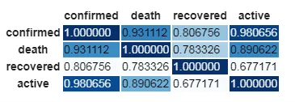
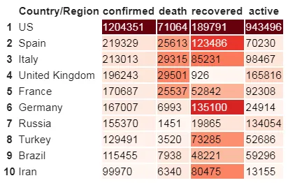
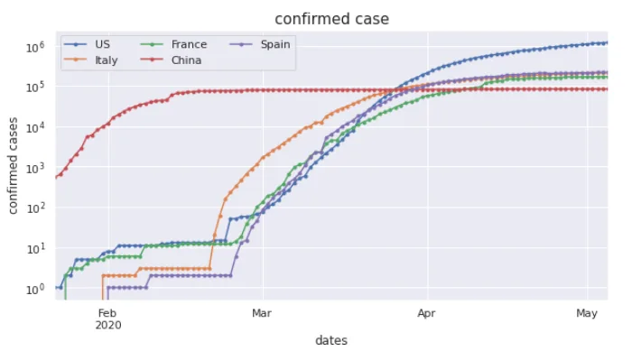
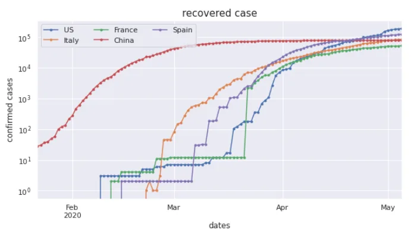
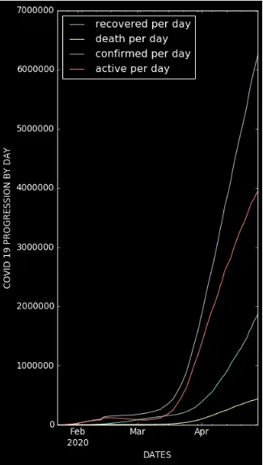

**Coronaviruses** are a group of related RNA viruses that cause diseases in mammals and birds. In humans, these viruses cause respiratory tract infections that can range from mild to lethal. Mild illnesses include some cases of the common cold (which is caused also by certain other viruses, predominantly rhinoviruses), while more lethal varieties can cause SARS, MERS, and COVID-19. Symptoms in other species vary: in chickens, they cause an upper respiratory tract disease, while in cows and pigs they cause diarrhea. There are as yet no vaccines or antiviral drugs to prevent or treat human coronavirus infection.

In this serie we show the evolution of covid 19 disease around the world. This serie is divised as follow:

- The distribution of coronavirus symptoms
- The most affected countries
- Correlation between data
- Looking confirmed death and recovered case in some countries
- The evolution over time of the virus

**Data source**

The data used come from different sources like Kaggle and GitHub.
We have A dataset containing the coronavirus symptoms distribution from kaggle
A time serie Dataset of global case obtained on GitHub
A time serie Dataset of world deaths cases from GitHub
A timesrie dataset of recovered cases from GitHub.

**The distribution of coronavirus symptoms.**

The coronavirus symptoms are distributed as shown on the following image.

**Conclusion**

:
By looking at this image we can see that the most common covid symptom reported is fever we also have dry cought and fatigue. If a person have this symptoms he is probably affected by the virus and will have to put himself in quarantine to protect others people and help to contain the spread of the diseases. The others symptoms reported with a weak percentage are nasal congestation, diarrhea, heamoptysis and conjunctival congestation.so isn’t impossible that people who have those symptoms aren't affected by the covid19.

**Correlation between Data.**

Correlation is used to show the quality of relationship between data. The correlation between covid 19 data are show in this image:

There is a strong positive relationship between data. The number of deaths cases are very strongly correlated with the number of confirmed cases,so the death depends of the confirmed cases.

**The most affected countries.**

By a studying we can see that the most affected countries are those who have a big population and a important arean traffic. Let's see the most affected countries in the world

So we see that USA are the most affected country in the world by all number as well as active cases confirmed cases deaths and recovered cases. In second position we have Spain. In United kingdom has the most weak number of recovered people : 926 person. Russia has a binumber of confirmed cases but the number of death is very wake around 1451 people. Germany has a large number of cases but is one of the countries which has better managed the coronavirus with a large number of people treated and a small number of deaths.

**Looking deaths recovered cases in some countries**

In this section we are looking the evolution of deaths and recovered cases in some countries.

Sine middle February new cases in seem to be linear. USA have the biggest growth in terms of new cases since March. The transmission in Italy seems also to be exponential between 20th and 24th. China was the country with the first coronavirus cases

Let's look at the recovered cases.

China was the country with the first recovered coronavirus cases it is normal since China was the first country affected. France has the greatest number of recoveries in one day.

USA become the country with the greatest number of recovered cases on 29th of April.

Italy has their first recovered cases on 24th of March

**Evolution over the time of the virus**

The image below show the evolution of covid over the time:

Deaths cases represent a weak proportion of people affected by the covid 19 disease.

In March the number of recovered cases was greater than the number of actives cases.

**Final thought**

The covid 19 disease affected the world by starting in China there is more work to do for defeat the disease.
