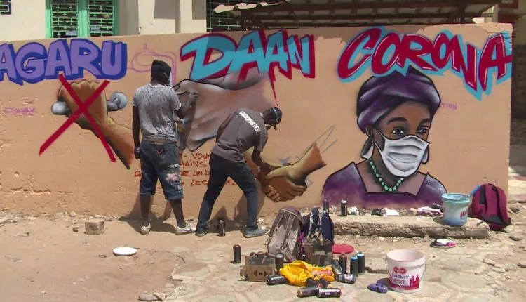
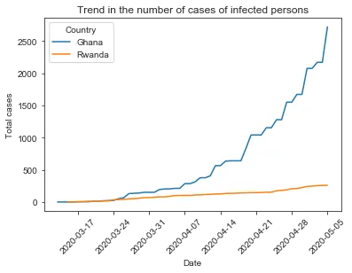
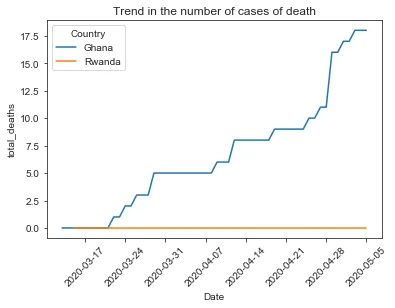
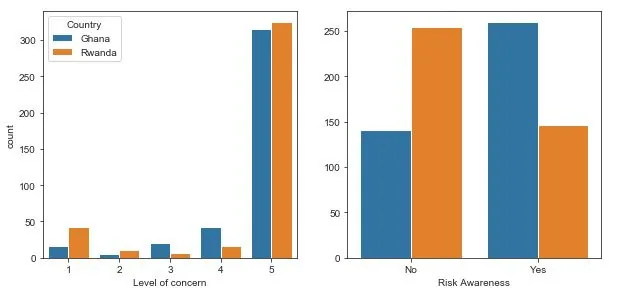
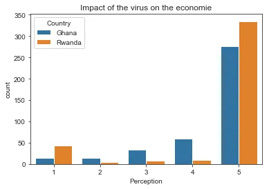

*@AfricaLifestyles*

**Introduction**

Discovered in China, the SARS-COV 2 coronavirus is challenging the entire world, including the world's major economies. This pandemic continues to spread throughout the world and in the various countries already affected. Almost 3.6 million confirmed cases with 257,000 deaths have been officially reported on the site of the World Health Organization. As for Africa, it recorded 27,973 confirmed cases, i.e. 0.86% of the number of confirmed cases in the world.

Through this study, we make a brief summary of the situation in two African countries (Ghana and Rwanda) in order to highlight the feelings of the populations on the difficult current situation.

**Datasets used**

For this report, we use two databases: a quantitative database from [**https://covid.ourworldindata.org**](https://covid.ourworldindata.org/) and a qualitative database from a survey on [**https://data.humdata.org**](https://data.humdata.org/). This analysis will be done on two countries: Ghana and Rwanda. We have extracted from the two global databases the parameters measured for these two countries.

```python
data1 = pd.read_excel("https://covid.ourworldindata.org/data/owid-covid-data.xlsx",
                    parse_dates=['date'])
data2 = pd.read_excel("https://data.humdata.org/dataset/24144abc-c60c-4bdd-b123-2bb08f184765/resource/ab241169-4467-4a89-8e85-e9384ad22c52/download/geopoll-coronavirus-round2-data.xlsx",
                      header=2, parse_dates=['Survey Date'])
data1.info()
data2.info()
```

The database (data1) provides a trend in the number of infections, number of deaths, etc. from different countries. The database contains 13883 lines and 16 variables.
The database (data2) examine perceptions and the impact of COVID-19 in 12 countries throughout sub-Saharan Africa. Topics covered include greatest concerns surrounding coronavirus, preventative measures being taken, changes in food market operability and food security, etc. The database contains 4788 lines and 55 variables.

**A- Trend analysis of the disease in the two countries**

**Question**

**1.** What is the progression of the disease (in terms of mortality and number of infected persons) in these two countries?

```python
df1 = data1[(data1.location.isin(["Ghana", "Rwanda"]))]
fig1= sns.lineplot(x='date', y='total_cases',
                   hue='location', data=df1, legend = False)
fig1.set(xlabel="Date", ylabel="Total cases",
         title="Trend in the number of cases of infected persons")
plt.xticks(rotation=45)
plt.legend(title="Country", loc='upper left', labels=['Ghana', 'Rwanda'])
plt.show()
```



```python
fig2= sns.lineplot(x='date', y='total_deaths',
                   hue='location', data=df1, legend = False)
fig2.set(xlabel="Date", ylabel="total_deaths",
         title="Trend in the number of cases of death")
plt.xticks(rotation=45)
plt.legend(title="Country", loc='upper left', labels=['Ghana', 'Rwanda'])
plt.show()
```



The results show a net evolution of the contamination of the disease in Ghana than in Rwanda. After more than a month, Ghana has registered nearly 2719 infected persons with 18 deaths while Rwanda remains at 0 with nearly 261 cases of infections. We can conclude that the virus evolves more rapidly in Ghana than in Rwanda.

**B- Perceptions and the impact of COVID-19**

In Africa, the response measures adopted are less drastic than in developed countries. The majority of countries have suspended flights, closed schools and borders, banned large gatherings and set up curfews, systematic quarantine of passengers entering their territories and health barriers around the epicenters of the pandemic. However, some countries have adopted containment of either cities or parts of the country.

**Question 2.**

What is their level of involvement and **3**. knowledge of the risk of this virus in these countries? The degree of their involvement was measured from 1 (less concerned) to 5 (very concerned).

```python
df2=data2[(data2.Country.isin(["Ghana", "Rwanda"]))]
plt.figure(figsize=(10,10))
plt.subplot(2,2,1)
q2 = sns.countplot(x="LevelConcern", data=df2, hue="Country")
q2.set(xlabel="Level of concern")
plt.subplot(2,2,2)
q3 = sns.countplot(x="RiskAwareness", data=df2, hue="Country")
q3.legend_.remove()
q3.set(ylabel='', xlabel="Risk Awareness")
```



```python
print(df2.groupby('Country')["LevelConcern"].value_counts())
print(df2.groupby('Country')["RiskAwareness"].value_counts())
```

Both countries have an estimated average of more than 300 people claiming to be affected by the presence of the virus. While in general both countries show the same trend, the number of people in Rwanda who say they are not concerned about the virus is higher than in Ghana. However, against all expectations, 254 people in Rwanda say they do not know the risks involved, compared to 141 people in Ghana. It appears that for this study, 65% of the population in Ghana (against 35% in Rwanda) are aware of the dangerousness of the contrary illness.

**Question**

**4**.The majority of people living either in the informal sector or in daily work, what is their perception of the impact (measured on a scale of 1 to 5) of the virus on the economy of their country.

These measures have significantly affected economic activities not only in the confined countries but also in other countries due to the interactions between the different countries, particularly in terms of trade. Indeed, covid-19 risks aggravating extreme poverty, hunger and food insecurity on the continent. Indeed, in a predominantly informal economy dominated by individual micro-enterprises, where millions of people live off the previous day's income on a daily basis, any cessation of activity will have dramatic consequences on the capacity of economic agents, particularly households, to ensure their food security. Likewise, those who have continued to carry out their economic activities also experience a significant reduction in their income due to slumping sales, etc.

```python
sns.countplot(x="EconomicImpact", data=df2, hue="Country")
plt.xlabel("Perception")
plt.title("Impact of the virus on the economie")
print(df2.groupby('Country'["EconomicImpact"].value_counts())
```



Respectively 277 people in Ghana and 335 people in Rwanda said that the impact of the virus on their country's economy is very high. Beyond this analysis, it is important to note that the Ghanaian (perception levels (2 to 4)) perceive more the probably very negative effects of the virus on the economy of their country.

**Conclusion**

The perception of the population of the virus in terms of health or economic impact seems to be practically the same in both countries. However, these data do not allow us to make a decision on the factors that have influenced the number of cases and mortality observed in the database (Dataset n°1).

To deal with these problems, states should adopt measures to support businesses and vulnerable households. It is also an opportunity for political actors to think about the health systems of our countries.

Stay Home and Stay Safe.

**Please feel free to check the full analysis** [**here**](https://github.com/Espipi228/Covid19_Training)**.**

**References**

<https://afrique.latribune.fr/entreprises/agriculture/2017-07-10/alimentation-l-afrique-plus-que-jamais-dependante-des-importations-previennent-la-fao-et-l-ocde-743455.html>

<http://www.fao.org/news/story/fr/item/1272106/icode/>

https://au.int/documents/20200310/covid-19-scientific-and-public-health-policy-update-march-10-2020
