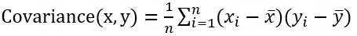
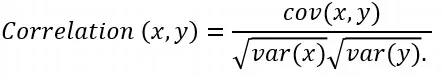
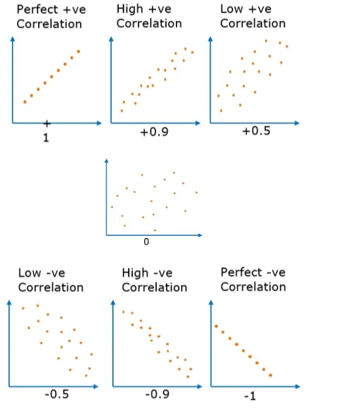

Whenever we talk about statistics, we should mention correlation and covariance. In this article, we will go through them to illustrate each concept with some examples.

**Covariance:**

It shows how two variables differ or the direction of the linear relationship. Its value can range from -∞,+∞, so a positive value indicates a positive relationship and a negative value indicates a negative relationship, and If the two variables are independent, So their covariance will be 0. So when we have a positive number we can conclude that there is a direct relationship, but that does not mean the dependency of one variable on another one.

Its formula:



· xi = data value of x

· yi = data value of y

· x̄ = mean of x

· ȳ = mean of y

· N = number of data values.

It is important to mention that the covariance is affected the variances of the variables.

```python
x=[2,4,6,9,14]
y=[32,64,72,81,172]
np.cov(x,y)[0][1]
```

```python
235.5
```

**Correlation:**

It is used to study the strength of a linear relationship between the variables, so unlike covariance, the correlation can be used to compare how strong or weak the relationship is because of its magnitude.

there are different methods that we can use to quantify the correlation. we will use the **Pearson correlation coefficient.**

Its formula:



We can say that the variables are positively correlated when the two variables move in the same direction. And they are negatively correlated when they move in the opposite directions.

the following are shapes for the relationships between variables and their correlation values based on that.



It is important to remember the common phrase "correlation does not imply causation" and that because there is a third factor can affect both of them.

Notice that you can always compute the correlation even if the relationship is not linear. So before we compute the correlation we should always check the scatterplot to see if the variables are linearly related. And if they are not linearly related, we should not use the correlation or Pearson correlation coefficient.

Here some examples in code:

```python
x = np.arange(10, 20)
y = np.array([2, 1, 4, 5, 8, 12, 18, 25, 96, 48])
print(x)
print(y)
```

```python
[10 11 12 13 14 15 16 17 18 19]
[ 2  1  4  5  8 12 18 25 96 48]
```

```python
r = np.corrcoef(x, y)
print(r)
```

```python
array([[1.        , 0.75864029],
       [0.75864029, 1.        ]])
```

Another example using pandas:

```python
x_col = pd.Series(range(10, 20))
y_col= pd.Series([2, 1, 4, 5, 8, 12, 18, 25, 96, 48])
x_col.corr(y_col)
```

```python
0.7586402890911867
```

There is a difference between correlation and association as the strongly correlated items are strongly associated but not vice versa.

Resources used: [here](https://realpython.com/numpy-scipy-pandas-correlation-python/)

That was part of Data Insight's Data Scientist program.
