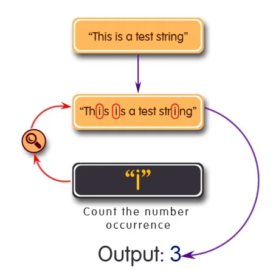

In this blog we will see that how to count the number of occurrence of a given character in a given word, phrase or a sentence. So let's get started!

## Approach:
- First we take input from the user to enter the string and the character to search for in that string.
- Then, we convert both the string and the character to lower case using the lower() function.
- Then, we pass this string and character to our function.
- Then, take a variable count = 0 and in every true condition we increment the count by 1.
- Now run a loop at 0 to length of string and check if our string is equal to the character.
- If condition true then we increment the value of count by 1 and in the end we print the value of count.

**The Main Function**

In this function we will implement the logic for counting the occurrence of the desired character.

# Count character occurrences in a given word, phrase or sentence

def countOccurrences(str, character):

# search for character in str

count = 0

for i in range(0, len(str)):

# if match found increase count

if (character == str[i]):

count = count + 1

return count

This function receives two parameters, the string and the character to search for. We take a counter which starts from 0 and run a loop starting from 0 to length of the string. If the character matches with the character in the string then the counter is incremented by 1. Finally, we return the counter.

**Let's Test this Function**

```python
# Driver code
str = input('Enter a word, phrase or sentence for the test:')
str = str.lower()

character = input('Enter the character you want to search for: ')
character = character.lower()

result = countOccurrences(str, character)

print("The number of times character " + character + " occuring in " + str + " is: " , result)
```

We have taken input from the user and convert it to lower case using the .lower() function. The .lower() method takes no arguments and returns the lowercased strings from the given string by converting each uppercase character to lowercase. Finally, we have passed the arguments in our function and stored the value of count which is being returned from the function in the result variable.

### Example for the output
```python
Enter a word, phrase or sentence for the test: Hello World from Hassan

Enter the character you want to search for: o

The number of times character o occuring in hello world from hassan is:  3
```

**That's it! Hope you enjoyed the blog.**

**You can find the project on my** [**GitHub**](https://github.com/MHS-crypto/Character-count-python.git)
