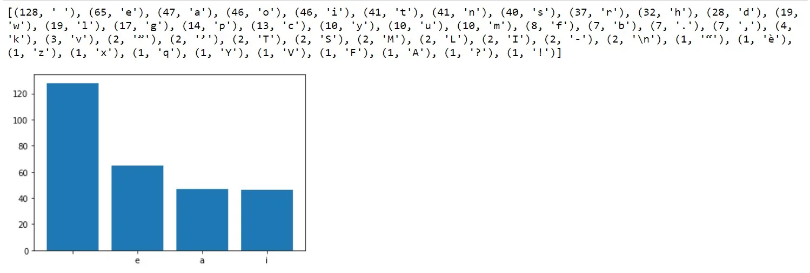

First we assign a variable to contain the string we want our application to count the number of characters of.

```python
# Contents variable containing the passage we want to count
contents = """Lawrence closed his eyes, listening to the quiet lap lap of water against the old buildings, the drip drip from the gondolier’s oar. Somewhere in the distance a baby was crying, but it was almost silent on the narrowest of narrow canals down which they now proceeded.
There’d been no problem getting a gondola ride. For the second day, a thick white mist hung in the air over the city, and at the gondola station at San Moisè the vessels had loomed out of the fog like Viking ships. A man in a pink T-shirt with horizontal red stripes, and a body-warmer had appeared from nowhere. “You wanna ride, signor e signora? Is foggy. I give you special price of sixty euros!”
Lawrence was surprised when Melissa had showed enthusiasm."""
```

We import a library called matplotlib.pyplot so that we can visualize the distribution of characters. We will use an empty dictionary so we can properly count each characters.

```python
#import matplotlib.pyplot as plt

inside = dict()
for characters in contents:
        inside[characters]=inside.get(characters,0) + 1

templist = sorted([(key,value) for (value,key) in inside.items()],reverse=True)
print(templist)
templist = dict(templist[:5])

# labels = [x[1] for x in templist]
# values = [x[0] for x in templist]
#prints the result
plt.bar(templist.values(),templist.keys())
plt.show()
```

The results are astounding.
We were able to print out the number of occurrences for each character and we are also able to visualize it.

We can see that spaces are the most frequent with 128 occurrences!


