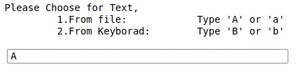
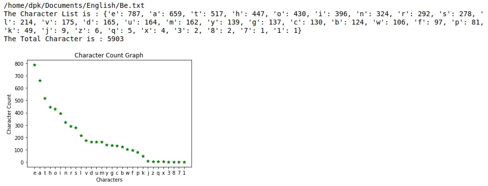

Count Character occurrence project is application that can count total characters of input word, sentence,and text file. It can also count total number of individual characters and can visualize in matplot graph. This project include Character Analysis Class, Count Visualization Function and result production function.

**Character Analysis Class**
This class create object that count the numbers of individual character from 'a' to 'z', from '0' to '9'. This class doesn't consider special characters, signs, etc. This class also count the total number of character.

### Visualization Function
**Result Production Function**

**OUTPUT**

Request Input

The app requests two type of input

Result

**Choosing Input Type**

If user types 'A' or 'a', he must insert text form text file.

If user types 'B' or 'B', he must insert text form keyboard.

Other input type will be invalid.

**Final Result**

[Get source code](https://github.com/DoublePK/DataScientistProgramAssignments/blob/master/CountCharacter.ipynb)
