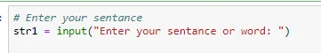
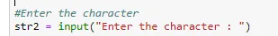
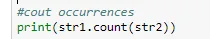

In this post, I aim to represent how to get the number of occurrences of a character in a given word, phrase, or sentence using Python.

First, we will start with getting the input sentence or word via this code bellow

Second, after getting the sentence that we are going to work with we will request the user to enter the character that he/ she wants to court its occurrences as shown in the code below

Thind and the most important step we will count the number of occurrences of the character using the pre-defined method **count().**

**The count()** method in Python calculates how many times a particular value appears within a string or a list in Python. count() accepts one argument: the value for which you want to search in the string or list.

When count() is used with a string, it will search for a *substring* within a larger string. Then, count() will return the number of times that *substring* appears in the string. When count() is used with a list, it will return the number of times a particular value has been entered into the list.

as shown in the code below:

you can found the code at this link :

[Link](https://github.com/tasnimassali/Application1_Data-insight)
