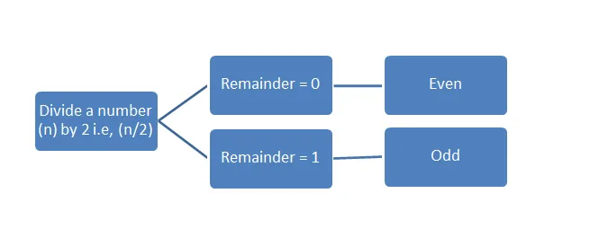

In our daily lives, we may need to count odd and even numbers. For instance, in the library, you are trying to know the numbers of books having odd numbers or even numbers. It can happen also that in a given digits numbers, we wanted to know the number (count) of odd numbers and even numbers or *zero.*

**Even numbers**, are numbers when you divide by **2**, the remainder is **0** in opposite with **odd numbers** where you will get a remainder which is **1**. We can also say that **even numbers** are numbers that are divisible by **2** and **odd** numbers are not divisible by **2**.

*We can use python programming to build an app that we can use to go through a lengthy integer to count the number of odd, even, and zero numbers that occur.*

```python
def digits_count(digits):
    """ Takes a list of single digits and returns the
        count of zeros, evens and odds
    """
    zero = 0
    even= 0
    odd= 0
```

We define our function to count zero, even, and odd numbers. Our variables zero, even, and odd are assign to zero because it will help later to increment them.

```python
    for i in digits:
        if i == 0:
            zero += 1
        elif i % 2 == 0:
            even += 1
        else:
            odd += 1
        return zero, even, odd
```

The for loop is to assign to ***i*** each value of in the n**-digits** to make the program easy and also the calculation. now, when the program will meet **i=0**, then it will increment(augmentation) the variable **zero**, if the remainder of de division is **0**, it increments the variable **even**, else (the remainder is different than **0**), the program increment our variable **odd**. The program will then return **zero, even**, and **odd** values.

```python
digit_input = input("Enter a n-digits number please: ")
digits = [int(i) for i in digit_input]

zero, even, odd = digits_count(digits)

print('zero: %d' % zero)
print('even: %d' % even)
print('odd: %d' % odd)
```

Our function (**def digits_count(digits)** ) does not give an error after runing, now the user should enter a n-digits number. the snippet **digits = [int(i) for i in digit_input]** is to avoid the error **int** object is not iterable.

Now we can try our program if it will works.

```python
Enter a ten-digit number please: 021369495970340464277
zero: 3
even: 8
odd: 10
```

Clique on **SOURCE CODE** to have a jupyter notebook and try to play around with it and add more conditions or others functions as you want. Because programming is about doing more practice even if it is the same problem. We can solve many problems using python programming and this will make life easy. If you like share with others and follow me for more post.

Do not hesitate to send your feedback for improvement.

[SOURCE CODE HERE](https://github.com/Toadoum/Data-Insight-Certification-Data-Science-program-/blob/main/Count%20the%20number%20of%20zeroes%2C%20odds%2C%20and%20evens%20in%20a%2010-digit%20number%20.ipynb)
