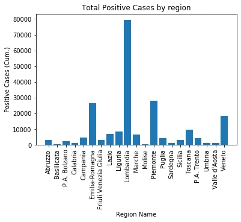
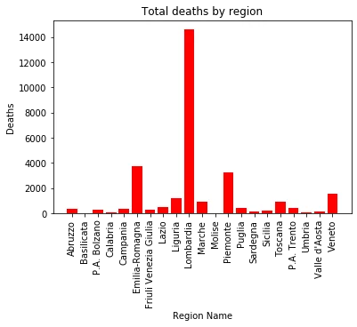
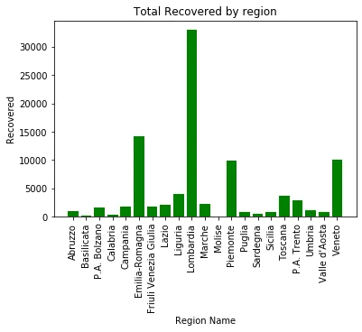
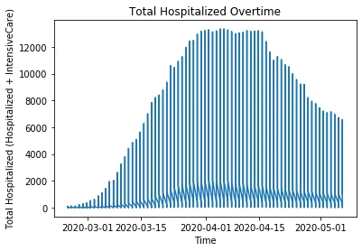
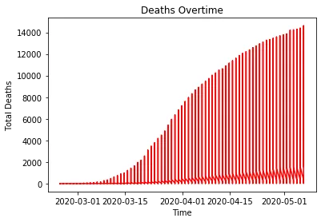
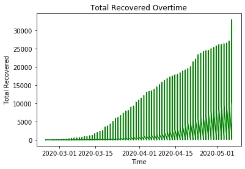

The world is currently undergoing a state of emergency due to the COVID-19 pandemic. Following notification of cases of pneumonia of unknown cause in Wuhan city, China , on December 31st 2019, a novel coronavirus (2019-nCov) was identified as the virus that causes COVID-19 illness on January 9th 2020(source:www.who.int). On 11 and 12 January WHO was notified by National Health Commission China that the outbreak had links to the exposures in one seafood market in Wuhan City. On 13 January 2020 Thailand reported the first imported case of lab-confirmed 2019-novel coronavirus(2019-ncov) from Wuhan City, the first case outside of China. By 20th January more than 280 cases had been reported from four countries: China, Thailand, Japan and the Republic of Korea. Since then the spread and rate of infection has been tremendous worldwide with over 4 million lab-confirmed cases and over 200 thousand deaths.

Italy, one of the hardest hit countries in the world has seen the worst of the pandemic. As reported by European Center for Disease Control and Prevention (ECDC), the first confirmed cases were recorded in Lombardy region on 22 February 2020. Italy falls among the top 5 ranking countries with the highest recorded number of COVID-19 laboratory confirmed and deaths. As of date the number of confirmed cases is above 200 thousand while death toll has exceeded 26 thousand (source: [www.worldometers.info).](http://www.worldometers.info) In this post we have decided to give some insight into Italy COVID-19 situation analysis. We have used the dataset from <https://www.kaggle.com/sudalairajkumar/covid19-in-italy#covid19_italy_region.csv>. It is aggregated by different regions in Italy and composes of 17 columns. The dataset is dated from 24 February 2020 and has been updated on a daily basis until the current date.

1. EXPLORATORY DATA ANALYSIS

In this section we will implore codes to import our dataset and explore it's attributes but first we are going to import some Python packages we will need for our analysis.

```python
 #let us begin by importing packages:
import pandas as pd
import matplotlib.pyplot as plt
import numpy as np
import seaborn as sns
```

```python
df = pd.read_csv(r'C:\Users\covid19_italy_region.csv', parse_dates=['Date'])
```

To view the first five rows of our dataframe we run:

```python
df.head()
```

To view data type for all columns we run:

```python
df.info()
:<class 'pandas.core.frame.DataFrame'>
RangeIndex: 1533 entries, 0 to 1532
Data columns (total 17 columns):
 #   Column                     Non-Null Count  Dtype
---  ------                     --------------  -----
 0   SNo                        1533 non-null   int64
 1   Date                       1533 non-null   datetime64[ns]
 2   Country                    1533 non-null   object
 3   RegionCode                 1533 non-null   int64
 4   RegionName                 1533 non-null   object
 5   Latitude                   1533 non-null   float64
 6   Longitude                  1533 non-null   float64
 7   HospitalizedPatients       1533 non-null   int64
 8   IntensiveCarePatients      1533 non-null   int64
 9   TotalHospitalizedPatients  1533 non-null   int64
 10  HomeConfinement            1533 non-null   int64
 11  CurrentPositiveCases       1533 non-null   int64
 12  NewPositiveCases           1533 non-null   int64
 13  Recovered                  1533 non-null   int64
 14  Deaths                     1533 non-null   int64
 15  TotalPositiveCases         1533 non-null   int64
 16  TestsPerformed             378 non-null    float64
dtypes: datetime64[ns](1), float64(3), int64(11), object(2)
memory usage: 203.7+ KB
```

To view summary statistics of our dataframe we run:

```python
df.describe()
```

1.1 Plots by region

In this section we will plot total positive cases, total deaths and total recovered against region to view distribution of the aggregated incidences by different regions. We will use matplotlib bar plots.

```python
#total positive cases by region name:
fig, ax = plt.subplots()

ax.bar(df['RegionName'],df['TotalPositiveCases'])
ax.set_xlabel('Region Name')
ax.set_xticklabels(df['RegionName'], rotation=90)
ax.set_ylabel('Positive Cases (Cum.)')
ax.set_title('Total Positive Cases by region')
```

- 

```python
# plot of total deaths by region:
fig, ax = plt.subplots()

ax.bar(df['RegionName'],df['Deaths'], color='red')
ax.set_xlabel('Region Name')
ax.set_xticklabels(df['RegionName'], rotation=90)
ax.set_ylabel('Deaths')
ax.set_title('Total deaths by region')
```

- 

```python
#total recoveries by region:
fig, ax = plt.subplots()

ax.bar(df['RegionName'],df['Recovered'], color='green')
ax.set_xlabel('Region Name')
ax.set_xticklabels(df['RegionName'], rotation=90)
ax.set_ylabel('Recovered')
ax.set_title('Total Recovered by region')
```

- 

We see from the plots that Lombardia has the highest cases in Italy followed by Emilia-Romagma.

2.**2. ANALYSIS OF THE KEY INDICATORS**

We have seen the distribution of total positive cases, total deaths and total recoveries in part 1. In section let us try to run our analysis basing ourselves on some of the key indicators related to the spread, distribution and occurance of the COVID-19 pandemic. We will run our analysis trying to address the following 3 factors; 2.1 How postive cases, deaths and recoveries changed over time(trend analysis). 2.2 Determine the distribution of cases by percentage hospitalized and percentage at home-confinement and the possible reasons behind the observations 2.3 Determine the differences between final outcomes and the possible causes to observed differences.

2.1 Trend analysis

In this section we view how total hospitalized cases, total deaths and total recoveries have changed over time, we will implore matplotlib plots:

```python
fig, ax = plt.subplots()

ax.plot(df['Date'], df['TotalHospitalizedPatients'])
ax.set_xlabel('Time')
ax.set_ylabel('Total Hospitalized (Hospitalized + IntensiveCare)')
ax.set_title('Total Hospitalized Overtime')
plt.show()
```

- 

```python
fig, ax = plt.subplots()

ax.plot(df['Date'], df['Deaths'], color='red')
ax.set_xlabel('Time')
ax.set_ylabel('Total Deaths')
ax.set_title('Deaths Overtime')
plt.show()
```

- 

```python
fig, ax = plt.subplots()

ax.plot(df['Date'], df['Recovered'], color='red')
ax.set_xlabel('Time')
ax.set_ylabel('Total Recovered')
ax.set_title('Recovered Overtime')
plt.show()
```

- 

## 2.1.1 Interpretation
We see from the 1st figure that there has been an upward trend of identified positive cases in Italy from the 1st March to 1st April, then the cases somewhat remained high but constant in the 1st 2 weeks of April and then a declining trend in the last 2 weeks of April until May the 7th. Taking a look at the second plot, we see that there has been some increases in the numbers recovered from beginning of March with even high increases observed towards end of April to beginning of May. The last figure shows sharp increases in the cases of deaths from beginning of March to beginning of April. However, from April we see a somehow constant increase in the number of deaths to beginning of May.

2.2 In this section we determine the percentages of hospitalized patients and home-confined patients on the total positive cases.

```python
#let us define our variables:

total_positive=df['TotalPositiveCases'].sum()
total_hospitalized=df['TotalHospitalizedPatients'].sum()
current_positive=df['CurrentPositiveCases'].sum()
deaths= df['Deaths'].sum()
recovered=df['Recovered'].sum()
home_confinement=df['HomeConfinement'].sum()
```

```python
#let us now define our percentages:

percent_hospitalized=total_hospitalized/total_positive
percent_home_confinement=home_confinement/total_positive
percent_died=deaths/total_positive
percent_recovered=recovered/total_positive
```

```python
print(percent_hospitalized)
:0.1923375946044296
```

```python
print(percent_home_confinement)
:0.4230171807799001
```

We see from the output that more patients (42.3%) are on home-confinement than those hospitalized (19.2%).

**Interpretation**

**2.3 We will now try to establish the most likely outcome for patients in home confinement.**

```python
print(percent_died)
:0.12616726937791345
```

```python
print(percent_recovered)
:0.2584779552377569
```

## Interpretation
We see that a greater percentage(25.8%) of positive cases has resulted in recoveries than deaths (12.6%)

## CONCLUSION
From the analysis above we see that out of the total positive cases, hospitalized cases has risen sharply in the early stage of the pandemic, then remained constant for some time and then declined at a later stage while deaths have been rising sharply in the beginning but reaching a constant increase over time. Furthermore, looking at recovered cases, we have seen that they have been rising somewhat constantly from the beginning but have shown a further increase of late.The possible explanation to this observed scenarios is that maybe the society is beginning to realize the importance of self-isolation, social-distancing and proper hygiene in preventing both new infections and re-infections It is also observable that a greater percentage of positive cases has been held at home-confinement than hospitalized.
