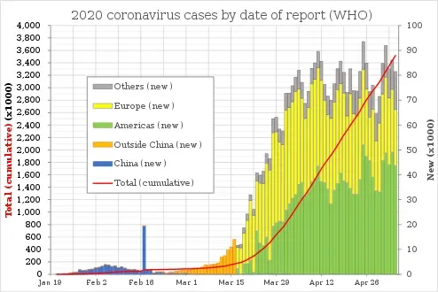
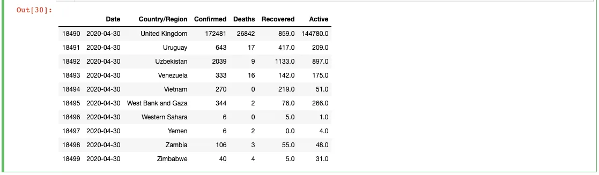
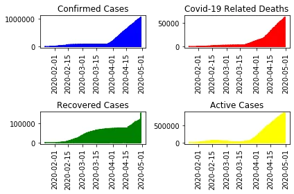
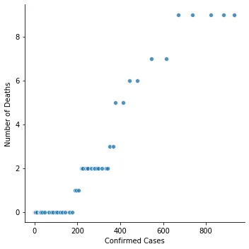
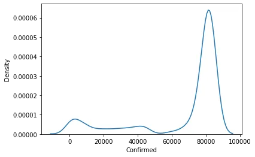

SARS-CoV-2 also known as the novel coronavirus is a respiratory virus that is highly contagious and proves to be very deadly especially when contracted by the elderly and people with underlying health condition(s). On December 31 last year, China alerted the WHO to several cases of unusual pneumonia in Wuhan, a city of 11 million people. On January 7, WHO health officials announced they had identified a new virus.

The novel virus was named 2019-nCoV and was identified as belonging to the coronavirus family, which includes SARS and the common cold.

Since then, the virus has infected people from almost every country on earth and killed over a quarter of a million people globally.

In this blog post, we will look at the average infection rate in Senegal and also to answer the question of whether we are likely to record more deaths in Senegal as the number of cases rise. We will also be looking at the relationship between the key fields (Confirmed, Deaths, Active) to better comprehend the connection between them. Finally, it will show if China has flattened its curve and also take a look at some of the measures they put in place in achieving that success.

I have acquired the datasets from the github account of [Johns Hopkins University Center for Systems Science and Engineering (JHU CSSE)](https://github.com/CSSEGISandData/COVID-19) before cleaning and merging them.

Before going any further, we will display the last few rows of the cleaned dataframe and also plot some of the important fields in it.

```python
full_grouped.tail(10)
```



```python
# Create a figure with 2x2 subplot layout and make the top left subplot active
plt.subplot(2,2,1)

# Plot in blue is the % of the Confirmed Cases in the world.
plt.plot(df.Confirmed, color='blue')
plt.title('Confirmed Cases')
plt.xticks(rotation='vertical')

# Make the top right subplot active in the current 2x2 subplot grid
plt.subplot(2,2,2)

# Plot in red is the % of the Covid-19 Related Deaths in the world.
plt.plot(df.Deaths, color='red')
plt.title('Covid-19 Related Deaths')
plt.xticks(rotation='vertical')

# Make the bottom left subplot active in the current 2x2 subplot grid
plt.subplot(2,2,3)

# Plot in green is the % of the Recovered Cases in the world.
plt.plot(df.Recovered, color='green')
plt.title('Recovered Cases')
plt.xticks(rotation='vertical')

# Make the bottom right subplot active in the current 2x2 subplot grid
plt.subplot(2,2,4)

# Plot in yellow is the % of the Active Cases in the world.
plt.plot(df.Active, color='yellow')
plt.title('Active Cases')
plt.xticks(rotation='vertical')

# Improve the spacing between subplots and display them
plt.tight_layout()
plt.show()
```



From the plots above, we see that there is a steady rise in all of the variables globally.

Now to the most pertinent questions my analysis aims to solve.

**What is the average infection rate in Senegal?**

We will first extract the data related to Senegal and get the statistics of its mean to give us the average infection rate that country has.

```python
senegal = df['Country/Region'] == 'Senegal'
df[senegal]['Confirmed'].mean()
```

We get an average of about 135 confirmed cases as of the 30th of April 2020.

**What is the relationship between the globally confirmed, deaths and active cases?**

To determine this relationship, we will use the Pearson correlation to tell us if the variables are strongly related or not. It shows a number between -1 and 1 that indicates the extent to which two variables are linearly related. Closer to positive one means strong relationship and vise-versa.

```python
# The columns to check
fields = ['Confirmed', 'Deaths', 'Active']
# create a subset dataframe from the main dataframe (df)
subset = df[fields]
# calculate the correlation of the subset dataframe
subset.corr()
```


This matrix shows that there is a very strong relationship between these three variables. Since this is the global representation of the data, we will next explore the question of whether we going to see more deaths as the number of confirmed cases grow in Senegal.

**Are we going to see more deaths as the number of confirmed cases grow in Senegal?**

We will graphically plot the confirmed cases against the the number of deaths related to coronavirus in Senegal to help me answer this question. But first, the code we use to generate the graph is as follows.

```python
# confirmed = df[senegal]['Confirmed']
# deaths = df[senegal]['Deaths']

sns.relplot(x='Confirmed', y='Deaths', data=df[senegal], kind='scatter', alpha=0.8)

# Make a scatter plot
# plt.plot(confirmed, deaths, 'o', markersize=4, alpha=0.6)

plt.xlabel('Confirmed Cases')
plt.ylabel('Number of Deaths')

plt.show()
```

And it yields the graph below.



From the plot above, we can see the correlation between the confirmed cases and the number of deaths in Senegal. The higher the cases the more deaths there are. Unless there is a vaccine or they maintain strict restrictions with regards to social distancing, unnecessary travels, maintaining proper hygiene etc; cases will continue to grow bringing in more deaths along the way.

And now to the almighty term of "flattening the curve". We have seen a steady decrease in the number of confirmed cases and deaths in some parts of the world. We will explore the data from China to see if they have actually accomplished this milestone.

**Has China flattened its COVID-19 cases curve?**

We have seen some very drastic measures put in place in Wuhan and else where in China to contain the spread. Have those measures ultimately paid off? We will look at the data from China, analyze it and plot a graph to show if China is seeing meaningful improvements leading up to now.

```python
ch = df['Country/Region'] == 'China'
china = df[ch]
sns.distplot(china['Confirmed'],hist=False, bins=10)
plt.ylabel('Density')
plt.show()
```



From the plot above, we can see that when China reached that 80,000 confirmed cases milestone, the curve took a dramatic downward direction depicting how the confirmed cases were gradually going down and thereby flattening the curve.

**Recommendations**

Using China as a model of success in getting the numbers down, here are some key measures they have put in place in achieving that feat.

1. Strict social distancing measures.

2. Avoiding unnecessary travels.

3. Wearing face masks when going out and maintain clean hygiene at all times.

4. Mandatory lockdowns for areas affected.

5. Follow W.H.O and health expert guidelines.

My complete analysis can be found on github [here](https://github.com/siseebrima/Data-Insight-Analysis-Project/blob/master/Analysis.ipynb).

**References**

1. Center for Systems Science and Engineering (CSSE) at Johns Hopkins University

2. Aljazeera News
