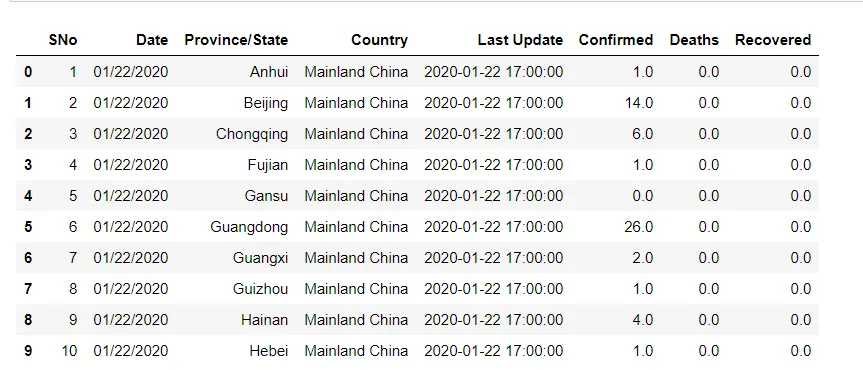
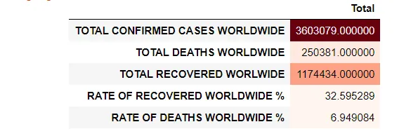
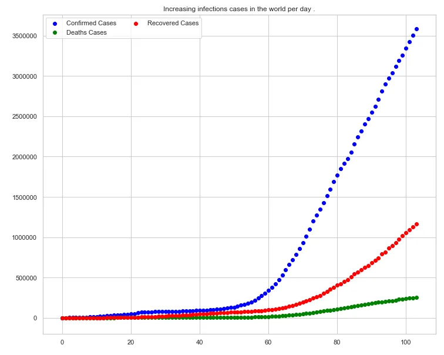
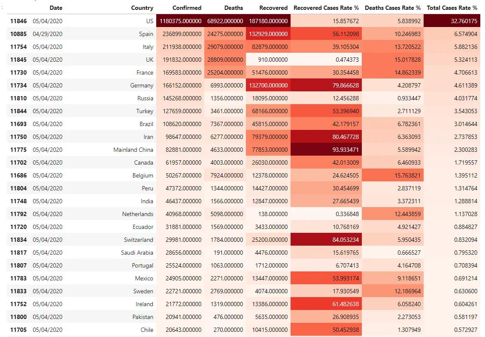
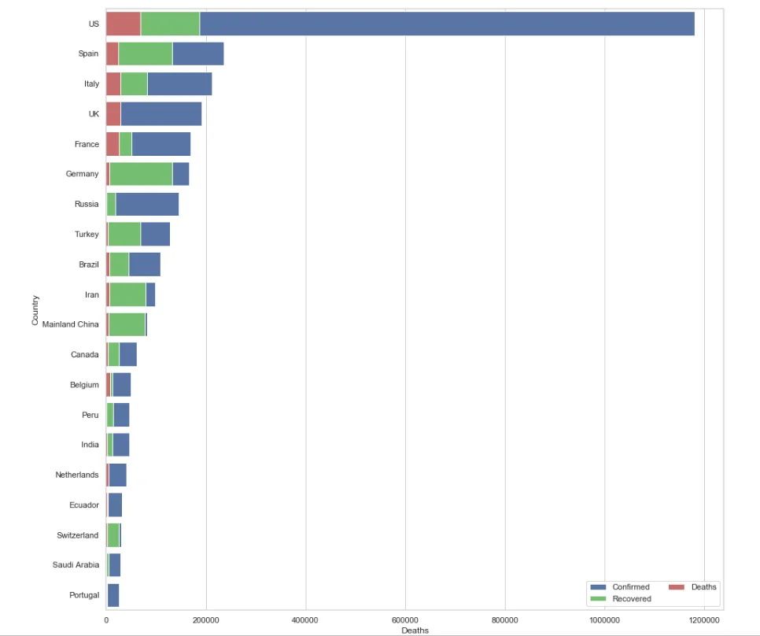
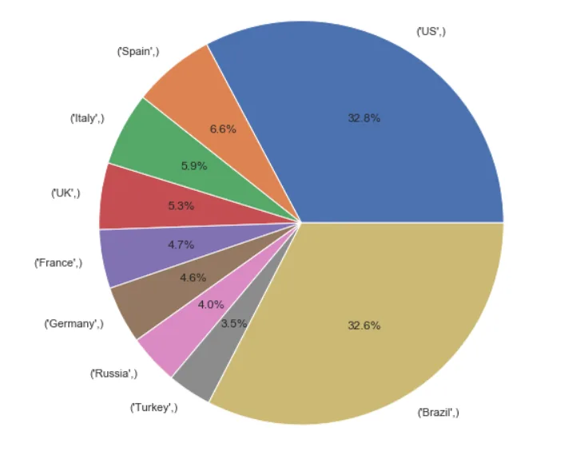

As you are reading this, there is a high possibility of being stuck at home or otherwise quarantined in some way.

And like most people, you are deeply concerned with the pandemic that has plagued the entire world.

Well, let's jump into analyzing the dataset I downloaded from Kaggle.

Preview of first cases:

Basic statistics:

Graph showing increasing recovery, confirmed & death cases per day:

Confirmed cases in increasing order:

Barplot:

Case rate per country of total cases in the world:

In a nutshell the confirmed cases keep rising at an exponential rate. Our only security lies in staying at home and only going out for essential so that those at the forefront of fighting the virus can do so effectively.
