**Introduction:**

According to the WHO (World Health Organization) website, Corona viruses are a large family of viruses that are known to cause illness ranging from the common cold to more severe diseases such as Middle East Respiratory Syndrome (MERS) and Severe Acute Respiratory Syndrome (SARS).In December 2019, a novel corona-virus was identified in 2019 in Wuhan, China. This is a new corona-virus that has not been previously identified in humans. The novel virus was named Covid-19,since then the virus has spread throughout the world at an alarming rate causing death and changing the way of life as the global village once new it.

In this article, we will conduct an explanatory analysis to answer the 3 questions:

1. Which countries had the highest confirmed cases of Covid-19 and what was their daily cases trend in April?
2. What was the Covid-19 recovery rates among the top 8 most affected countries in the month of April?
3. What was the outlook and trends in Kenya in the month of April?

1. April 2020: Countries with the highest Confirmed Cases & daily trends

To explore these we will use open source data from *CSSEGISandData*

we will utilize the posted data on GitHub.

Importing data:

```python
recovered_csv="https://raw.githubusercontent.com/CSSEGISandData/COVID-19/master/csse_covid_19_data/csse_covid_19_time_series/time_series_covid19_recovered_global.csv"
confirmed_csv="https://raw.githubusercontent.com/CSSEGISandData/COVID-19/master/csse_covid_19_data/csse_covid_19_time_series/time_series_covid19_confirmed_global.csv"
```

```python
#Reading in the data to dataframes
recovered_timeseries_df=pd.read_csv(recovered_csv)
confirmed_timeseries_df=pd.read_csv(confirmed_csv)
```

```python
#Inspecting the data sets
recovered_timeseries_df.head()
```

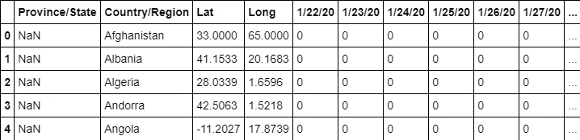

```python
confirmed_timeseries_df.head()
```

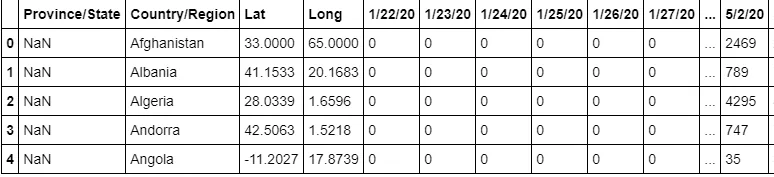

Reshaping the data to facilitate for analysis:

```python
#Since the columns in the df's are the same we can come up with a function to massage the data
#we shall drop columns Province/State,Lat,Long as we don't require it in our analysis
def reshape_data(recovered_timeseries_df,confirmed_timeseries_df):
    confirmed=confirmed_timeseries_df.melt(id_vars=['Province/State','Country/Region','Lat','Long'],var_name='Date',value_name='Confirmed_cases').drop(columns=['Province/State','Lat','Long'])
    recovered=recovered_timeseries_df.melt(id_vars=['Province/State','Country/Region','Lat','Long'],var_name='Date',value_name='Recovered_cases').drop(columns=['Province/State','Lat','Long'])
    confirmed['Date']=pd.to_datetime(confirmed['Date'])
    recovered['Date']=pd.to_datetime(recovered['Date'])
    recovered.set_index("Date",inplace=True)
    confirmed.set_index("Date",inplace=True)
    recovered.index = recovered.index.strftime('%d/%m/%Y')
    confirmed.index = confirmed.index.strftime('%d/%m/%Y')

    return (confirmed,recovered)
```

Inspecting the transformed data

```python
#Wrangling the raw data and unpacking the massaged data to new dataframes
Confirmed_data,Recovered_data=reshape_data(recovered_timeseries_df,confirmed_timeseries_df)
```

```python
#Inspecting the unpacked data
Confirmed_data.head()
```

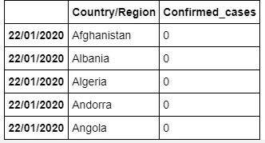

```python
Recovered_data.head()
```

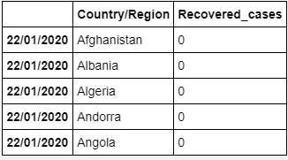

```python
#Filtering the countries with a high number of confirmed cases registered for the month of April 2020
High_Cases_Confirmed=Confirmed_data['01/04/2020':'30/04/2020'].groupby("Country/Region").max().sort_values(by="Confirmed_cases",ascending=False).head(5)
```

```python
High_Cases_Confirmed.index
```

Index(['US', 'Spain', 'Italy', 'United Kingdom', 'France'], dtype='object',
 name='Country/Region')

```python
Countries_List=High_Cases_Confirmed.index.to_list()
```

```python
#Filtering the confirmed cases data with Countries list for the month of April 2020 & summing over Confirmed_cases for any cases  of duplicated Country/Region per day
def April_data(data,count_column):
    data1=data[data["Country/Region"].isin (Countries_List)]
    data1=data1['01/04/2020':'30/04/2020']
    data1 = data1.groupby([data1.index,'Country/Region']).agg({count_column: 'sum'})
    data1.reset_index(inplace=True)
    data1.set_index('level_0',inplace=True)
    data1.index.rename('Date',inplace=True)
    return data1
```

visualizing the cases confirmed among the different countries

```python
Color=['Red','Blue','Green','Black','Purple']
c=0
fig,ax=plt.subplots(figsize=(14,9))
for i in Countries_List:
    a=Highest_Cases_data[Highest_Cases_data['Country/Region']==i]
    ax.plot(a.index,a['Confirmed_cases'],color=Color[c])
    c+=1
ax.legend(Countries_List,loc='best')
plt.xticks(rotation='vertical')
ax=plt.gca()
plt.title('Most Affected Countries ( Confirmed April Cases)')
plt.xlabel("Date")
plt.ylabel("Confirmed Cases")
plt.show
```

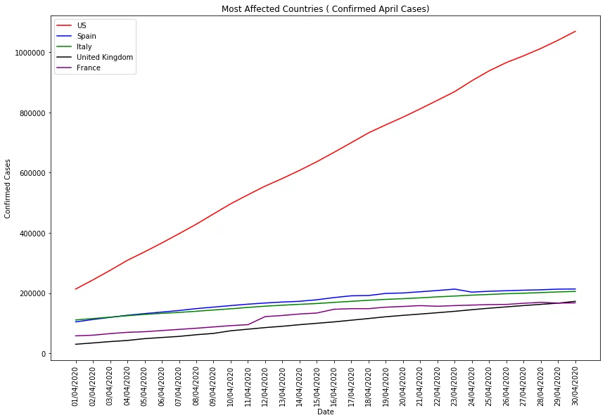

Visualizing confirmed cases except US:

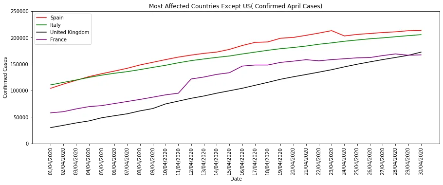

Observations:

From the graph we can observe that the confirmed cases have increased linearly in the US in the month of April, with an estimate of around 30,000 new cases per day.

From the above plot we can observe that: Generally there seems to be an almost linear growth of confirmed cases amongst the four countries; with Spain cases significantly going down on 23/04/2020 and cases in France spiking on 12/04/2020

**2.** **Recovery Rates Among the top 8 Affected Countries in the month of April**

```python
#Summing for values with duplicated region/Country
Confirmed_data_April=Confirmed_data.groupby([Confirmed_data.index,'Country/Region']).agg({'Confirmed_cases': 'sum'})
```

```python
Confirmed_data_April=Confirmed_data_April.loc['01/04/2020':'30/04/2020']
```

```python
Confirmed_Country_Max=Confirmed_data_April.groupby(['Country/Region']).max()
```

```python
Confirmed_Country_Max.reset_index(inplace=True)
```

```python
Confirmed_Country_Max.head()
```

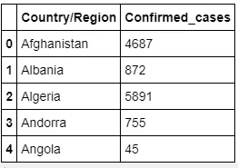

Replicating the above for the recoveries

```python
#Summing for values with duplicated region/Country
Recovered_data_April = Recovered_data.groupby([Recovered_data.index,'Country/Region']).agg({'Recovered_cases': 'sum'})
```

```python
Recovered_data_April=Recovered_data_April.loc['01/04/2020':'30/04/2020']
```

```python
#Getting the maximum recovery cases
Recovered_Country_Max = Recovered_data_April.groupby(['Country/Region']).max()
```

```python
Recovered_Country_Max.reset_index(inplace=True)
Recovered_Country_Max.head()
```

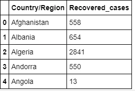

```python
Confirmed_Recovered_data=Confirmed_Country_Max
#Adding a Recovered_cases column to create a new dataframe
Confirmed_Recovered_data['Recovered_cases']=Recovered_Country_Max['Recovered_cases']
Confirmed_Recovered_data['Recovery rate']=Confirmed_Recovered_data['Recovered_cases']/Confirmed_Recovered_data['Confirmed_cases']
```

```python
Confirmed_Recovered_data.head()
```

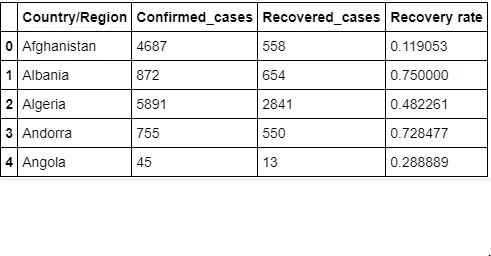

***Visualizing the recovery rate of the Most affected countries in the world(8 Countries)***

```python
Countries_Most_Affected=Confirmed_Recovered_data.groupby("Country/Region").max().sort_values(by="Confirmed_cases",ascending=False).head(8)
```

```python
Countries_Most_Affected.reset_index(inplace=True)
```

```python
Countries_Most_Affected.head()
```

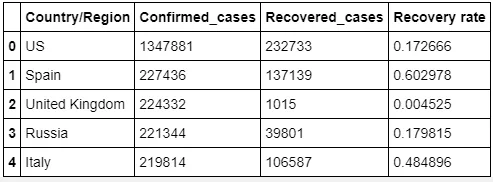

visualizing the data:

```python
sns.barplot(x='Country/Region',y='Recovery rate',data=Countries_Most_Affected,order=['United Kingdom','Russia','US','France','Brazil','Italy','Spain','Germany'])plt.xticks(rotation='vertical')plt.title("Recovery Rates for Countries Most Affected")
```

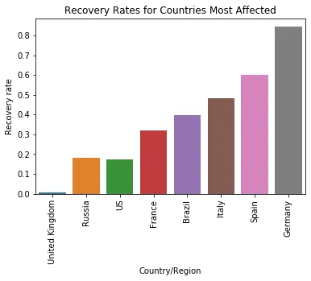

Observation:

We observe that in the month of of April UK had the lowest recovery rate and Germany had the highest recovery rate. Although this is the case, it is important to note that several factors have an impact on the recovery rates and this may be different from country to country. Some of this factors may include:

1. Demographics
2. Age distribution among the confirmed cases
3. Health system capacity
4. Rates at which tests are being carried out
5. Population size

e.t.c

**3.** **Outlook and Trends of Covid19 in Kenya in the month of April**

```python
#Subseting the Kenyan data Kenyan_Confirmed=Confirmed_data[Confirmed_data['Country/Region']=='Kenya']
```

```python
Kenyan_Confirmed=Kenyan_Confirmed['01/04/2020':'30/04/2020']
```

```python
Kenyan_Confirmed.reset_index(inplace=True)
```

```python
Kenyan_Confirmed.rename(columns={'index':'Day'},inplace=True)
```

```python
Kenyan_Confirmed.head()
```

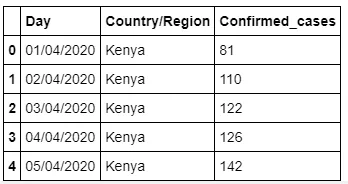

```python
#Plot of confirmed cases over_time
fig,ax=plt.subplots(figsize=(15,5))
sns.lineplot(y='Confirmed_cases',x='Day',ax=ax,data=Kenyan_Confirmed,marker='s')
plt.xticks(rotation="vertical")
ax.set_ylim([0,450])
sns.set_style("darkgrid")
plt.title("Total Confirmed Cases")
plt.show()
```

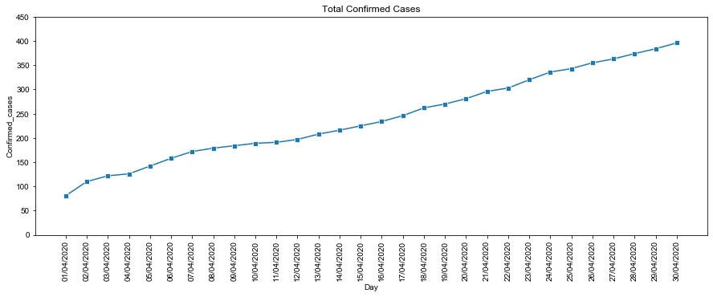

We observe that like most of the other countries confirmed cases in Kenya rose linearly over the month of April. Although this is the case, these cases are mostly affected by the number of sample tests conducted per day. It is important to note that testing is also limited to the availability of testing kits which are on high demand all over the world amidst their less supply.

```python
Kenyan_Confirmed['Daily_Confirmed_cases']=Kenyan_Confirmed['Confirmed_cases'].diff()
```

```python
#Dropping the first day
Kenyan_Daily_Confirmed=Kenyan_Confirmed.dropna(axis=0)
```

```python
Kenyan_Daily_Confirmed.head()
```

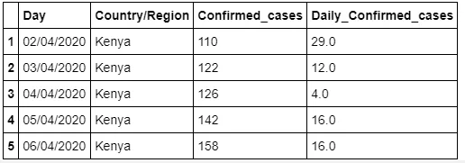

Visualizing the daily confirmed cases

```python
fig,ax=plt.subplots(figsize=(15,5))
sns.lineplot(y='Daily_Confirmed_cases',x='Day',data=Kenyan_Daily_Confirmed,marker='o')
plt.xticks(rotation="vertical")
ax.set_ylim([0,30])
sns.set_style("darkgrid")
plt.title("April-Kenya Daily Cases")
plt.show()
```

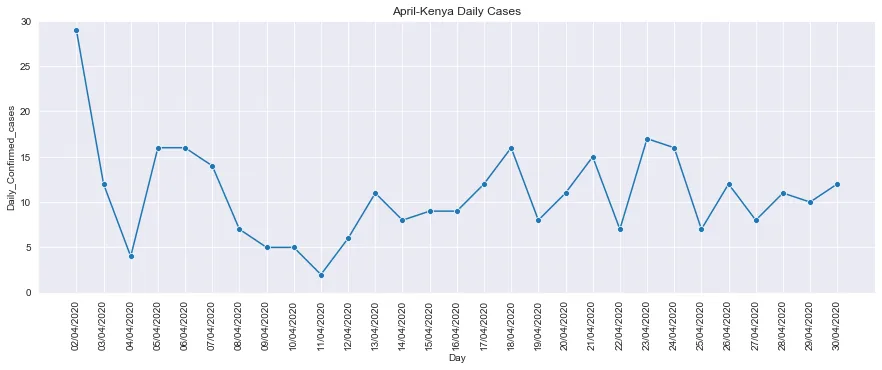

*Kenya testing data scraped from daily press briefings by the Ministry of Health Kenya*

```python
Dates=Kenyan_Confirmed['Day'].to_list()
#Converting the dates to a list
#It is worth noting that some days had missing information of test data thus we shall drop those days
#Dropping days with missing test data
Dates=Dates[1:]
Test_Missing=['06/04/2020','08/04/2020','16/04/2020','17/04/2020','20/04/2020','25/04/2020','26/04/2020','27/04/2020','28/04/2020']
Test_Dates=[item for item in Dates if item not in Test_Missing]
```

Loading data for dates with entries

```python
Kenyan_tested=[662,362,372,530,696,308,504,491,766,674,694,803,1115,1330,545,707,668,946,508,777]
d={'Test Days':Test_Dates,'Count Sample Tests':Kenyan_tested}
df_Tests=pd.DataFrame(d)
```

inspecting the data

```python
df_Tests.head()
```

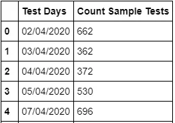

```python
#Visualizing the same
fig,ax=plt.subplots(figsize=(12,5))
sns.barplot(y='Count Sample Tests',x='Test Days',data=df_Tests,color='b')
plt.xticks(rotation="vertical")
sns.set_style("darkgrid")
plt.title("Daily Test Cases")
plt.show()
```

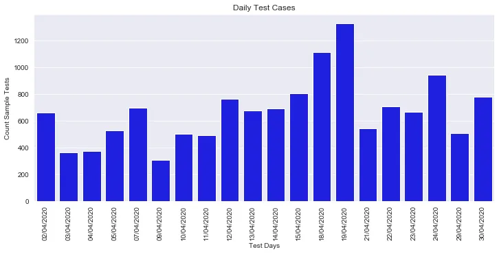

***Count_test_samples vs Confirmed cases***

```python
Kenya_x=Kenyan_Confirmed.set_index('Day')
Kenya_x=Kenya_x.drop(['01/04/2020','06/04/2020','08/04/2020','16/04/2020','17/04/2020','20/04/2020','25/04/2020','26/04/2020','27/04/2020','28/04/2020'])
Kenya_x.reset_index(inplace=True)
Kenya_x=Kenya_x.rename(columns={'Day':'Test Days'})
Kenya_x=pd.merge(df_Tests,Kenya_x,on='Test Days')
Kenya_x.head()
```

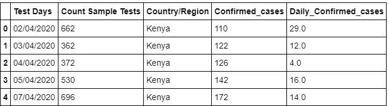

```python
fig,ax=plt.subplots(figsize=(12,6))
ax2=ax.twinx()
sns.lineplot(y='Daily_Confirmed_cases',x='Test Days',data=Kenya_x,ax=ax,marker='o',color='red')
sns.lineplot(y='Count Sample Tests',x='Test Days',data=Kenya_x,ax=ax2,marker='x')
ax.set_xticklabels(ax.get_xticklabels(), rotation=90)
ax2.set_xticklabels(ax2.get_xticklabels(),rotation=90)
ax.set_ylim([0,30])
sns.set_style("darkgrid")
plt.title("Kenya Daily Cases & Test Conducted")
plt.show()
```

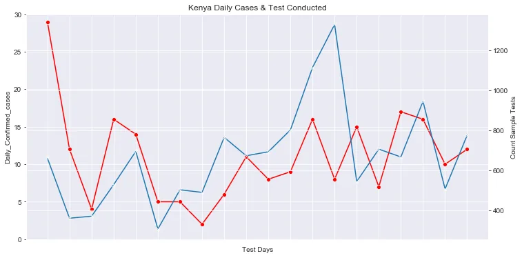

**Observations:**

The inconsistency in the number of tested conducted per day is due to the limited supply of testing kits and the testing policies applied in Kenya.It is important to note that as at April 30th Mass testing had not taken place in Kenya. Also we note that there is really no correlation between the daily confirmed cases and the sample tests conducted per day. It is important to note that both the number of cases is affected by the test samples conducted, currently in Kenya the population tested is that of people in quarantine or those with a high probability of being infected.Maybe the numbers might change if mass testing is done, but we shall wait and see.

*Data Sources:*

*1.* [*https://github.com/CSSEGISandData/COVID-19/tree/master/csse_covid_19_data/csse_covid_19_time_series*](https://github.com/CSSEGISandData/COVID-19/tree/master/csse_covid_19_data/csse_covid_19_time_series)

2. www.health.go.ke
