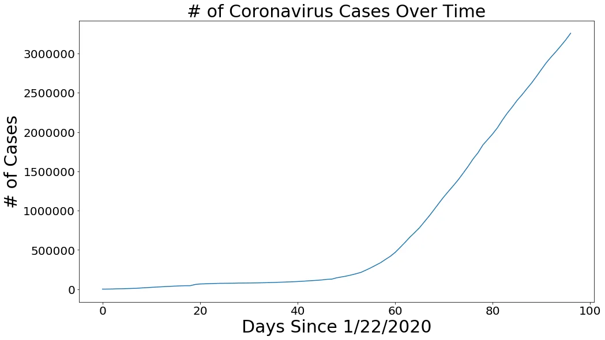
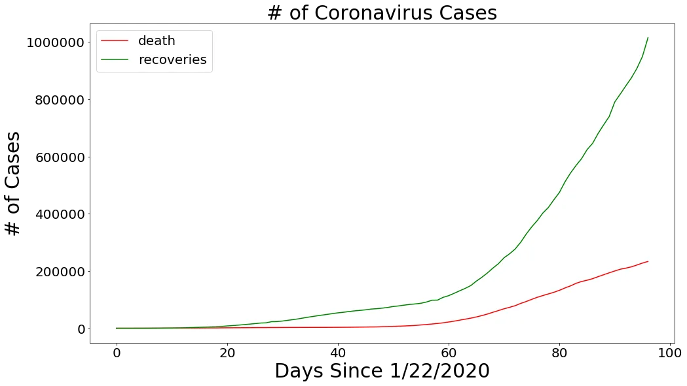
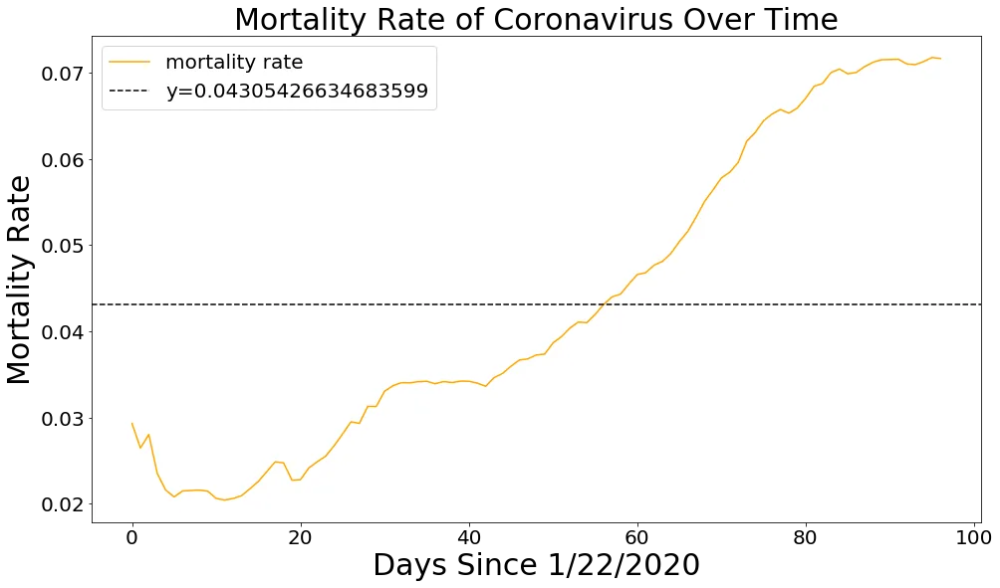
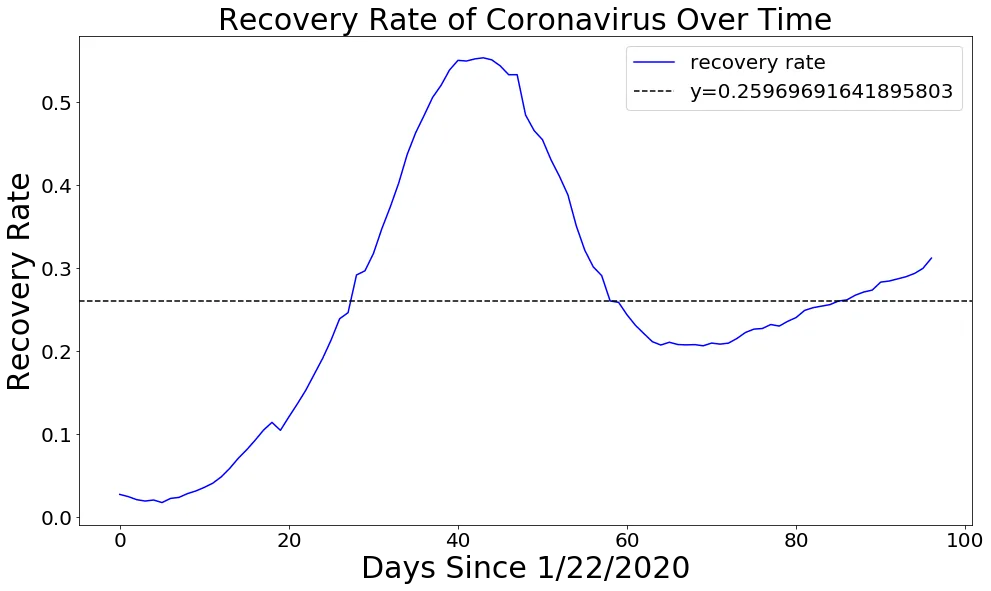
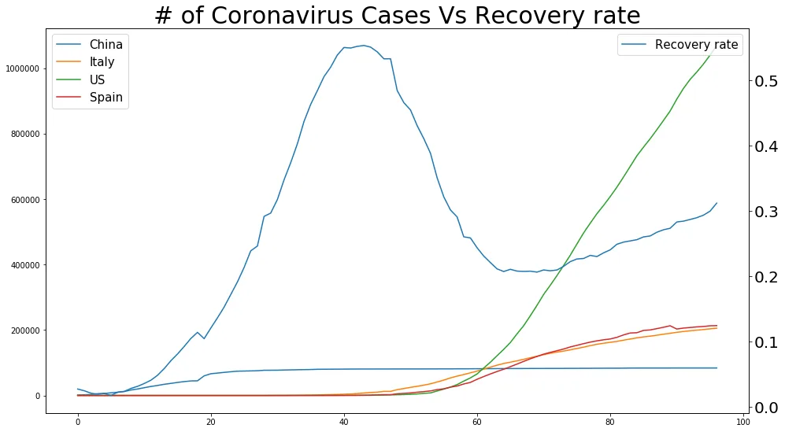
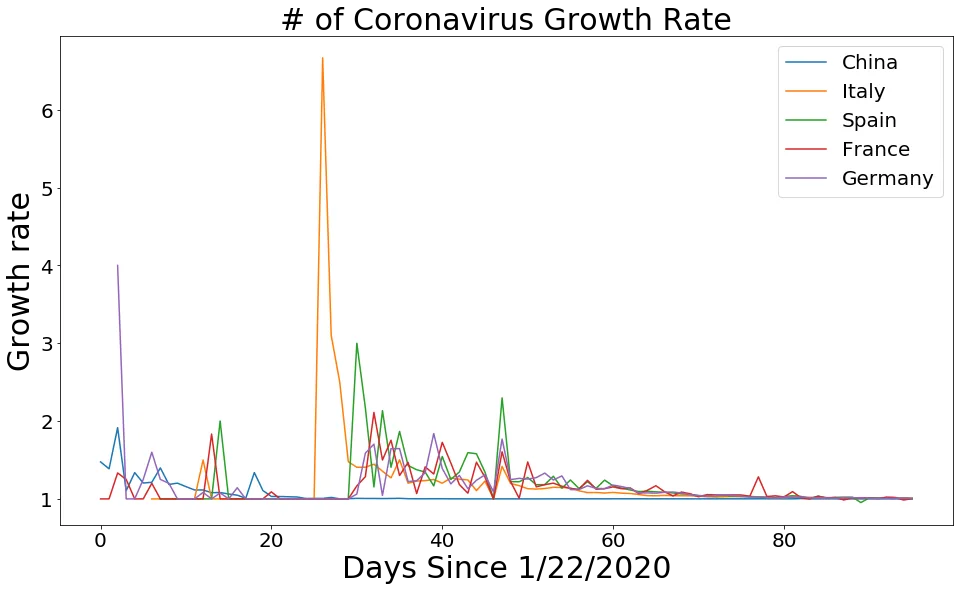

The world has been put on its knees by a rather rare respiratory disease that was first detected around end of 2019 and keeps growing strongly world over. We set out to make some preliminary analysis on the data available on the cases,deaths and recoveries. As we go on we shall look at a few insights we derived from our analysis.

To start off our analysis we pick data from John Hopkins University repository on GitHub to be able to get a look and feel of the extent to which the virus has spread around the world. It is however clear that very few countries if any have not had a case of the deadly virus and by the time of this blog we are well past the two million mark in terms of diseases and over one hundred thousand deaths. Whereas many would argue that the disease is not as severe as previous pandemics its prudent to take precautions and STAY SAFE.

As from the words of Ghanaian president, "We know how to recover a fallen economy but we do not know how to bring back the dead".

We start off our analysis with some pre-processing to ensure the data we have is in a more usable format, we drop unnecessary columns for example the longitude and latitude.

```python
#minor preprocesing
confirmed=confirmed.drop(['Province/State','Lat', 'Long'],axis=1).sort_values('Country/Region')
deaths=deaths.drop(['Province/State','Lat', 'Long'],axis=1).sort_values('Country/Region')
recoveries=recoveries.drop(['Province/State','Lat', 'Long'],axis=1).sort_values('Country/Region')
```

We then apply some aggregations to have data aggregated per country per day

```python
train_dates=confirmed.columns[1:]# The dates for the train period
# Grouping by territory
country_deaths=deaths.groupby('Country/Region').sum()[train_dates]country_cases=confirmed.groupby('Country/Region').sum()[train_dates]country_recoveries=recoveries.groupby('Country/Region').sum()[train_dates]
```

We then create a data frame to put together all the data in a single data frame.

```python
# Creating the dataframe
data=pd.DataFrame({'Country':country_cases.stack().reset_index()['Country/Region'].to_list(),'dates':country_cases.stack().reset_index()['level_1'],'cases':country_cases.stack().reset_index()[0],'deaths':country_deaths.stack().reset_index()[0],'recoveries':country_recoveries.stack().reset_index()[0]})
```

Once we have our data saved per country per day, we set out to get world wide data per day to aid in world level summaries

```python
#picking off all dates
cols = confirmed.keys()

confirmed_dates = confirmed.loc[:, cols[4]:cols[-1]]
deaths_dates = deaths.loc[:, cols[4]:cols[-1]]
recoveries_dates = recoveries.loc[:, cols[4]:cols[-1]]

dates = confirmed_dates.keys()
world_cases = []
total_deaths = []
mortality_rate = []
recovery_rate = []
total_recovered = []
total_active = []
```

```python
for i in dates:
    confirmed_sum = confirmed_dates[i].sum()
    death_sum = deaths_dates[i].sum()
    recovered_sum = recoveries_dates[i].sum()

    # confirmed, deaths, recovered, and active
    world_cases.append(confirmed_sum)
    total_deaths.append(death_sum)
    total_recovered.append(recovered_sum)
    total_active.append(confirmed_sum-death_sum-recovered_sum)
```

We go through a similar process to the worldly data for the major top 10 countries since they are very pivotal in our analysis. We then create new columns for mortality and recovery rates

```python
# get mortality and recovery rates per day
data['Mortality_rate']=data['deaths']/data['cases']
data['Recovery_rate']=data['recoveries']/data['cases']
```

Once done with the data pre processing we set out to do some preliminary visualisations to provide a feel of how bad the situation is currently





We can see from the visualizations that whereas the cases are skyrocketing the deaths are moving at a slower pace, which definitely shows that we will be able to save most of our sick by the time we are done with the pandemic.

The visualization below shows that our mortality rate is way below 10 percent of all cases reported.



Also if you notice clearly we are recovering more people compared to those we loose to the disease with China reporting an over 93 percent recovery rate. We then try to look at the recovery curve over time as shown below.



Basing on this preliminary analysis we set out to answer a couple of questions we find apparent in the Corona virus data set.

***Question 1***

**What caused the drop in recoveries world over from the start of March taking into account that the deaths kept rising?**

It is important to note that by End of February and early March China was reaching the top of their curve and it was just starting to flatten. And it is without a doubt that China was/is responsible for majority of the recoveries in the world. The drop then meant that a new surge in cases was stemming up majorly from Europe and America and these caused the deep as shown below. It is important to see that the recovery rate is slowly picking up as countries record more recoveries



***Question 2***

**Why are we noticing a higher mortality and growth rate for covid-19 among some regions compared to others?**

When we look at mortality rates by country We are noticing a slower mortality in Africa, Australia among others. What is causing this could be the regions had a head start in preparation for the pandemic or the Airplane traffic to these places is low and thus benefited from not importing the cases or the curve is yet to spike in those geographies. We provide some visualizations to try and understand the scenarios.


From the above we can reliably confirm that The number of cases a country receives could be directly linked to its air traffic over time.

***Question 3***

**On average how long do we expect the growth in covid cases to flatten out?**

Keeping all other factors constant. We set out to look at some of the top 5 high risk countries during the corona pandemic



On average from the plot above we realize that the first two months after recording the first case are the hardest and as we go into over 80 days the growth rate of the disease is reduced significantly. We however are yet to get to a point when the growth rate is zero.

Full code can be found at the website below

<https://github.com/ussozi/data_insights_Covid19-Analysis>

Thank you for reading. See you on the next one

STAY HOME STAY SAFE
