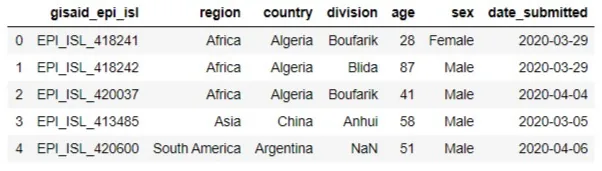
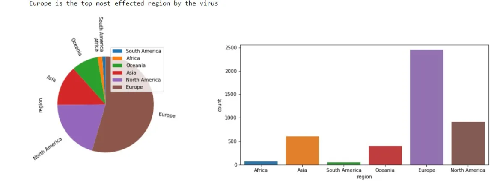
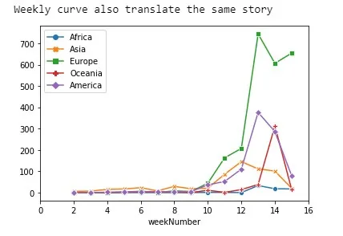
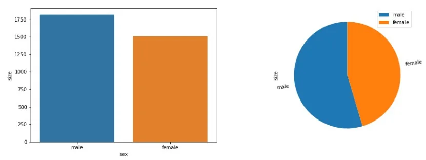
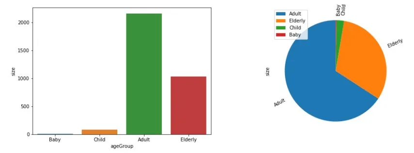
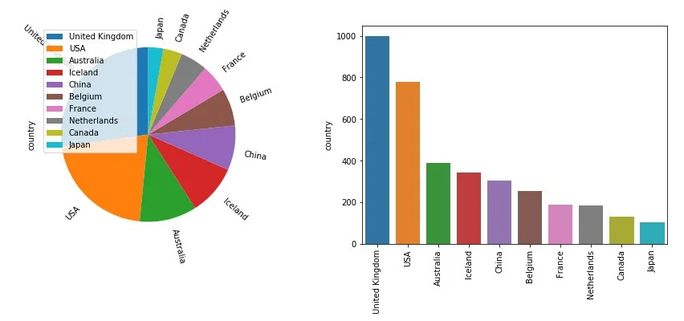
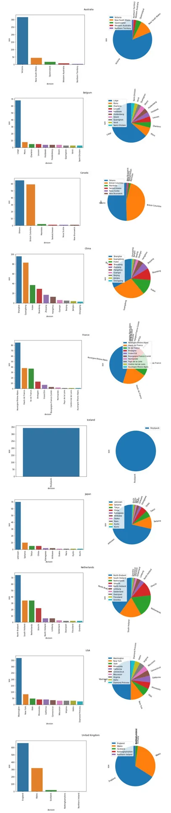
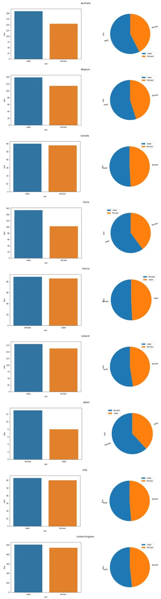
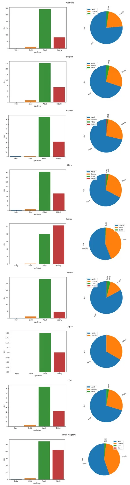

The whole world is suffering the wrath of Covid-19 and I think it’s the need of the hour that we should devote our energies in exploring such field for the betterment of well-being. Therefore it’s the time to spend our energies in understanding and exploring available information regarding this virus. The dataset used for this exercises is a part of Uncover Covid-19 Challenge at Kaggle. I'm using a subpart of that dataset with the name of the directory "nextstrain". We are going to use pandas for the analysis, while seaborn and matplotlib for the visualization. Here following is the link to the dataset: <https://www.kaggle.com/roche-data-science-coalition/uncover>. Let’s try to answer few basic questions regards to the spread of virus.

- Which region is mostly effected by Covid-19?
- How genders are effected by the virus in the world?
- Which age group is more prone to the virus?
- Which are the top ten countries fighting Covid-19?
- What is the status of virus spread in the Divisions of Top 10 countries?
- What is the status of virus spread in the Divisions of Top 10 countries based on their genders?
- What is the status of virus spread in the Divisions of Top 10 countries based on their age groups?

Let's start by importing useful libraries:

```python
%matplotlib inline
import numpy as np
import pandas as pd
import matplotlib.pyplot as plt
import seaborn as sns
import datetime
```

We are going to use "covid19GeneticPhylogeny" file for this analysis so lets import it as pandas dataframe

```python
covid19 = pd.read_csv('nextstrain/covid19GeneticPhylogeny.csv')
covid19.head()
```

Now we will start the preparation phase as the data contains '?', therefore we need to make sure that we eliminate this with nan values. Also we need to evaluate the Data Types of columns and missing values.

```python
covid19.replace('?', np.NaN, inplace=True)
print(covid19.count())
print(covid19.isnull().sum())
```

The result display many columns which are not required in this analysis and few of them contains missing values. Therefore, we will remove all such columns.

```python
covid19.drop(['date','strain','virus','genbank_accession','location','region_exposure','country_exposure','division_exposure','segment','length','host','originating_lab','submitting_lab','authors','url','title'], axis=1, inplace=True)
covid19.head()
```



Now we will analyze the data types of current dataframe

```python
 covid19.info()
```

From its results we will change the data types of the following columns.

```python
covid19.date_submitted = pd.to_datetime(covid19.date_submitted)
covid19.sex = covid19.sex.astype('category')
covid19.age = covid19.age.astype('float')
covid19.info()
```

Lets focus on the question regarding the region mostly effected by Covid-19.

```python
regionFractions = covid19.region.value_counts(normalize=True).sort_values()
fig, axes = plt.subplots(1,2,figsize=(15,5))
regionFractions.plot.pie(legend=True,rotatelabels=True, startangle = 90, ax =axes[0])
sns.countplot(x = 'region', data=covid19, ax =axes[1])
plt.tight_layout()
print('Europe is the top most effected region by the virus')
```

The above code will produce a bar chart and pie chart representing frequency and proportion respectively. However, the following represents the line chart to visualize the weekly curve.

```python
covid19['weekNumber'] = covid19.date_submitted.dt.week
weekNumberRegion = covid19.groupby(['weekNumber','region']).size().to_frame('size')
weekNumberRegionPivot = weekNumberRegion.pivot_table(index='weekNumber', columns=['region'], values = 'size',fill_value = 0)
weekNumberRegionPivot['America'] = weekNumberRegionPivot['North America'] + weekNumberRegionPivot['South America']
weekNumberRegionPivot.drop(['North America', 'South America'], axis=1, inplace=True)
sns.lineplot(hue="region", style="event", markers=True, dashes=False, data=weekNumberRegionPivot)
plt.xlim(0,16)
print('Weekly curve also translate the same story')
```





The above charts shows that the Europe is the mostly effected region. Now we will try to analyze gender distribution of the dataset.

```python
covid19['sex'] = covid19.sex.str.lower()
genderDisDetails = pd.DataFrame(covid19[(covid19.sex.str.lower() == 'female') | (covid19.sex.str.lower() == 'male')].groupby('sex').size().sort_values(ascending = False))
genderDisDetails.rename(columns={0:'size'}, inplace=True)

fig, axes = plt.subplots(1,2,figsize=(15,5))
genderDisDetailsBarChart = sns.barplot(data=genderDisDetails, x=genderDisDetails.index, y='size', ax =axes[0])
genderDisDetailsFraction = genderDisDetails['size'] / genderDisDetails['size'].sum()
genderDisDetailsFraction.plot(kind='pie', subplots=True,legend=True,rotatelabels=True ,yticks=None, startangle = 90, ax =axes[1])
print('According to results males are more effected by the virus then the females')
```



This data shows that currently males are more effected by the virus as compared to females. Now lets focus on visualizing the age groups that is more effected by the virus.

```python
covid19['ageGroup'] = pd.cut(covid19[covid19['age']>0].age, bins=[0,2,17,60,99],labels=['Baby','Child','Adult','Elderly'])
ageDistDetails = pd.DataFrame(covid19.dropna(subset = ["ageGroup"]).groupby('ageGroup').size().sort_values(ascending = False))
ageDistDetails.rename(columns={0:'size'}, inplace=True)
fig, axes = plt.subplots(1,2,figsize=(15,5))
divBarChart = sns.barplot(data=ageDistDetails, x=ageDistDetails.index, y='size', ax =axes[0])
ageDetailsFraction = ageDistDetails['size'] / ageDistDetails['size'].sum()
ageDetailsFraction.plot(kind='pie', subplots=True, legend=True,rotatelabels=True ,yticks=None, startangle = 90, ax =axes[1])
print('Adults are more infected by the virus as compare to other age groups')
```



Here we can observe that adults are more prune to the virus. Here adults represents the age group of 18 - 60 years. Lets try to fetch top ten countries effected by Covid-19.

```python
countryCount = pd.DataFrame(covid19.country.value_counts().sort_values(ascending=False))
top10Count = countryCount.iloc[:10]
top10Frac = top10Count.country / top10Count.country.sum()

fig, axes = plt.subplots(1,2,figsize=(15,5))
top10Frac.plot(kind='pie', subplots=True,legend=True,yticks=None,rotatelabels=True , startangle = 90, ax =axes[0])

chartTop10Count = sns.barplot(data=top10Count, x=top10Count.index, y='country', ax =axes[1])
chartTop10Count.set_xticklabels(chartTop10Count.get_xticklabels(),rotation=90)
```



Above graph displays the top ten countries facing the spreed of Covid19 cases. According to this dataset the most effected country is United Kingdom. This information is correct according to the dataset because details of other countries are still missing. Now lets dig deep in the data related to these countries.

```python
top10CountDiv = covid19[covid19['country'].isin(top10Count.index.to_list())].groupby('country')

for key,group_df in top10CountDiv:
    fig, axes = plt.subplots(1,2,figsize=(15,5))
    division = pd.DataFrame(group_df.groupby('division').size().sort_values(ascending = False))
    division.rename(columns={0:'size'}, inplace=True)
    if(len(division) > 10):
        division = division[:10]

    divBarChart = sns.barplot(data=division, x=division.index, y='size', ax =axes[0])
    divBarChart.set_xticklabels(divBarChart.get_xticklabels(),rotation=90)

    divisionFraction = division['size'] / division['size'].sum()
    divisionFraction.plot(kind='pie', subplots=True,title = key,legend=True,rotatelabels=True ,yticks=None, startangle = 90, ax =axes[1])
```



Here we can observe the number of cases and the fraction they contribute to each region. England is the most effected country the reason is same which we described above. Now lets observe the gender distribution in these countries. Note here we have to remove the results of Netherlands because the associative data is missing.

```python
for key,group_df in top10CountDiv:
    group_df['sex'] = group_df.sex.str.lower()
    genderDist = pd.DataFrame(group_df[(group_df.sex.str.lower() == 'female') | (group_df.sex.str.lower() == 'male')].groupby('sex').size().sort_values(ascending = False))
    genderDist.rename(columns={0:'size'}, inplace=True)
    if(len(genderDist)> 0):
        fig, axes = plt.subplots(1,2,figsize=(15,5))
        divBarChart = sns.barplot(data=genderDist, x=genderDist.index, y='size', ax =axes[0])
        genderFraction = genderDist['size'] / genderDist['size'].sum()
        genderFraction.plot(kind='pie', subplots=True,title = key,legend=True,rotatelabels=True ,yticks=None, startangle = 90, ax =axes[1])
```



As we can clearly see that the trend remain consistent, which means males are more prone to this virus then its counterpart. Lastly we will observe the distribution of effected age groups.



**Conclusion:**

We have observed that this data reflects that top effected region is Europe and UK is the most suffered country in terms of number of cases. Its worth mentioning here that the data details of other countries are missing thats why UK shows up on top. Whereas males and adults are more vulnerable to this virus. Here one should not assume that virus would effect adults more in comparison to elders. The analysis of deceased would provide more insight regarding this theory.

In future these analytics should be observed in combination with other contributing factors like travel history, population density, weather conditions, culture of these countries to identify more meaningful patterns.

Here is the link to the repository to access the source code: <https://github.com/saadazharsaeed/Covid19-EDA>
