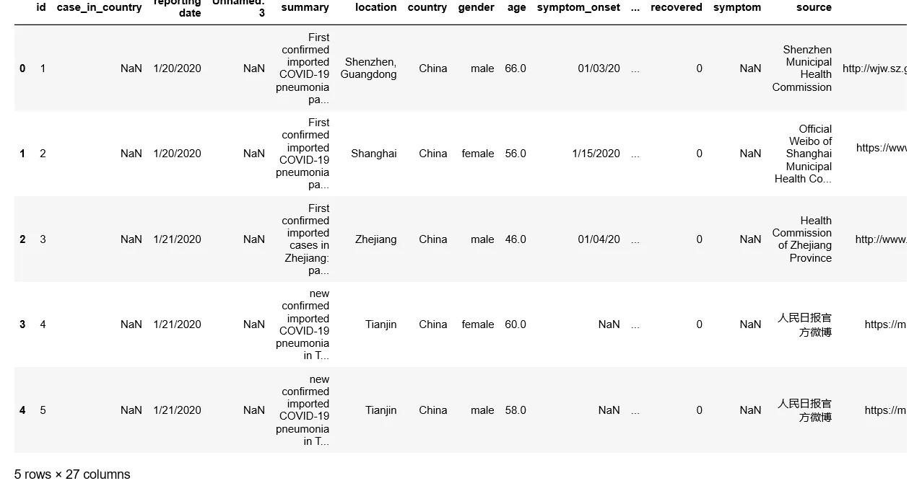
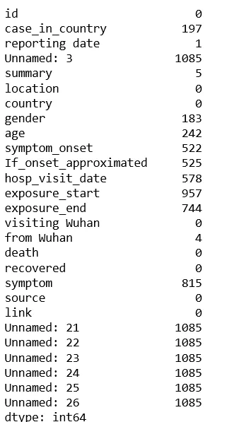
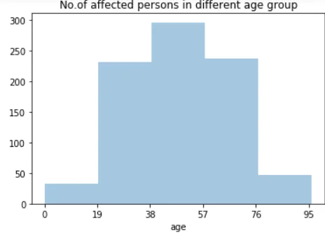
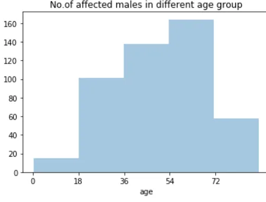
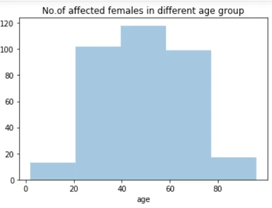
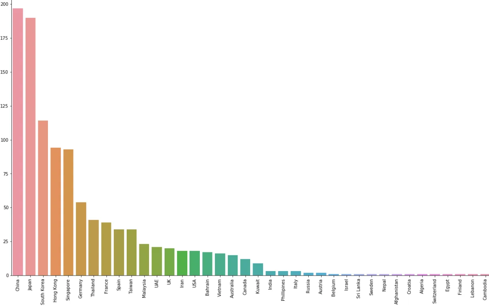
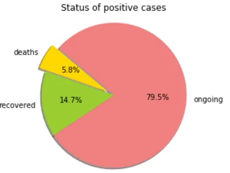

The COVID-19 pandemic, also known as the coronavirus pandemic, is an ongoing pandemic of coronavirus disease 2019 (COVID‑19) caused by severe acute respiratory syndrome coronavirus 2 (SARS‑CoV‑2). The outbreak was identified in Wuhan, China, in December 2019.

We have some awareness about this pandemic but there are a lot of questions we will be having with us. So in the quest of getting answers to few such questions, lets start our journey of data analysis.

**Wait !!** What are the questions??

Lets start with 3 questions.
1. What is the most affected age group ?
2. What are the most affected countries ( during initial months ) ?
3. What is the status of recorded cases ?

**How to get the answers ?**
By doing some data analysis.

**What's that ?** Data analysis, in simple words, is processing the data to draw some insights from the data we have with us. And a straight forward way is to have some visualizations.
There are lot of tools and libraries that can help us. Here we will be using few of them like pandas, numpy, matplotlib and seaborn.

**But where is the data ?**
We will be taking a dataset from kaggle. This dataset contains information about the registered cases worldwide for Jan and Feb 2020.
[Get it from here](https://www.kaggle.com/sudalairajkumar/novel-corona-virus-2019-dataset#covid_19_data.csv).

## *Lets get started.....*
First we import the above mentioned libraries.

```python
import pandas as pd
import numpy as np
import matplotlib.pyplot as plt
import seaborn as sns
```

Then we load the dataset into a data frame using pandas.

```python
df=pd.read_csv('COVID19_line_list_data.csv')
```

Using head() method we can have a view of the first 5 rows of the data frame.

```python
df.head()
```



We can get number of rows and columns using shape attribute.

```python
df.shape
```

(1085, 27)

That means 1085 rows and 27 columns.

We can see there are a lot of columns ( also called features ). We can get the column names using columns attribute .

```python
df.columns
```

We have marked in the data frame there are some values denoted as NaN. These are null values or empty spaces in our data.
To check total number of null values in each column:

```python
df.isnull().sum()
```



We can see the column names with prefix as "unnamed" are completely empty. Lets get rid of them.

```python
df.drop(['Unnamed: 3','Unnamed: 21','Unnamed: 22','Unnamed: 23','Unnamed: 24','Unnamed: 25','Unnamed: 26'], axis=1,inplace=True)
```

axis=1 : To drop the columns.
inplace=True : To apply changes to the data frame.

**BTW** *when we will get some answers to our questions ??*

Could have explored a bit more. But we could start visualization with this.

## **Q1**. What is the most affected age group ?

```python
sns.distplot(df.age,bins=5,kde=False)
_=plt.title('No.of affected persons in different age group')
_=plt.xticks(list(range(0,int(max(df.age)),int(max(df.age)/5))),  list(range(0,int(max(df.age)),int(max(df.age)/5))))
```



So, the age group of 38-57 are the most affected, followed by 57-76 and 19-38 age groups.

*Are the trends same for different gender ?*

For males:

```python
sns.distplot(df[df.gender=='male'].age,bins=5,kde=False)
_=plt.title('No.of affected males in different age group')
_=plt.xticks(list(range(0,int(max(df[df.gender=='male'].age)),int(max(df[df.gender=='male'].age)/5)+1)), list(range(0,int(max(df[df.gender=='male'].age)),int(max(df[df.gender=='male'].age)/5)+1)))
```



For males, 54-70 is the most affected age group.

For females:

```python
sns.distplot(df[df.gender=='female'].age,bins=5,kde=False)
_=plt.title('No.of affected females in different age group')
_=plt.xticks(list(range(0,int(max(df[df.gender=='female'].age)),int(max(df[df.gender=='female'].age)/5)+1)), list(range(0,int(max(df[df.gender=='female'].age)),int(max(df[df.gender=='female'].age)/5)+1)))
```



In females, 40-60 is the most affected age group.

## **Q2**. Which are the most affected countries ( at initial months ) ?

```python
temp=df.country.value_counts().sort_values(ascending=False)
plt.figure(figsize=(20,12))
ax=sns.barplot(temp.index,temp.values)
_=ax.set_xticklabels(temp.index,rotation=90)
```



So, during initial months (till Mar 2020), China was the most affected country. Its quite obvious. Followed by Japan and South Korea.

## **Q3**. What is the status of recorded cases till now ? ( number of deaths, recovered and ongoing cases )

```python
deaths=df[df.death!='0'].shape[0]
recovered=df[df.recovered!='0'].shape[0]
ongoing=df[(df.death=='0') & (df.recovered=='0')].shape[0]
labels = ['deaths','recovered','ongoing']
sizes = [deaths,recovered,ongoing]
colors = ['gold', 'yellowgreen', 'lightcoral']
explode = (0.1, 0, 0)  # explode 1st slice

# Plot
plt.pie(sizes, explode=explode, labels=labels, colors=colors,
autopct='%1.1f%%', shadow=True, startangle=140)
plt.title('Status of positive cases')
plt.axis('equal')
plt.show()
```



So, only 15% of people have recovered till now and 80% cases are still under treatment.
The fraction of deaths is only around 6% but it will surely going to increase if proper treatment not available.

So, now we have got some insights to feed our curiosity. We will be doing some more analysis on different sets of data to draw some more conclusions.

Feel free to let me know your feedback and share some of your own analysis. Till then **Stay Home, Stay Safe**.

> *Thank you .....*
