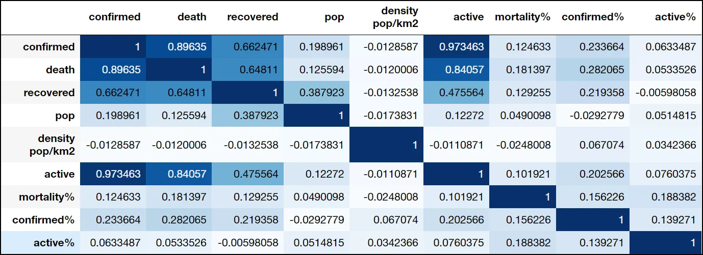
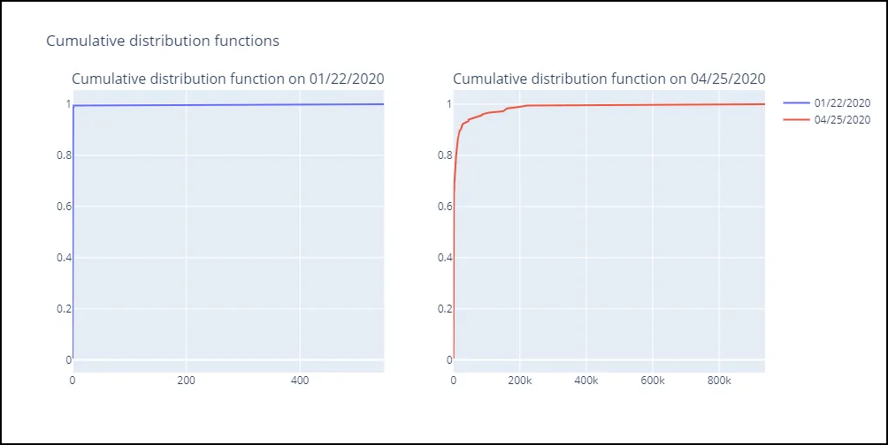
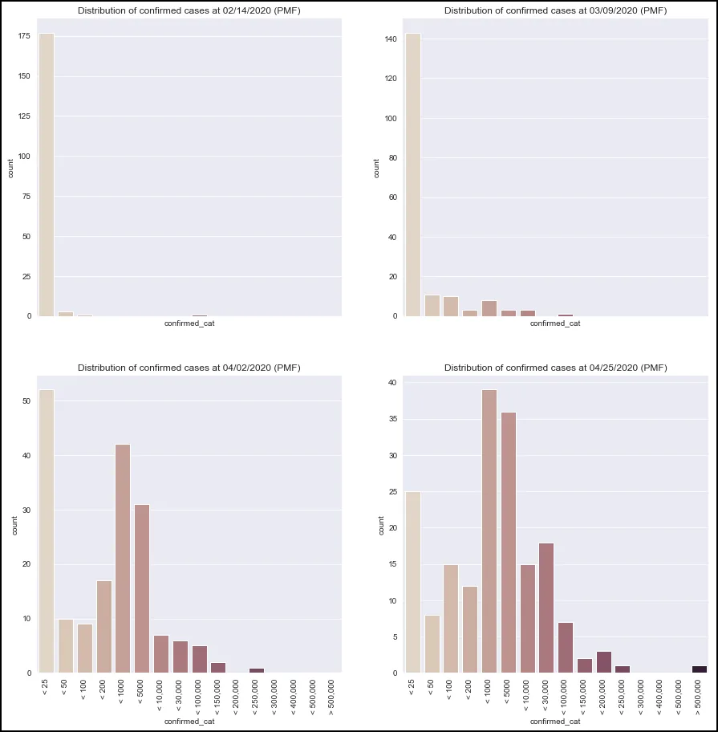
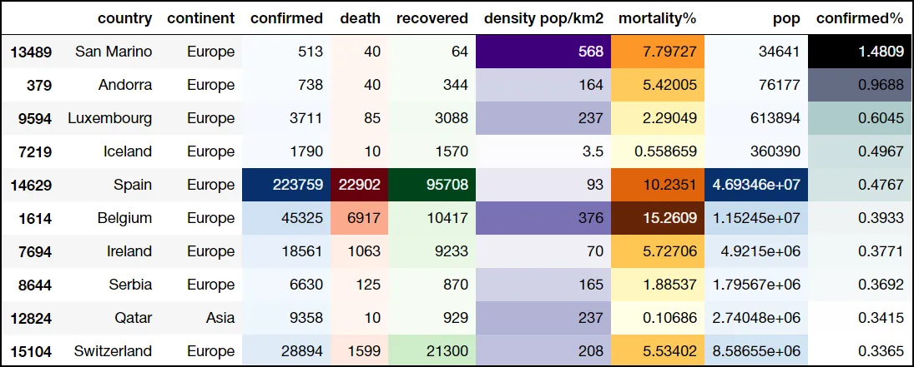
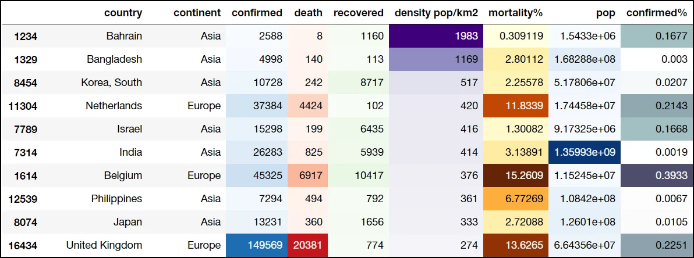
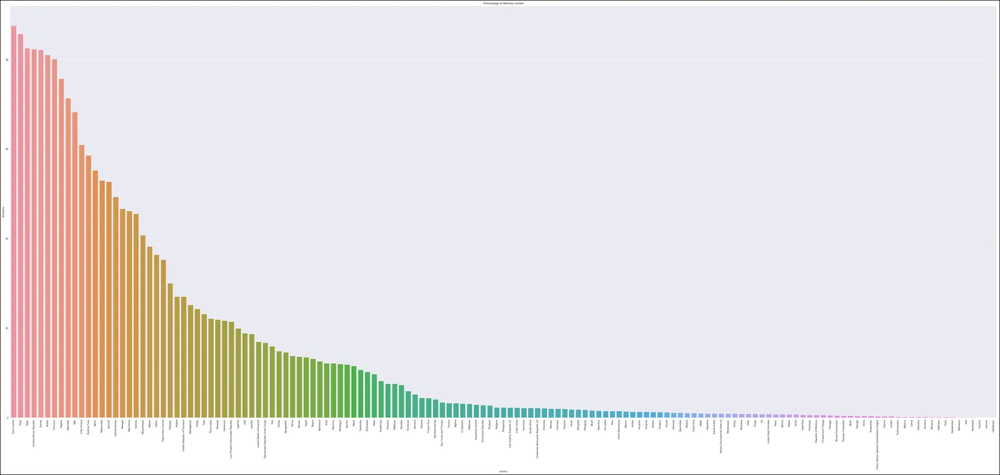
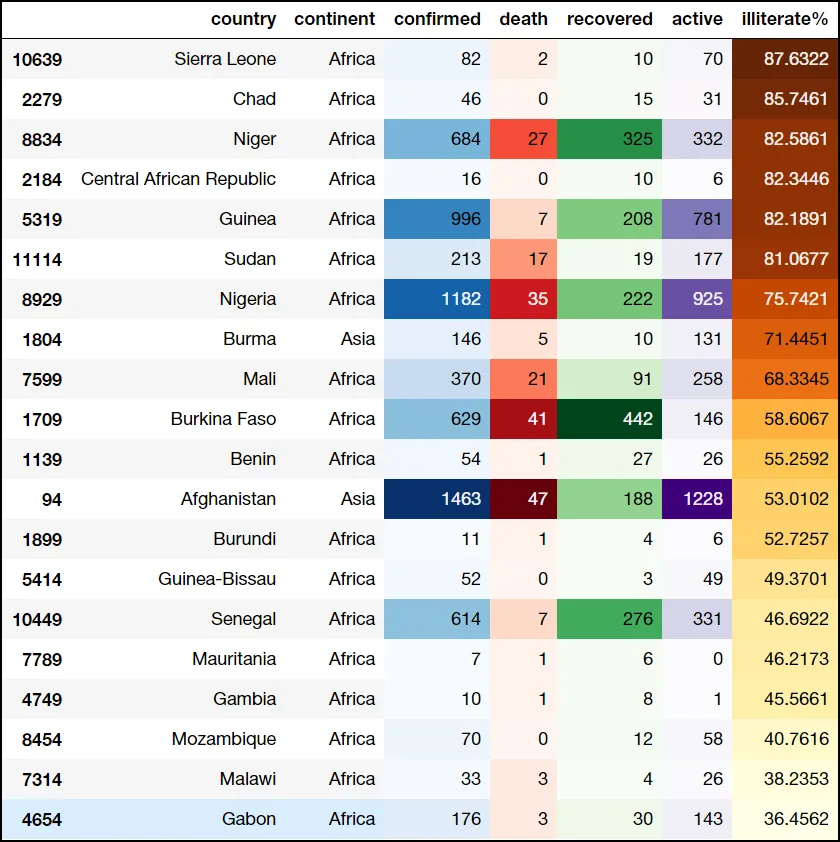

## A comprehensive analysis of [#COVID19](https://www.datainsightonline.com/blog/hashtags/COVID19)


*Image by World Health Organization via their website*

As the [global coronavirus toll](https://www.worldometers.info/coronavirus/#countries) reached a cumulative total of more than three million cases and over 230,000 deaths this week, the economic and lifestyle implications of the pandemic continue to complicate efforts to contain the virus. With the continuing spread in Africa, Asia, and Latin America, countries scramble to contain the fallout and ease the burden.

In this post, we are exploring the spread of COVID-19 and some of the factors that may affect it. We are trying to answer a few questions; How do population density and level of illiteracy influence the spread of the virus? Which of these affects the spread of the virus the more? Which countries are affected the most? What does the word 'affect' mean in this context?.

## Introduction to COVID-19


**Coronavirus disease 2019** (**COVID-19**) is an infectious disease caused by severe acute respiratory syndrome coronavirus 2 (SARS-CoV-2). The disease was first identified in December 2019 in Wuhan, the capital of China's Hubei province, and has since spread globally, resulting in the ongoing 2019–20 coronavirus pandemic. As of 30 April 2020, more than 3.24 million cases have been reported across 187 countries and territories, resulting in more than 230,000 deaths. More than 1,000,000 people have, however, recovered.

Common symptoms of COVID-19 include fever, cough, fatigue, shortness of breath, and loss of smell. While the majority of cases result in mild symptoms, some progress to viral pneumonia, multi-organ failure, or cytokine storm. The time from exposure to onset of symptoms is typically around five days but may range from two to fourteen days.

## Datasets used

## COVID-19:

**2019 Novel Coronavirus COVID-19 (2019-nCoV) Data Repository by Johns Hopkins CSSE (**[**LINK**](https://github.com/CSSEGISandData/COVID-19)**)**

Dataset consists of time-series data from 22 JAN 2020 up to this date (Updated on Daily Basis).

**Three Time-series dataset :**

- time_series_covid19_confirmed_global.csv ([Link Raw File](https://raw.githubusercontent.com/CSSEGISandData/COVID-19/master/csse_covid_19_data/csse_covid_19_time_series/time_series_covid19_confirmed_global.csv))
- time_series_19-covid-Deaths.csv ([Link Raw File](https://raw.githubusercontent.com/CSSEGISandData/COVID-19/master/csse_covid_19_data/csse_covid_19_time_series/time_series_19-covid-Deaths.csv))
- time_series_covid19_deaths_global ([Link Raw File](https://raw.githubusercontent.com/CSSEGISandData/COVID-19/master/csse_covid_19_data/csse_covid_19_time_series/time_series_covid19_deaths_global.csv))

#### Educational Datasets from UNESCO UIS Statistics:
- ***DataEd2.csv :*** Educational Dataset from UNESCO UIS Statistics
- ***pop.csv :*** Educational population Dataset

#### World Population & Density Datasets from Worldometers.info:
- ***wpop2.csv :*** World Population & Density Dataset from Worldometers.info

## A Statistical Peek

After importing, cleaning, and merging data files -using pandas library- we started calculating some statistical inference to explore the data and its relationships.

Firstly, exploring the correlation between the data columns.We used the '.corr()' function in the pandas library to explore that.

```python
full_df.corr().style.background_gradient(cmap='Blues')
```

Where 'full_df' is the cleaned DataFrame.



**Correlation shows:-**

- A strong positive correlation between confirmed, death, recovered, and active columns (Which is expected).
- A moderate positive correlation between population and confirmed columns.
- A weak negative between density and confirmed columns (which is unexpected) probably due to US high cases count and low density.
- Correlation does not necessarily imply causation.

Expanding upon the correlation's observations; We followed up with a cumulative distribution function to explore the distribution of data at the start and end of the data.



Which showed that the spread of data is starting to occur, with 95% of the confirmed cases counts are 80K or less.

We are following that with a Probability mass function to explore the distribution of categorical counts through the date. Which gives us a more accurate view of how the virus spreads through time.

```python
# Set up the matplotlib figure
f, axes = plt.subplots(2, 2, figsize=(15, 15),sharex=True);
_=sns.despine(left=True);

#distribution of data at 4 quantiles of Dates
for i , j in {0.25:axes[0,0],0.5:axes[0,1],0.75:axes[1,0],1:axes[1,1]}.items():
    d = full_df[full_df.Date == full_df.Date.quantile(i).strftime('%m/%d/%Y')].sort_values(by = 'confirmed_cat');
    _=sns.catplot(data = d, x="confirmed_cat", kind="count", palette="ch:.25", ax=j);
    _=j.title.set_text(f'''Distribution of confirmed cases at {full_df.Date.quantile(i).strftime('%m/%d/%Y')} (PMF)''');
    plt.close()

#Rotating x labels
for axes in f.axes:
     plt.sca(axes)
     plt.xticks(rotation=90)
```



As per this illustration, we could safely assume that the spread of cases and change in their distribution through time, where all cases types spreading to higher counts through a short interval of time.

Furthermore, elaborating on the matter and further clarifies things is a map plot showing the spread of the virus through time translated with circle sizes on a scatter map plot.

```python
# Subsetting data to plot
df_data = full_df.groupby(['country','Date'],as_index = False)['confirmed','death'].max()
df_data["Date"] = pd.to_datetime( df_data["Date"]).dt.strftime('%m/%d/%Y')

# Plotting geo data to plotly scatter_geo
fig = px.scatter_geo(df_data, locations="country", locationmode='country names',
                     color=df_data["confirmed"],
                     size= np.power(df_data["confirmed"]+1,0.3)-1,
                     hover_name="country",
                     hover_data=["confirmed"],
                     range_color= [0, max(df_data["confirmed"])-1],
                     animation_frame="Date",
                     color_continuous_scale=px.colors.sequential.Plasma,
                     title='Virus Spread through time (confirmed cases)'
                    )
fig.update_coloraxes(colorscale="hot")
fig.update(layout_coloraxis_showscale=False)
fig.show()
```

**Conclusions :**

- China was the first country to experience the COVID-19 outbreak.
- US, Spain, and Italy, which are the worst affected countries, didn't record almost any cases from the beginning of the outbreak in January. This indicates the fast spread of the virus.
- The US and Western Europe are the worst affected. Therefore as the virus spreads from Eastern Asia to Western Europe and the US, they are considered the new virus epicentre.
- Partial/Total Lockdown or quarantine in China led to controlling the spread and managing deaths and activity with minimum active cases and low death rates.

## A glimpse into the world status
Through the past five months, the rapid spread of the virus caused economical and emotional perplexity. But will it be for long?

A quick glimpse into the current situation may shed a few light rays into the matter.

Plotting cumulative sum of confirmed cases over time.

```python
# Subsetting data to plot
df_temp = full_df.melt(id_vars = ['country','Date','ISO','confirmed%','mortality%','pop','confirmed_cat','death_cat','recovered_cat','density pop/km2','continent','active_cat','active%'],var_name = 'Case Type',value_name='count').groupby(['Date','Case Type'],as_index=False).sum()[['Date','Case Type','count']]

# Plotting data to plotly line
px.line(df_temp,x = "Date", y = 'count',color = 'Case Type',title='Worldwide Cases, Recoveries and Deaths counts')
```

World cumulative confirmed cases show the exponential growth of data which is to be expected. Yet may not convey the full picture.

A plot of the daily increase of the data may actually be more compelling and insightful.

```python
# Adding daily counts to data
df_temp = add_daily(full_df.groupby('Date',as_index=False).sum()[['Date','confirmed','death','recovered','active']])[['Date','daily_confirmed','daily_death','daily_recovered','daily_active']]

# Subsetting data to plot
df_temp = df_temp.melt(id_vars = ['Date'],var_name = 'Case Type',value_name='count').groupby(['Date','Case Type'],as_index=False).sum()[['Date','Case Type','count']]

# Plotting data to plotly line
px.line(df_temp,x = "Date", y = 'count',color = 'Case Type',title='Worldwide Daily Cases, Recoveries and Deaths counts')
```

#### Conclusions :
- World Confirmed cases seem to increase almost exponentially and started to take off from mid-March 2020 and steady from mid-April 2020.
- World Recovered cases started to increase almost exponentially from the beginning of April 2020.
- World Active cases started to decline from the end of March 2020.
- World Death cases seem to be in a steady increase with a low curve line.

## A deep dive into graphical observations
A lot could be deduced from a graphical representation of data, some visual trends and patterns could be observed, and a lot of forecasting hypotheses could be mined.

With this in mind, the following set of graphs explores the changes in case types through two different countries ( 'United States of America' and 'People's Republic of China') with two opposite virus control strategies.

```python
#Creating a reshaped df with Case Type as one column
country_all = full_df.melt(id_vars = ['country','Date','ISO','confirmed%','mortality%','pop','confirmed_cat','death_cat','recovered_cat','density pop/km2','continent','active_cat','active%'],var_name = 'Case Type')

#Plotting filtered data to plotly line plot
countryname= 'US'
fig = px.line(country_all[(country_all['country'] == countryname)],x = 'Date', y = 'value',color = 'Case Type',title=f'Progression of Case types for {countryname} through time')
fig.show()
```

At first glance, confirmed cases seem to increase at a very high rate. Yet most cases do. What makes the US in such a critical point?

Observing the curve of the active case, which is too close to the curve of the confirmed cases. Which, in turn, indicates low recovery and death cases.

As the recovery rate starts increasing, we observe the curve of the active cases drifting away from the curve of the confirmed cases and more towards the curve of the recovered cases which in turn indicates progress, Yet in a very low rate. Meanwhile, the death rate is also increasing thus putting the US in a critical situation.

**Conclusions :**

- The US Started Lockdown on the 22nd of March.
- Since the Lockdown 'Active Cases' has ever been dropping.
- Since the 29th of March Recovered Cases has started to increase yet the death rate is increasing too. Which may suggest a weak healthcare system.
- Cases in the US are growing almost exponentially.
- The US is considered and due to this data, the virus global epicentre.

On the other hand, observing the contrary situation in China.

```python
#Creating a reshaped df with Case Type as one column
country_all = full_df.melt(id_vars = ['country','Date','ISO','confirmed%','mortality%','pop','confirmed_cat','death_cat','recovered_cat','density pop/km2','continent','active_cat','active%'],var_name = 'Case Type')

#Plotting filtered data to plotly line plot
countryname= 'China'
fig = px.line(country_all[(country_all['country'] == countryname)],x = 'Date', y = 'value',color = 'Case Type',title=f'Total Case types for {countryname}')
fig.show()
```

In comparison to the US, China seems to have imposed a strict lockdown coupled with a highly effective health care system to face the challenge at hand.

From the observed graph, we could see as the curve of the active cases starts to steady out then declining with a minimum period drifting away from the curve of the confirmed cases.

Also, the graph shows how quickly recovered cases increased as active cases dropped with a very low and steady death rate, which in turn indicates a robust health care system.

**Conclusions**

- China is the virus origin and first epicentre. An outbreak that started on the 22nd of January 2020.
- China Started Lockdown on the 23rd of January. Which is the earliest country to start Lockdown.
- Active cases started dropping after around 10 days from the Lockdown.
- Since the 13th of February Death Cases have started to decrease significantly.
- Since the 4th of February -11 days after the Lockdown- Recovery cases have started increasing and doubling.
- China had a very effective and robust Lockdown, and a very effective healthcare system, which resulted in a very low death rate, a very high recovery rate, and a minimum active case rate globally.

## Exploring Mortality Rates
The mortality rate is a critical indicator in such crises as it translates the percentage of deaths to confirmed cases and describes how aggressive the pandemic is to individual countries.

In this section, we explore the mortality rate to find trends and patterns as well as analyse, which countries are in more critical condition.

We explore the rate of change of the mortality percentage through time as well as continents of each country and its case count.

```python
# Subsetting data to plot
df_data = full_df.groupby(['Date', 'country'])['confirmed', 'death','continent','mortality%'].max().reset_index()
df_data["date_reformated"] = pd.to_datetime( df_data["Date"]).dt.strftime('%m/%d/%Y')

#Plotting filtered data to plotly scatter plot
fig = px.scatter(df_data, y='mortality%',
                    x= df_data["confirmed"],
                    range_y = [-1,18],
                    range_x = [1,df_data["confirmed"].max()+1000000],
                    color= "continent",
                    hover_name="country",
                    hover_data=["confirmed","death"],
                    range_color= [0, max(np.power(df_data["confirmed"],0.3))],
                    animation_frame="date_reformated",
                    animation_group="country",
                    color_continuous_scale=px.colors.sequential.Plasma,
                    title='Change in Mortality Rate of Each Countries Over Time',
                    size = np.power(df_data["confirmed"]+1,0.3)-0.5,
                    size_max = 30,
                    log_x=True,
                    height =700,
                    )
fig.update_coloraxes(colorscale="hot")
fig.update(layout_coloraxis_showscale=False)
fig.update_xaxes(title_text="Confirmed Cases (Log Scale)")
fig.update_yaxes(title_text="Mortality Rate (%)")
fig.show()
```

#### Conclusions :
- Mortality Rate indicates how health systems perform during the crisis.
- There are many European countries with high mortality rate and high case counts which is considered a critical point.
- Up till the 1st of March, no country passed a mortality rate above 7%.
- Up till the 1st of March, no country passed a case count more than 4000 cases (excluding China).
- Mortality rates reached over 15% in some countries in less than a month.
- The virus is progressing fast and is in a critical phase.

## Exploring Confirmed cases to population rate
Investigating Critical countries where a high percentage of their total population are infected.

```python
df_temp = full_df[(full_df.Date == full_df.Date.max()) & (full_df.confirmed > 200)][['country','continent','confirmed','death','recovered','density pop/km2','mortality%','pop','confirmed%']].sort_values(by = 'confirmed%',ascending = False).nlargest(10,'confirmed%')
df_temp.style.background_gradient(cmap='Blues',subset=["confirmed"])\
                        .background_gradient(cmap='Reds',subset=["death"])\
                        .background_gradient(cmap='Greens',subset=["recovered"])\
                        .background_gradient(cmap='Purples',subset=["density pop/km2"])\
                        .background_gradient(cmap='YlOrBr',subset=["mortality%"])\
                        .background_gradient(cmap='bone_r',subset=["confirmed%"])\
                        .background_gradient(cmap='Blues',subset=["pop"])
```



Plotting ratio between total population and confirmed cases.

```python
# Subsetting data to plot
sub_df = full_df[full_df.Date == full_df.Date.max()].nlargest(10,'confirmed%')

#Plotting filtered data to plotly line plot
pxplotline(full_df,sub_df,'confirmed%',x ='Date',title='Countries with highest confirmed cases to total population ratio',hd=['pop','death','confirmed'])
```

#### Conclusions :
- All top ten confirmed cases % to total population are European countries as of 25th of April.
- San Marino is the country with the highest confirmed cases % to total population at almost 1.5% as of 25th of April.
- Spain has the highest confirmed cases on the list and the 5th country in the world with confirmed cases % to total population at almost 0.5%. As of 25th of April.
- Italy, with the highest population and second to highest mortality rate, comes as the 11th highest country with confirmed cases % to total population at 0.32%. As of 25th of April.
- Belgium, with the highest mortality rate on the list (15.3%), comes as the 6th highest country with confirmed cases % to total population at 0.32%, which makes it at a critical point. As of 25th of April.

## Exploring Population Density

Investigating countries with the highest population density and how the virus spreads over time. As well as exploring the relationship between them.

Does the population density affect the spread of the virus?

Exploring countries with the highest densities and with confirmed cases higher than a calculated threshold.

```python
df_temp = full_df[(full_df.Date == full_df.Date.max()) & (full_df.confirmed > 2500) & (full_df['density pop/km2'] < 3500)][['country','continent','confirmed','death','recovered','density pop/km2','mortality%','pop','confirmed%']].sort_values(by = 'density pop/km2',ascending = False).nlargest(10,'density pop/km2')
df_temp.style.background_gradient(cmap='Blues',subset=["confirmed"])\
                        .background_gradient(cmap='Reds',subset=["death"])\
                        .background_gradient(cmap='Greens',subset=["recovered"])\
                        .background_gradient(cmap='Purples',subset=["density pop/km2"])\
                        .background_gradient(cmap='YlOrBr',subset=["mortality%"])\
                        .background_gradient(cmap='bone_r',subset=["confirmed%"])\
                        .background_gradient(cmap='Blues',subset=["pop"])
```



Exploring the data further using plotly scatter function.

```python
px.scatter(df_temp,trendline = 'ols',y='confirmed',x='density pop/km2', size = 'pop', color='continent',hover_data=['country'], title='Variation of Population density wrt Confirmed Cases')
```

#### Conclusions :
- Seven out of the top dense populations are Asian countries.
- Three out of the top dense populations are European countries.
- Asian countries with high density have a slightly negative linear relationship with their confirmed cases with relation to their population density.
- European countries, on the other hand, has a linear strong negative relationship with their confirmed cases with relation to their population density.

## Exploring Density VS Illiteracy
Investigating countries with highest illiterate rate to their supposed educated population with relation to confirmed cases, and how the virus spreads over time. As well as exploring the relationship between them.

***Does illiteracy affect the spread of the virus?***

A general glance at the sorted chart of less-educated countries is recommended to get a general view of the distribution.



*Click on the Image to enlarge*

We subset the top 20 countries with high illiteracy rate to their supposed educated population.

```python
edu_full_df = full_df.merge(edu_df[['ISO','illiterate%']],on = 'ISO')
edu_full_df_temp = edu_full_df[edu_full_df.Date == edu_full_df.Date.max()].nlargest(20,'illiterate%')
edu_full_df_temp[['country','continent','confirmed','death','recovered','active','illiterate%']].style.background_gradient(cmap='Blues',subset=["confirmed"])\
                        .background_gradient(cmap='Reds',subset=["death"])\
                        .background_gradient(cmap='Greens',subset=["recovered"])\
                        .background_gradient(cmap='Purples',subset=["active"])\
                        .background_gradient(cmap='YlOrBr',subset=["illiterate%"])\
```



After glancing at the data at hand, we could explore said data with further compassion through a scatter plot with ordinary least squares visible to determine the slope of the data.

```python
edu_full_df = full_df.merge(edu_df[['ISO','illiterate%']],on = 'ISO')
edu_full_df_temp = edu_full_df[edu_full_df.Date == edu_full_df.Date.max()].nlargest(20,'illiterate%')
px.scatter(edu_full_df_temp,trendline="ols",x='confirmed',y='illiterate%', size = 'pop', color='continent',hover_data=['country','continent'],title='Variation of illiteracy rate wrt confirmed cases for top 20 illiterate countries')
```

#### Conclusions :
- 18 of the top illiterate countries are African countries
- Two of the top illiterate countries are Asian countries
- African countries have a moderate positive relationship between illiteracy rate and confirmed and death cases suggesting that illiteracy may have a slight effect on the spread of the virus in Africa.
- Asian countries have a strong negative relationship between illiteracy rate and confirmed and death cases, suggesting that illiteracy does not affect the spread of the virus in Asia.

## Final Thoughts
**After a lengthy analysis of the mentioned data, and several conclusions from various sections of this project, we could safely assume the following:-**

- The United States of America is considered the new virus epicentre with most confirmed cases and highest active cases.
- Europe is the most critical continent with very high active cases, confirmed cases and mortality rates in the globe.
- Population density has a moderately positive effect on the virus spread in African countries, yet negative impact in European countries.
- Illiteracy percentage has a strong effect on the virus spread in African countries, yet negative impact in Asian countries. Suggesting other factors contributing to it and requires further analysis.
- The virus outbreak that started in Asia rapidly shifted its effects to western countries and more dense locations.
- Some European countries are on the verge of a catastrophe while some have faced the pandemic very well.
- Lockdown was very useful in all countries in which it was applied correctly.
- African and developing countries are at risk of turning to critical points, with high mortality rates and high case counts as well as low recovery rates.
- Countries with high confirmed cases rate should apply a total Lockdown and enhance their healthcare system.
- Healthcare systems are the main anchor to this pandemic and combined with an efficient Lockdown are the most promising solution.

***And Finally, Stay Home and Stay Safe.***

***Please feel free to check the full analysis*** [***here***](https://github.com/osos96/COVID-19_Data_Insight)***.***
