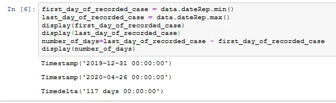
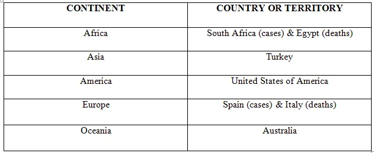
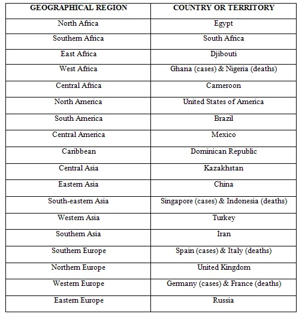
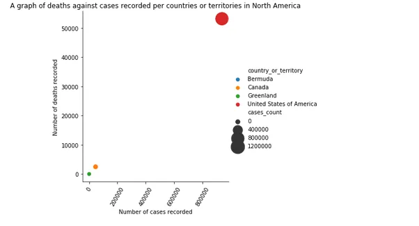
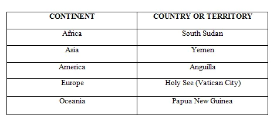
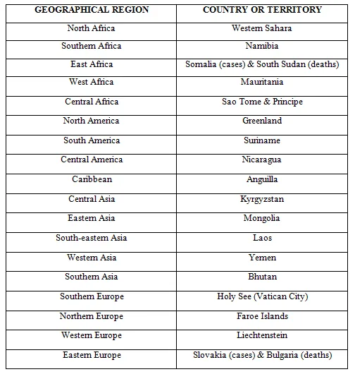
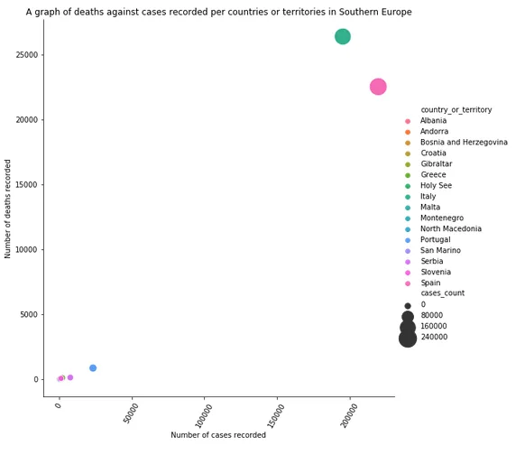
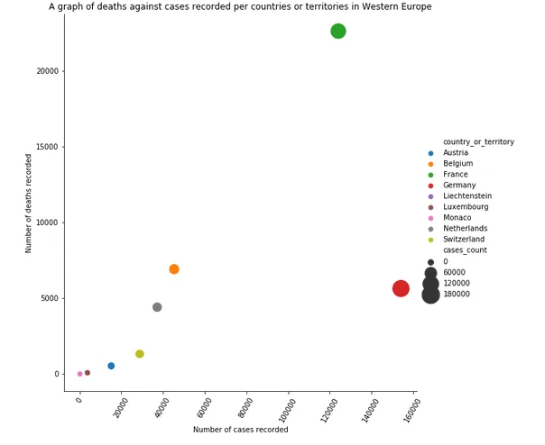
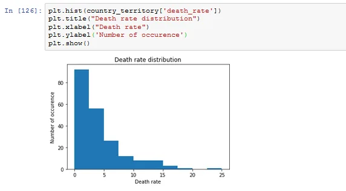

According the WHO, COVID-19 is the infectious disease caused by the most recently discovered coronavirus. This new virus and disease were unknown before the outbreak began in Wuhan, China, in December 2019. COVID-19 is now a pandemic affecting many countries globally. A dataset obtained from <https://www.ecdc.europa.eu/en/publications-data/download-todays-data-geographic-distribution-covid-19-cases-worldwide>as at April 26 2020 shows that the pandemic has affected 207 countries or territories globally since December 31 2020. Each row/entry of the dataset contains the number of cases and deaths reported per day and per country. There are 13211 rows and 11 columns in the dataset.

The disease started spreading throughout the globe from the second week of March 2020. United States of America recorded the highest number of cases and deaths per day that is 48529 cases and 4928 deaths during the period (i.e. 31 Dec - 26 Apr).

On the average daily approximately 215 people were infected with Covid-19 and 15 deaths approximately.

The following question inform the analysis and unearth information and insights about the data.

1. What is the highest number of cases recorded per day or month?
2. What is the highest number of death recorded per day or month?
3. What is the average number of cases per day or month?
4. What is the average number of deaths per day or month?
5. Which is the hardest hit a. country? b. continent? c. geographical region?
6. Which is the least hit a. country b. continent c. geographical region
7. Which is the hardest and the least hit country or territory in each a. continent? a. geographical region?

The most affected continent is Europe with 1214584 recorded cases and 119306 relate deaths followed by America and Asia. But the least affected continent is Oceania. United States of America has been the hardly hit country or territory having almost a million case (i.e. 939053) with 53198 deaths. Yemen in the Western part of Asia is the also the least hit country having only a case with no death.

The hardest hit country or territory in each continent and geographical region is summarized in the table below. Where there are two countries or territories it means one is hardest hit in terms of number of cases differentiated by putting cases in bracket after that country or territory and the same goes for number of deaths.

The least hit countries or territories in each continent and geographical region is also summarized in the tables below.

This pandemic which started as a disease far away in a distant area has engulfed the entire globe with 2,844,721, almost three million recorded cases of infection with over 200,000 related deaths (i.e. 201,315). This translates to 7% death rate i.e. for every hundred persons infected seven of them would lose their lives. Therefore we must adhere the WHO precautionary measures of practicing hand and respiratory hygiene is important at ALL times and maintaining at least a 1 meter distance between yourself and others. (physical distancing).

The average death rate is around 3.96 approximately 4% with Nicaragua having the highest death rate of 25% (i.e. 12 cases with 3 deaths).

From the death rate distribution below most of the rate falls within 0 to 2.5 which is good compared to the average rate of 4%.

COVID-19 has come to stay with us even if treatment or vaccine is found. Protect yourself and protect your loved ones, protect your country and together we can heal our world. [#STAYSAFE](https://www.datainsightonline.com/blog/search/.hash.staysafe) [#DATAINSIGHT](https://www.datainsightonline.com/blog/search/.hash.datainsight)
