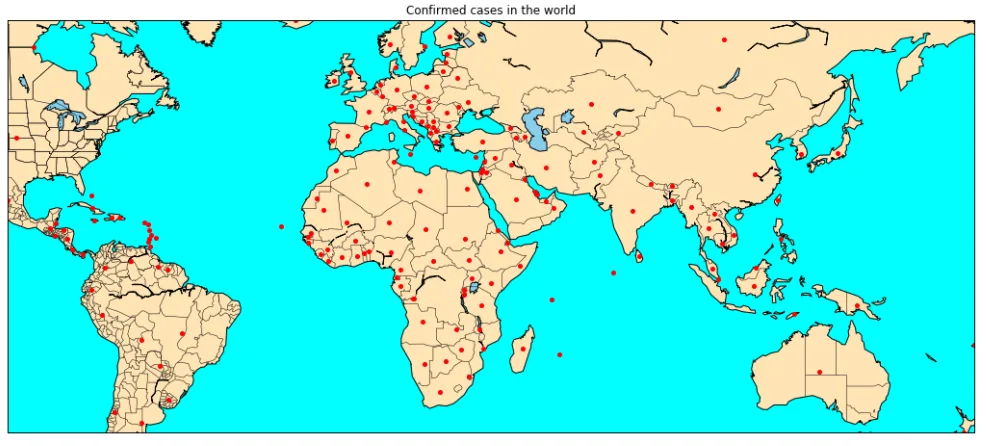
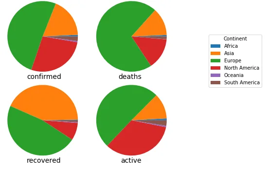
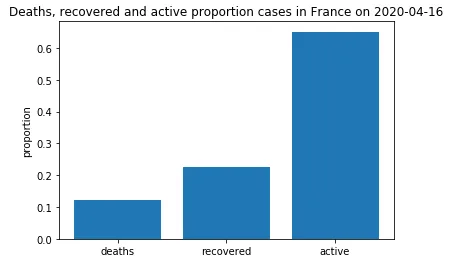
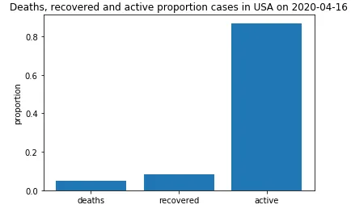

Since the beginning of 2020 the world is facing a pandemic call covid-19 which have affected more than 180 countries. As a student in data science, i have analyse this pandemic on 2020 April 16, in this blog i’m going to answer the questions below :

- What is the world state ?

- Is France deconfinement right ?

- Is Trump action suit data ?

**World state**

Here i’m talking of the world state on 2020 April 05, in that date the number of confirmed cases is of 1,251,537 persons in the world and 68,125 deaths one (5.44%). The global death rate seem to be very low, but it’s more than the one of the flu (0.1%, this

[article](https://www.livescience.com/new-coronavirus-compare-with-flu.html) say more).

A global comparison of the continents show us that Europe represent allmost half of the confirmed cases (50.85%), it’s follow by North America (27.55%) and then Asia (18.22%) ; in term of deaths Europe has 70.98% part of the deaths, followed by North America (14.30%) and Asia again (12.70%); it’s a bit different for the recovered cases, Europe come first with 47.41% then Asia with 43.04% and finally North America with 7.96%. We notice that Africa, Oceania and South America seem to be not affected or very low affected by the covid-19 pandemic.

It’s when we look at the cases for each continent separately that we see an asthoning thing. Although Africa is the second continent after Oceania with the lowest number of deaths cases, it’s also the second continent after Europe with the highest deaths cases rate (4.84%) ; this means that more people affected by covid-19 in Africa died than North America and Asia who have the biggest deaths cases with Europe, so if Africa had the same number of confirmed cases than continent, Africa would be one of the continent with the biggest deaths cases.

With no surprise Oceania had allmost no deaths cases compared to it confirmed cases (deaths cases rate of 0.53%), it’s only matter is that Oceania had too many active cases (85.92%), this means that allmost people affected by covid-19 are still stick, however it’s not very bad because the number of confirmed cases in Oceania is not too high (6739 confirmed cases).

Let’s go deeper and look at global aspect about the world’s countries. The countries the most affected by covid-19 are United Stated, Italy, Spain, China and France ; United States had the most number of confirmed and active cases ; Italy is the one with the most deaths cases ; and China had the most recovered cases, this is due to the fact that China has reach the peak of contamination. The majority of the countries the most affected are all in Europe and the countries where the recovered is very good are allmost all in Asia.

So this is the state of the world, if you want more go take a look at my analysis, link is provide at the end of this blog.

Now let’s go talk of France and United States. Here the analysis is from 2020 January 22 to 2020 April 16.

**Let’s see if France is right to stop confinement ?**

A first look at the data say us that France had about 12.20% of deaths cases, 22.66% of recovered cases and 65.15% of active cases ; more than half of the people affected by covid-19 in France are still sick but recovered is lowly good.

When we continue the analyse, we saw that most of days had recovered cases over deaths, the max number of deaths cases in a day is of 1440 persons where this of recovered cases is of 2372 persons so a difference of 932, and the difference of the recovered cases mean and the deaths cases mean is of 183 persons ; this show that per day the deaths cases is surpassed by the recovered one.

We also see that since 2020-03-24 the recovered cases are over confirmed cases mean, this mean that there more people who recovered from covid-19 in a day than those who was affected in a day. In conclusion, France is right to stop confinement and it’s a good idea to do it progressively.

**Let’s see now if Trump behavior is in accord with data ?**

A first look at data show us that United States had about 4.93% of deaths cases, 8.19% of recovered cases and 86.88% of active cases ; the deaths proportion is very low but allmost all people affected are still sick.

When we go deeper in the data, we saw that the max deaths cases in a day is of 4591 persons and this of recovered is of 10491 ; the difference of mean of recovered cases and this of deaths cases is of 253. However we notice that allmost the month of March the deaths cases was bigger than the recovered cases.

In conclusion the situation in United States is not stable and not very good even if it had very low deaths rate. According to my analysis, data is not in accord with the fact that Trump encourage his population to the non respect of protective measures.

[Here](https://github.com/Donutson/Analysis-of-Covid-19/blob/master/Analysis-covid-19-dataset.ipynb) to see my full analysis.
