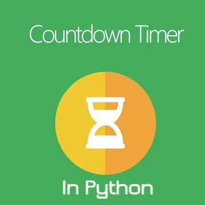

This blog will teach you how to make a countdown timer.



Python has a module named time to handle time-related tasks. To use functions defined in the module, we need to import the module first. Here's how:

```python
import time
```

Here goes the full code for the CountDown Timer.

```python
import time

def countdown(time_sec):while time_sec:
        mins, secs = divmod(time_sec, 60)
        timeformat = '{:02d}:{:02d}'.format(mins, secs)
        print(timeformat, end='\r')
        time.sleep(1)
        time_sec -= 1print("stop")

countdown(5)
```

- **The divmod() method takes two numbers and returns a tuple of their quotient and remainder**

The syntax of divmod() is:

```python
divmod(x, y)
```

## divmod() Parameters
*divmod() takes two parameters:*

- **x** - a non-complex number (numerator)
- **y** - a non-complex number (denominator)

## Return Value from divmod()
*divmod() returns*

- (q, r) - a pair of numbers (a tuple) consisting of quotient q and remainder r

If x and y are integers, the return value from divmod() is same as (a // b, x % y).

If either x or y is a float, the result is (q, x%y). Here, q is the whole part of the quotient.

- end='r' overwrites each iteration's output.

- The value of time sec is decremented at the end of each iteration.

```python
 time.sleep()
```

In the program, time.sleep() takes as arguments the number of seconds you want the program to halt or to be suspended before it moves forward to the next step.
