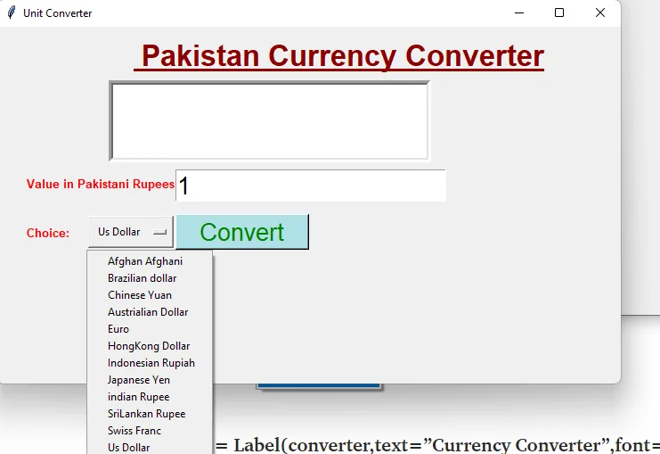
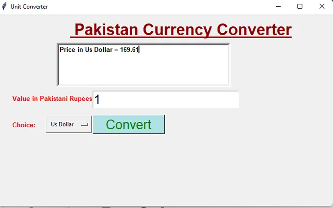

Why do we need a **Currency Converter**?

We need a **currency converter** because there are hundreds of currencies in the world and each has its own unique value compared to the other. Therefore we need a currency converter to convert the value of our currency to another currency.

Here we are going to work on a **GUI-based Currency Converter** that accepts the Indian rupee as input value and converts that value to **US Dollar, Australian Dollar, Brazilian Real, British Pound, Chinese Yuan, etc.** when the user clicks the covert button. *We will use the current exchange rate for the project. (The exchange rate is the price of one currency in term of another currency).*

**For example,** The value of 1 US dollar is equal to 169.61 Pakistani rupees.

## **Define code working**:-

**Tkinter** is the name of the GUI library in Python. Creating a GUI application using **Tkinter** is an easy task.

Here in this line of the code, we import the ttk module from the Python GUI library. The [ttk](https://docs.python.org/3/library/tkinter.ttk.html#module-tkinter.ttk) module provides access to the Tk-themed widget set

```python
converter = Tk()converter.title(“Currency Converter”)converter.geometry(“700x400”).
```

Tk class is used to create a root window. Here converter is the name of a root window. In these steps, we are giving the title of the GUI root window.Tkinter provides many methods, one of them is the geometry() method.

```python
OPTIONS = {"Afghan Afghani":1.98,"Brazilian dollar":87.07,"Chinese Yuan":26.37,"Austrialian Dollar":124.20,"Euro":200.47,"HongKong Dollar":8.83,"Indonesian Rupiah":2.31,"Japanese Yen":1.55,"indian Rupee":2.31,"SriLankan Rupee":0.86,"Swiss Franc": 184.64,"Us Dollar":169.61        }
```

In the **dictionary**, we store the data like the country name and its currency value. Here the name of the dictionary is OPTIONS.

```python
def ok():price = rupees.get()
answer = variable1.get()
DICT = OPTIONS.get(answer,None)
converted = float(DICT)*float(price)
result.delete(1.0,END)
result.insert(INSERT,”Price in “,INSERT,answer,INSERT,” = “,INSERT,converted)
```

Here in this line of the code, we define the **Function** where the function name is ok. Again, we define the price variable to hold the value of the rupees object. Get function provides getting the data from any object or any variable. Now again we define the answer variable to hold the value of the **variable1** object.

Here in this line of the code define the DICT variable to hold OPTIONS value, here the option value gets the value from the answer variable. We create the **Converted variable**. The converted variable holds the value of the DICT\*price value, we are performing multiplication on the DICT or price variable. **Delete Methods** provides for delete Tkinter Text Box’s Contents. Insert method allows inserting the text in the text box.



```python
appName = Label(converter,text=”Currency Converter”,font=(“arial”,25,”bold”,”underline”),fg=”dark red”)appName.place(x=150, y=10)result = Text(converter,height=5,width=50,font=(“arial”,10,”bold”),bd=5)result.place(x=125, y=60)
```

Now come to the **Designing part of the GUI project**. Here we are using some **Labels, Entry Box and Buttons** in a project. So let us start to comprehend the project code line by line.

Here we define the appName object of the Label Method on the GUI window and write text on the appName object and set the font and set fg, bg, or width of the object. Place method, assign the place of the appName object. In this, we define the result object of the text method and set height and width of the Text Box and set font and bd. Assigning the place of the result object using x or y coordinates values.

```python
pakistan = Label(converter,text=”Value in indian Rupees:”,font=(“arial”,10,”bold”),fg=”red”)pakistan.place(x=30, y=165)rupees = Entry(converter,font=(“arial”,20))rupees.place(x=200, y=160)choice =Label(converter,text=”Choice:”,font=(“arial”,10,”bold”),fg=”red”)choice.place(x=30, y=220)
```

Now again we define the India object of the Label Method on the GUI window and write text on the Label and set font and set fg of the Label. Assign the place of the India object using x or y coordinates values. We define the rupees object of the Entry Method and set the font of the Entry Method. Assigning the place of the rupees object using x or y coordinates values.

In this line of the code, we define the choice object of the Label Method and write text on the Label and set font and set fg of the Label. Again assigning the place of the choice object using x or y coordinates value.

```python
variable1 = StringVar(converter)variable1.set(None)option = OptionMenu(converter,variable1,*OPTIONS)option.place(x=100 , y=210,width=100, height=40)
```

Now come to the next line of the code we define the variable1. Here in this line of the code Set the variable1 value to None. Here we define OptionMenu Method to hold the value of the variable1 object and **OPTIONS** object. Assigning the place of the OptionMenu method using x or y coordinate values and set width or height.

```python
button=Button(converter,text=”Convert”,fg=”green”,font=(“arial”,20),bg=”powder blue”,command=ok)button.place(x=200, y=210,height=40,width=150)converter.mainloop()
```

Now come to the Button part of a project in this we are performing an action on the Button. So let’s start **with how Button works?**

Button Method on the GUI window and give the ok command on the Button for performing an action when Button clicks. Assign the place of the button object using x or y coordinates values and set height and width.

Coming to the last line of code of the project is the **mainloop function** that provides an infinite loop. So let’s start to comprehend how it works. **mainloop()** is an infinite loop used to run the application, using this function window is not closed as long as.


