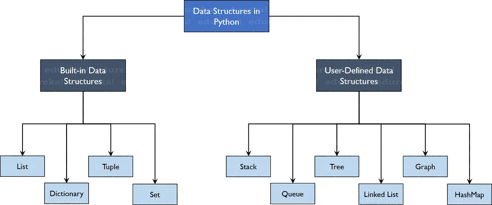
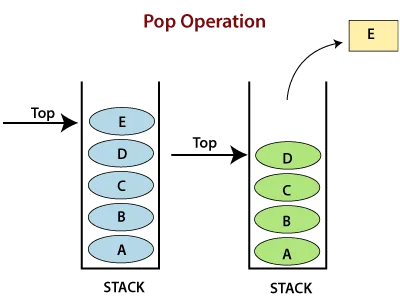
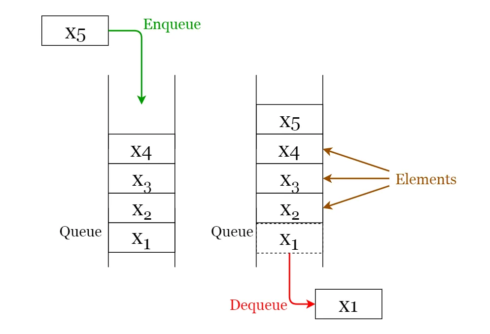

### Introduction


Python allows us to create our own Data Structures enabling us to have full control over their functionality. The most prominent Data Structures are Stack, Queue, Tree, Linked List which are also available to you in other programming languages. So now that you know what are the types available to you, why don’t we move ahead to the Data Structures and implement them using Python.

Lists in Python have some powerful methods, those methods can be used in implementation of data structures like Stacks, and Queues, they can also be used for implementing some advanced data structures like A.V.L trees,Splay trees and Priority Queues. However, Advanced data structures aren't covered in this article though might be explained in some future articles, this article will cover the implementation of the main ones, if you have any problems with List methods you can refer to the following article as it explains most list methods and how to manipulate lists the way you need to:

[Python Article : List Methods](https://www.datainsightonline.com/post/lists-in-python)

I put the Github version code of this article in order to have the code with you and feel free to fork it and re-run it and make things clearer to yourself:

[Python Github Code: Stacks & Queues Implementation using Lists](https://github.com/omarmohamed2011/Stacks_Queues-Python-Implementation/blob/main/Stacks_Queues.ipynb)

### Stacks

Stack Figure



A *stack* is a linear data structure that stores items in a Last-In/First-Out (LIFO) or First-In/Last-Out (FILO) manner; though the first input entering the stack is the last to be out, and the last element entered the stack is the first one you found when you check in. In stack, if a new element is added it's done at one end and if an element is removed it's from that same end as well like in 'Figure above'. The insert and delete operations are often called push and pop.

The functions associated with stack are:

- **is empty()** – Returns whether the stack is empty or not – Time Complexity: O(1)
- **top()** – Returns a reference to the topmost element of the stack – Time Complexity: O(1)
- **push(a)** – Inserts the element ‘a’ at the top of the stack – Time Complexity: O(1)
- **pop()** – Deletes the topmost element of the stack after returning it – Time Complexity: O(1)

We will get exposed with each one and code it step by step and cover everything with code, let's get started now then !

In the code we first initialize the class called stack and use method __init__ to initialize the stack as a Python List:

```python
## Stack class: LIFO Last Input First Output
class Stack:
  def __init__(self):
    self.data = []
```

Next we define the main methods needed:

- The Push() function to add the new element on top by using the method .append(new_element) to add it to the end of the list

- The Top() function to return the element on top which is the last element by simply using index -1.

- The Pop() function using the pop method to do things directly.

- The __str__ function to be able to print the stack.

- isempty() to check emptiness by using len() function.

```python
  def Push(self,key):
    self.data.append(key)

  def Top(self):
    return self.data[-1]

  def Pop(self):
    return self.data.pop()

  def __str__(self):
    return 'The stack contains :' + str(self.data)

  def isempty(self):
    return len(self.data) == 0
```

Next, we can test our methods and create a Stack Object and use it and let's create s1;

```python
s1 = Stack()
s1.Push(1)
s1.Push('a')
s1.Push(7)
s1.Push('StackString')
```

Here we create a stack and push to it elements [1,'a' , 7 ,'StackString'] respectively.

If we pop we get the last element from the array and remove the last one

which is 'StackString'

If we print the stack we find it as it is, except for the last element which is already popped.

```python
last_poped_element = s1.Pop()
print(last_poped_element)
print(s1)
>>> out:
StackString
The stack contains :[1, 'a', 7]
```

But for using the method Top(), it doesn't delete that element; it only returns the last element without a removal;

```python
last_element = s1.Top()
print(last_element)
print(s1)
>>> out:
7
The stack contains :[1, 'a', 7]
```

### Queue
Queue Figure



Like stack, queue is a linear data structure that stores items in First In First Out (FIFO) manner. With a queue the least recently added item is removed first. A good example of queue is any queue of consumers for a resource where the consumer that came first is served first.

The functions associated with queue are:

- **Enqueue:** Adds an item to the queue. If the queue is full - in case of an array, then it is said to be an Overflow condition – Time Complexity : O(1)
- **Dequeue:** Removes an item from the queue. The items are popped in the same order in which they are pushed. If the queue is empty, then it is said to be an Underflow condition – Time Complexity : O(1)
- **Front:** Get the front item from queue – Time Complexity : O(1) - Called Top() in the code we will explain
- **isempty:** Check emptiness of the queue : O(1)

We know the steps and we will test each function let's initialize the queue class;

```python
## Queue: FIFO First Input First Output
class Queue:
  def __init__(self):
    self.data = []
```

The enqueue method should append elements to the end, dequeue to return the first element before deleting it, and top to return the 'Front' - or let's say first list element.

```python
  def Enqueue(self,key):
    self.data.append(key)

  def Top(self):
    return self.data[0]

  def Dequeue(self):
    a = self.data[0]
    self.data = self.data[1:]
    return a

  def __str__(self):
    return 'The stack contains :' + str(self.data)

  def Boolempty(self):
    return len(self.data) == 0
```

Now, initializing a queue with name q1 and enqueue it with the same elements as the stack to notice the difference in methods;

```python
q1 = Queue()
q1.Enqueue(1)
q1.Enqueue('a')
q1.Enqueue(7)
q1.Enqueue('StackString')
```

The output from the dequeue method should be the first element, while the first element should be removed, here it is;

```python
first_output = q1.Dequeue()
print(first_output)
print(q1)
>>> out:
1
The stack contains :['a', 7, 'StackString']
```

If we dequeue the queue for another time it keeps decreasing and first element each time is removed;

```python
first_output = q1.Dequeue()
print(first_output)
print(q1)
>>> out:
a
The stack contains :[7, 'StackString']
```

Here we saw how to use a list to creating a Stack and a Queue and use them easily without problems, you can also use lists in other applications as lists are easily created and can implement lots of data structures, hope you enjoyed the article..

### Resources:
[GeeksForGeeks_Stacks](https://www.geeksforgeeks.org/stack-in-python/)

[GeeksForGeeks_Queues](https://www.geeksforgeeks.org/queue-in-python/)
