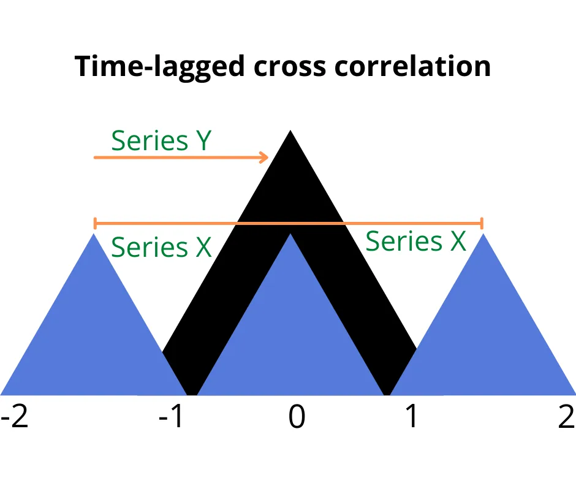
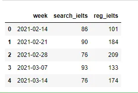
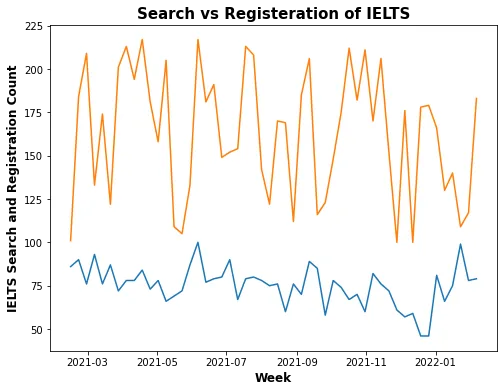
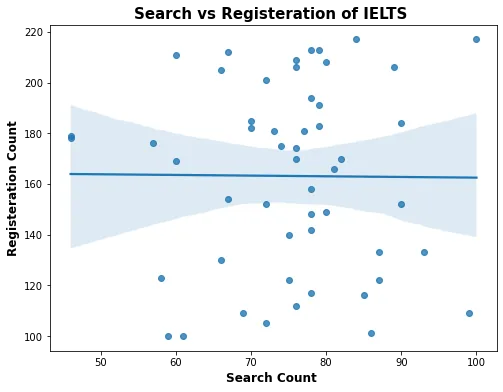
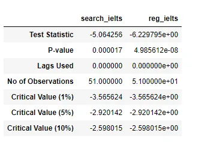
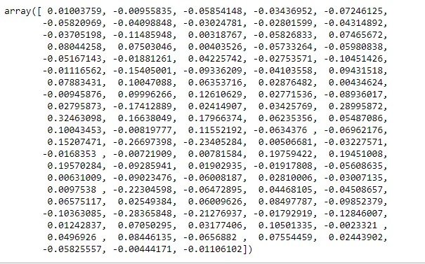
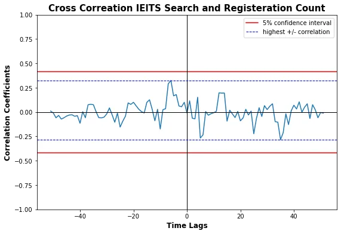

Ever wanted to check the degree of synchrony between two concepts over time? Put differently, how does a given concept X correlate with another concept Y, both of which happen across the same time interval and period? For instance, how does the search for IELTS on Google move in relation to the number of people who actually registered for the exam in the same time period?

This is clearly a problem of relationship. However, using a simple correlation coefficient to state the relationship will not fully utilize the data and thus hide some very important information. Why? A simple correlation coefficient, say Pearson, will compare pairs of the two data across the same time point: count of searches of IELTS on, say, 13/02/2020 against the count of actual IELTS registration on that same day, and so on, returning just one correlation coefficient.



In this article, we will briefly discuss why a single correlation coefficient may not be effective in this scenario. We will then proceed with implementing a time-lagged cross correlation in Python. Lastly, we will recommend further steps to take based on the goal of your analysis.

**Table of Content**:

- Limitation of correlation in presence of possible lead-lag relationship
- How to implement cross correlation in Python
- Interpretations and further steps

### Limitation of Simple Correlation

In the presence of a possible lead-lag relationship, there is a loophole in just estimating relationship between two times series with a single coefficient.

Now what is this loophole? It is possible that a prospective candidate searches for the exam yesterday but registers a week later. It is also possible the student already registered but later needed information about the exam and searched through Google. These two possible omissions can be catered for by using a **time-lagged cross correlation analysis** instead.

This method holds one of the series in place, usually the dependent variable, and creates both lags and leads of the second variable across the time period before computing the correlation coefficients. That way you can compare one series against the other at different times and have a more holistic understanding of the trend. That way you can talk about lag and lead relationships that are missing in the single coefficient method as noted earlier.

### Cross Correlation in Python

We will explore this concept with a simple example data. We will generate the IELTS search data from Google Trends. Then we will the Numpy library to generate random range of number to serve as our hypothetical IELTS registration data. The following section show the code implementation:

First we import the libraries and the data

```python
import numpy as np
import pandas as pd
import matplotlib.pyplot as plt
import seaborn as sns

df = pd.read_csv("IELTS-Nigeria.csv")
```

Then we format the week column to be a proper datetime and also generate the random data that will represent the IELTS registration count and then have a view of the data

```python
df["week"] = pd.to_datetime(df["week"], format ="%d/%m/%Y").dt.date
df["reg_ielts"] = pd.Series(np.random.randint(100, 220, size = len(df)))
df.head()
```



We can then use line plots to see the trend of the two time series as shown below the code:

```python
fig = plt.figure(figsize = (8, 6))
sns.lineplot(data = df, x = 'week', y ='search_ielts')
sns.lineplot(data = df, x = 'week', y ='reg_ielts')
plt.title('Search vs Registeration of IELTS', weight='bold', fontsize = 15)
plt.ylabel('IELTS Search and Registration Count', weight='bold', fontsize = 12)
plt.xlabel('Week', weight='bold', fontsize = 12)
plt.show()
```



The two datasets look somewhat stationary, that is they have no obvious trend or show any striking seasonality. Next, let's have a graphical idea of the relationship between them with the aid of a scatter plot

```python
fig = plt.figure(figsize = (8, 6))
sns.regplot(data = df, x = 'search_ielts', y ='reg_ielts')
plt.title('Search vs Registeration of IELTS ', weight='bold', fontsize = 15)
plt.ylabel('Registeration Count', weight='bold', fontsize = 12)
plt.xlabel('Search Count ', weight='bold', fontsize = 12)
plt.show()
```



Now, we can see there is almost no correlation between the two series when we pair the data at the same time point, which is the case of the simple correlation earlier of. But sometimes, two time series move synchronously at different time point and as earlier stated too, it is possible people first search information about IELTS, then day(s) or even months(s) later register for it. And this information captured only by lagging, or as the case maybe, leading the values of either of the time series against the other. And **cross correlation** is the method that accounts for that.

However, before we proceed with the actual cross correlation, we need to first check if our data meet certain conditions. Since this is just a simple guide, we will focus one important condition which is the assumption of **stationarity**, that is the mean and variance of the two series are approximately constant and are not affected by time movement. While there are a couple of tests for checking this we will be using the common Augmented Dickey Fuller test.

### Augmented Dickey Fuller Test

The null hypothesis for the ADF test is that the series in question is not stationary. So a rejection goes in favor of the alternative hypothesis of stationarity. The following Python code creates a function to run this test, and the result is presented in the table below:

```python
from statsmodels.tsa.stattools import adfuller
def adf_test(timeseries):
    dftest = adfuller(timeseries, autolag='AIC')
    result = pd.Series(dftest[0:4], index=['Test
    Statistic','P-value','Lags Used','No of Observations'])
    for key,value in dftest[4].items():
        result['Critical Value (%s)'%key] = value
    return result

    adf_table = df.drop('week', axis = 1)
    adf_table.apply(adf_test, axis = 0)
```



From the above table, we can see that both the p-values of both series is less than 0.05, so we can reject the null hypothesis and say the two series are stationary. Otherwise we would go ahead with **detrending** the data.

So now we can go ahead and generate the cross correlation coefficients as shown below:

```python
from scipy import signal
def ccf_values(series1, series2):
    p = series1
    q = series2
    p = (p - np.mean(p)) / (np.std(p) * len(p))
    q = (q - np.mean(q)) / (np.std(q))
    c = np.correlate(p, q, 'full')
    return c

ccf_ielts = ccf_values(df['search_ielts'], df['reg_ielts'])
ccf_ielts
```



Lastly, we will create a list of of our lag values and visualize it against the correlation coefficients. We will also set the confidence interval outside which the correlation coefficients becomes important.

```python
lags = signal.correlation_lags(len(df['search_ielts']), len(df['reg_ielts']))

def ccf_plot(lags, ccf):
    fig, ax =plt.subplots(figsize=(9, 6))
    ax.plot(lags, ccf)
    ax.axhline(-2/np.sqrt(23), color='red', label='5%
    confidence interval')
    ax.axhline(2/np.sqrt(23), color='red')
    ax.axvline(x = 0, color = 'black', lw = 1)
    ax.axhline(y = 0, color = 'black', lw = 1)
    ax.axhline(y = np.max(ccf), color = 'blue', lw = 1,
    linestyle='--', label = 'highest +/- correlation')
    ax.axhline(y = np.min(ccf), color = 'blue', lw = 1,
    linestyle='--')
    ax.set(ylim = [-1, 1])
    ax.set_title('Cross Correation IElTS Search and
    Registeration Count', weight='bold', fontsize = 15)
    ax.set_ylabel('Correlation Coefficients', weight='bold',
    fontsize = 12)
    ax.set_xlabel('Time Lags', weight='bold', fontsize = 12)
    plt.legend()

ccf_plot(lags, ccf_ielts)
```



### Interpretation and Further Steps

First, *search_ielts* is the X and the variable that is being shifted. The coefficient values on the left of zero are those where X leads and Y lags while the ones on the right are when Y leads and X lags.

The highest positive correlation coefficient (the point at which the plot touches the dashed horizontal blue line) is +0.32. Let's say this happened at the -8 lag, which is equivalent to lagging variable X 8 weeks behind Y. To interpret this, we would say there is a weak positive correlation between people searching IELTS today and registering 8 weeks later.

On the other hand, if the lag above was positive, we would say, given the correlation, people tend to check check information about IELTS 8 weeks after registering for the exam.

Another important step that could be taken after this is to check how significant the correlation coefficients are, and one popular method that is usually employed is the Granger Causality Test. While the test in itself does not mean causation, it is a better estimator of how both variables relate with each other.

Thanks for reading.

You can follow me on [LinkedIn](https://www.linkedin.com/in/salami-ajibola/) and [Twitter](https://twitter.com/AjibolaSalami2)
