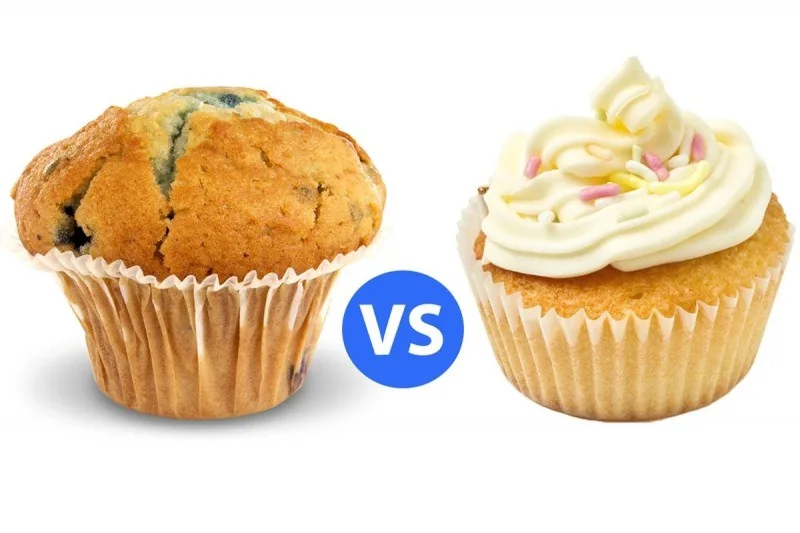
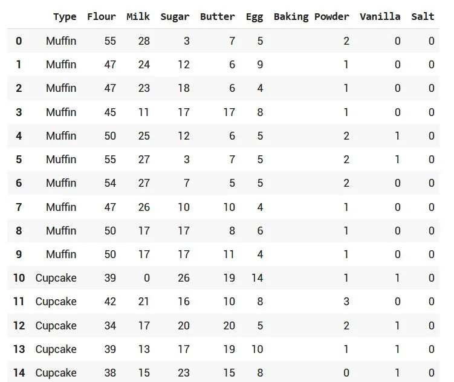
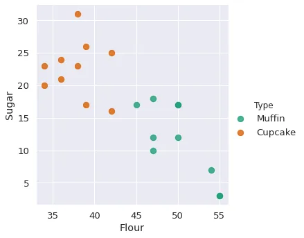

Hello and welcome to my new article in the series of data science beginner guide projects, we discuss here the delicious cupcake and muffin recipes using data analysis to understand the recipe and predict the ingredients. This pythonic article tries to predict either cupcake or muffin given the ingredients in grams.

See the link for github repo; [Here](https://github.com/omarmohamed2011/Muffin-cupcake-Dataset).

Let's start analyzing the code and how to implement that.

#### Libraries

First we start by importing the libraries;

```python
#allaw charts to apper in the nootbook
%matplotlib inline

#libraries for analysis
import pandas as pd
import numpy as np
from sklearn import svm

#libraries for ploting
import matplotlib.pyplot as plt
import seaborn as sns
sns.set(font_scale = 1.2)

# Pickle package
import pickle
```

-- Pandas

Pandas is a software library written for the Python programming language for data manipulation and analysis. In particular, it offers data structures and operations for manipulating numerical tables and time series. It is free software released under the three-clause BSD license.

-- Numpy

NumPy is a library for the Python programming language, adding support for large, multi-dimensional arrays and matrices, along with a large collection of high-level mathematical functions to operate on these arrays.

-- Scikit-learn

Scikit-learn (formerly scikits.learn and also known as sklearn) is a [free software](https://en.wikipedia.org/wiki/Free_software) machine learning [library](https://en.wikipedia.org/wiki/Library_(computing)) for the [Python](https://en.wikipedia.org/wiki/Python_(programming_language)) [programming language](https://en.wikipedia.org/wiki/Programming_language). It features various [classification](https://en.wikipedia.org/wiki/Statistical_classification), [regression](https://en.wikipedia.org/wiki/Regression_analysis) and [clustering](https://en.wikipedia.org/wiki/Cluster_analysis) algorithms including [support-vector machines](https://en.wikipedia.org/wiki/Support_vector_machine), [random forests](https://en.wikipedia.org/wiki/Random_forests), [gradient boosting](https://en.wikipedia.org/wiki/Gradient_boosting), [*k*](https://en.wikipedia.org/wiki/K-means_clustering)[-means](https://en.wikipedia.org/wiki/K-means_clustering) and [DBSCAN](https://en.wikipedia.org/wiki/DBSCAN), and is designed to interoperate with the Python numerical and scientific libraries [NumPy](https://en.wikipedia.org/wiki/NumPy) and [SciPy](https://en.wikipedia.org/wiki/SciPy). Scikit-learn is a [NumFOCUS](https://en.wikipedia.org/w/index.php?title=NumFOCUS&action=edit&redlink=1) fiscally sponsored project.

-- Matplotlib

Matplotlib is a cross-platform, data visualization and graphical plotting library for Python and its numerical extension NumPy. As such, it offers a viable open source alternative to MATLAB. Developers can also use matplotlib's APIs (Application Programming Interfaces) to embed plots in GUI applications.

-- Seaborn

Seaborn is a Python data visualization library based on matplotlib. It provides a high-level interface for drawing attractive and informative statistical graphics. For a brief introduction to the ideas behind the library, you can read the introductory notes or the paper.

-- Pickle

Python pickle module is used for serializing and de-serializing a Python object structure. Any object in Python can be pickled so that it can be saved on disk. What pickle does is that it “serializes” the object first before writing it to file. Pickling is a way to convert a python object (list, dict, etc).

Those are the most significant libraries that are must used in our project.

Let's now begin with the data itself.

#### Data

We first read the data of muffin and cupcake ingredients and try to visualize the 15 first rows, you can see the quantity in grams of each ingredient;

```python
#read in muffin and cupcake in ingredient data
recipes = pd.read_csv('/conten/recipes_muffins_cupcakes.csv')
recipes.head(15210)
#sns.pairplot(recipes)
```

See the output;



Flour,sugar, egg and baking powder are dominant ingredients in these two delicious meal except that we can easily see that salt column doesn't contain much info here. Let's explore the 'Flour Sugar' columns and how they affect the resultant meal.

```python
sns.lmplot('Flour','Sugar',data = recipes,hue='Type',palette='Dark2',fit_reg=False,scatter_kws ={"s":70})
```



To conclude this graph, high relative quantity of sugar in comparison to the Flour can result a cupcake and vice versa.

We can get an info if our insight is true about our data from this [link](https://www.masterclass.com/articles/the-difference-between-cupcake-and-muffin-explained).

But to summarize this point.

##### Muffins

A muffin is an individual-sized quick bread that rises using [baking soda or baking powder](https://www.masterclass.com/articles/baking-powder-vs-baking-soda-whats-the-difference) instead of [yeast](https://www.masterclass.com/articles/fresh-yeast-explained). These small quick breads are usually sweet, with a denser texture than cupcakes. To make muffins, bakers scoop the batter into a muffin pan that features a dozen or more individual cup-shaped wells.
Depending on the mix-in ingredients, you can enjoy muffins as a breakfast food, an accompaniment to a main course, or a snack.
Common add-ins include dried fruits, nuts, oats, and chocolate chips.

##### Cupcake

Cupcakes are small cakes that feature a topping of whipped icing sugar, a candy garnish, or another decorative element. Some cupcakes feature a sweet filling in the center of the cake, like jam, frosting, or compote. You can make these single-serving treats with standard cake batter—the only difference between the baked goods is their size. While a regular cake bakes in a large pan, cupcakes bake in small, individual cup-shaped wells in specialized pans.
The name “cupcake” originated from the concept of baking miniature cakes in small cups.

###### Generally here are the 6 differences between the cupcake and muffins;

Cupcakes and muffins vary in taste, texture, and production. Consider these differences the next time you’re deciding whether to make cupcakes or muffins:

1. **Frosting**: The main difference between cupcakes and muffins lies in the use of frosting. While muffins do not feature frosting, the creamy, sweet whipped topping is a cupcake staple. For example, red velvet cupcakes feature cream cheese frosting, which is thicker and less sweet than the standard buttercream frosting on other cupcakes. Bakers don’t add sugary frosting to muffin tops. Instead, you’ll find muffins with a thin glaze or crispy crumb topping made of brown sugar and cinnamon.
2. **Ingredients**: Muffin recipes typically call for less sugar than most cupcake recipes. Healthy alternative ingredients are common in muffin recipes, which may feature applesauce instead of vegetable oil or whole-wheat flour instead of cake flour or all-purpose flour. Cupcakes often feature additional sweeteners, such as vanilla extract, common in many standard cake recipes.
3. **Production**: Cupcake recipes often use the same creaming method as regular cake recipes. For this method, bakers cream the butter and sugar together before incorporating the other wet and dry ingredients, beating the mixture until they achieve a fluffy, smooth batter. Muffin recipes generally follow a different baking process: Bakers assemble the dry and wet ingredients separately, then combine them, resulting in a thicker, less uniform batter.
4. **Flavor**: Cupcakes are a dessert treat, so most flavors are sweet or fruity. Common cupcake flavors include chocolate, vanilla, strawberry, chocolate chip, and peanut butter. On the other hand, muffin flavors are either sweet or savory. For example, blueberry muffins are a classic sweet muffin, while cornbread muffins are a popular savory option.
5. **Texture**: Cupcakes have a lighter and fluffier texture than muffins. While cupcake batters are soft and smooth, muffin batters are thicker, resulting in a denser texture, similar to bread.
6. **Decorations**: In general, cupcakes are more decorative than muffins, as you can adorn them with sprinkles, candies, colorful paper liners, or elaborate frosting designs for celebrations and parties. Muffins are plainer and don’t often feature a decoration, garnish, or liner. While cupcakes are primarily for dessert, muffins can accompany a dessert, side dish, or appetizer, depending on the flavor profile.

#### Modeling

We found out in the latest graph that we can have the Flour and Sugar columns from our data as the features of our modeling phase.

```python
ingredients = recipes[['Flour','Sugar']]
```

We can use the Support Vector Machines in this simple case.

##### SVM

Support Vector Machine or SVM is one of the most popular Supervised Learning algorithms, which is used for Classification as well as Regression problems. However, primarily, it is used for Classification problems in Machine Learning.

The goal of the SVM algorithm is to create the best line or decision boundary that can segregate n-dimensional space into classes so that we can easily put the new data point in the correct category in the future. This best decision boundary is called a hyperplane.

SVM chooses the extreme points/vectors that help in creating the hyperplane. These extreme cases are called as support vectors, and hence algorithm is termed as Support Vector Machine.

**Example:** SVM can be understood with the example that we have used in the KNN classifier. Suppose we see a strange cat that also has some features of dogs, so if we want a model that can accurately identify whether it is a cat or dog, so such a model can be created by using the SVM algorithm. We will first train our model with lots of images of cats and dogs so that it can learn about different features of cats and dogs, and then we test it with this strange creature. So as support vector creates a decision boundary between these two data (cat and dog) and choose extreme cases (support vectors), it will see the extreme case of cat and dog. On the basis of the support vectors, it will classify it as a cat.

Now let's use the sklearn SVM and fit our model;

```python
# Create and Fit the SVM model
model = svm.SVC(kernel='linear' , C = 0.06**-2 , gamma='auto_deprecated',decision_function_shape='ovo')
train_model = model.fit(ingredients, type_label)
print(train_model)
>> output:
SVC(C=1, cache_size=200, class_weight=None, coef0=0.0,
    decision_function_shape='ovo', degree=3, gamma='auto_deprecated',
    kernel='linear', max_iter=-1, probability=False, random_state=None,
    shrinking=True, tol=0.001, verbose=False)
```

And model has well scored on data and was able to differentiate between the two meals.

You can also see an extra section in the code as I tried to show the SVM separating hyperplane.

Hope you enjoyed this article and it was a useful article to you and will help get better insights in your data science projects and can correlate the facts about data with the insights. Have a great day.
